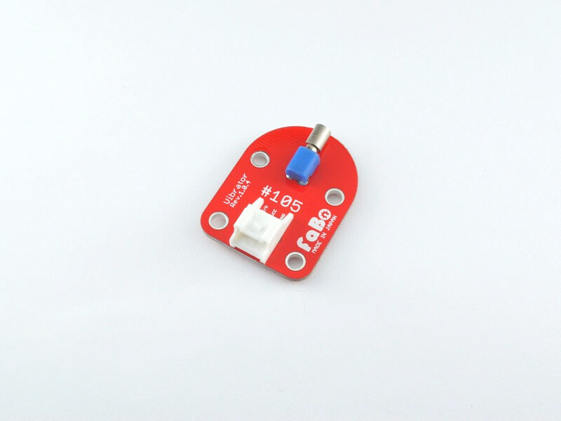

# #Shinobi_ANA6

<!--COLORME-->

## Overview

Shinobi_ANA6は、工事設計認証済み、Raytac(台湾) MDBT42Q(MDBT42Q-512K)BLEモジュール搭載。

DC/DCコンバータ―のためインダクタ搭載、スリープ時には、低速振動子搭載32kHzで、消費電力を抑えます。

６つのアナログまたはGPIOが使用できます。

### 搭載チップ
Nordic Semiconductor NRF52832(Cortex-M4)

### 通信
Bluetooth 4.0,4.1,4.2(BLE Mode)

### インターフェース
GPIO ADCインターフェース利用可能

### メモリ

RAM 64KB
ROM 512KB

###通信可能距離

飛距離　最大８０ｍ（オープンスペース）

### 入力電圧

1.7V~3.6V

## Connecting

## Parts Specification
| Document |
|:--|
| [raytac](http://www.raytac.com/products.php?subid=55) |

## Schematic

## Sample Code

## 構成Parts
