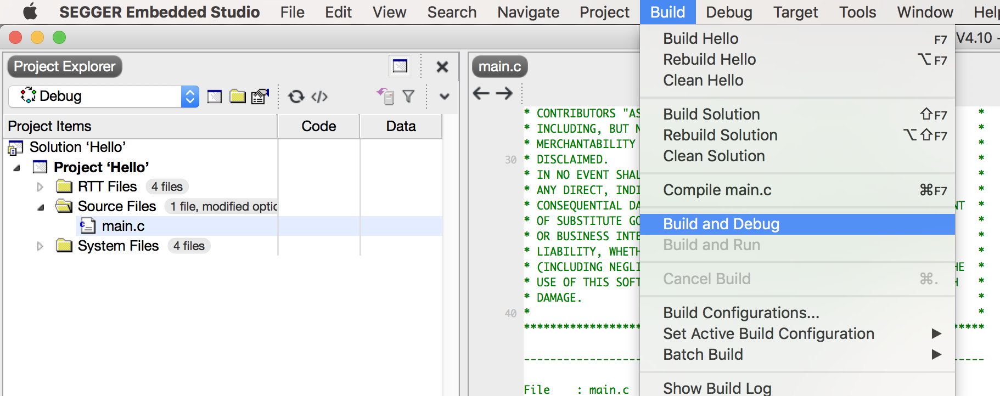
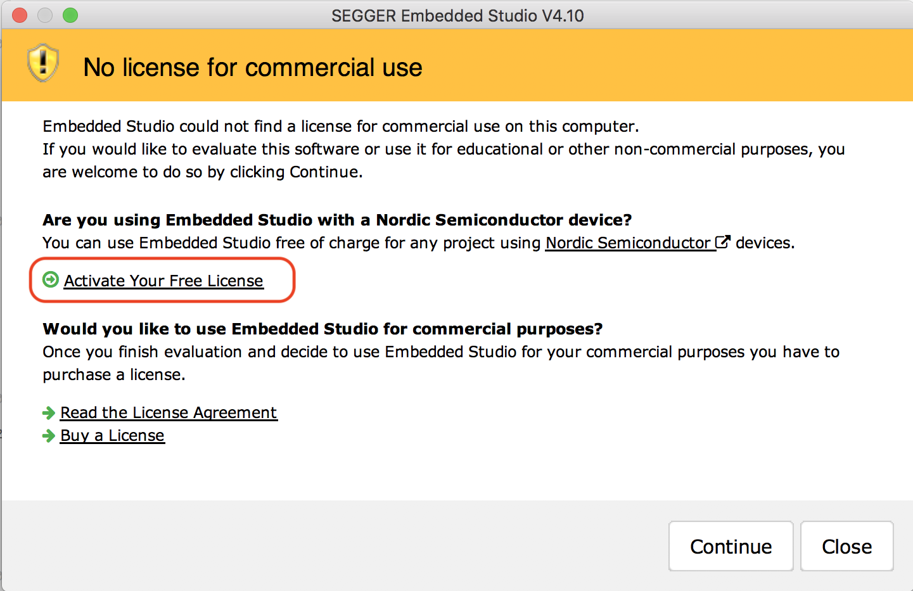
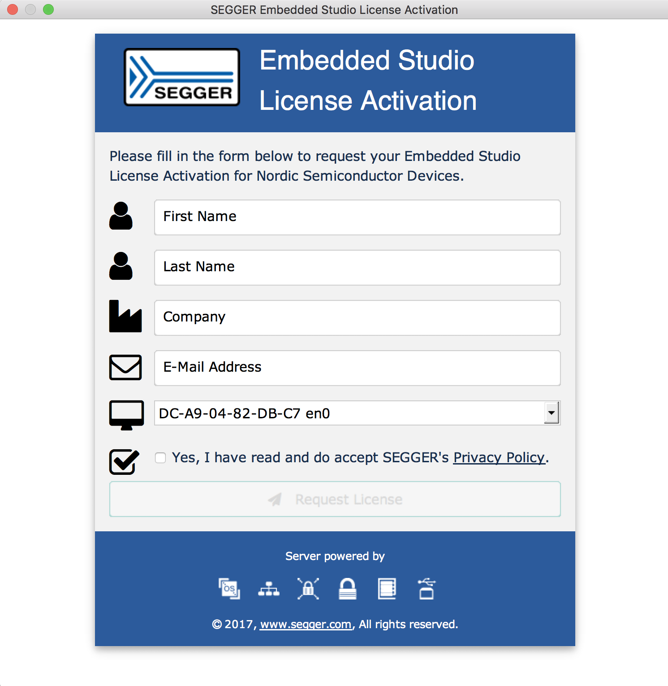
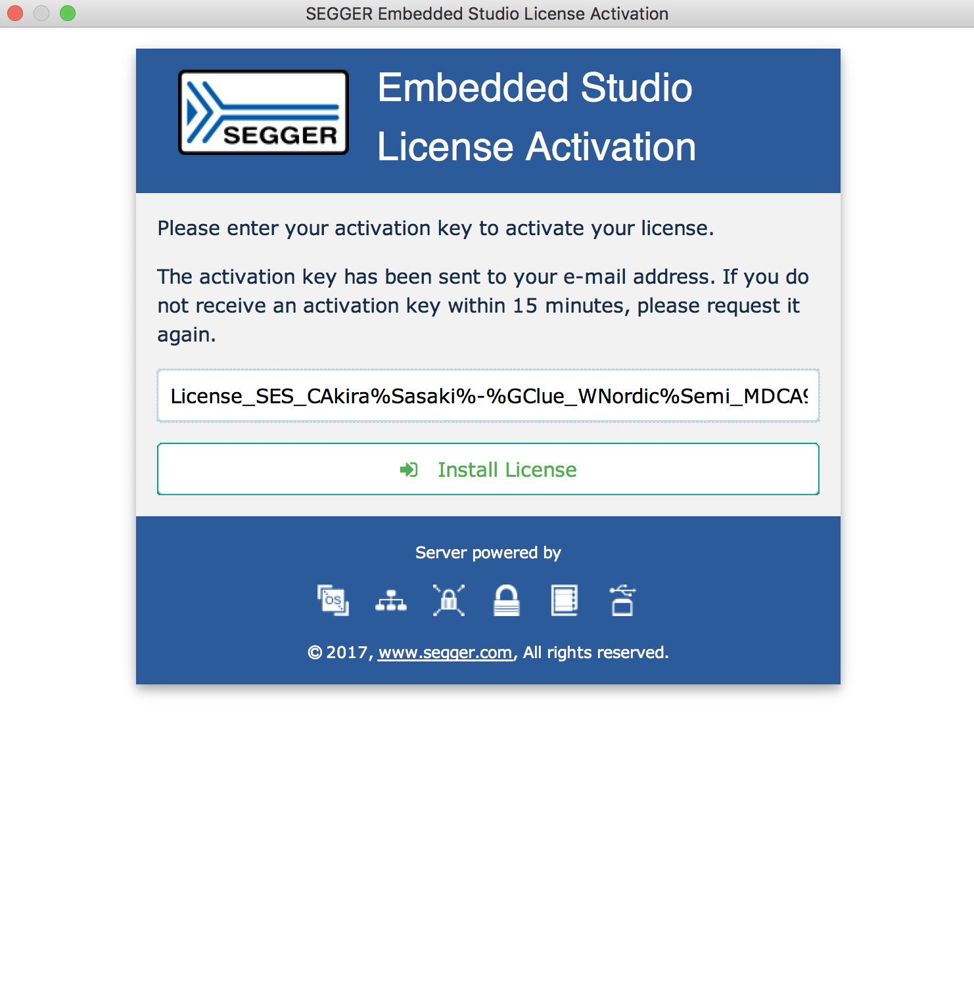

# Seggerでの環境構築

## Document

http://infocenter.nordicsemi.com/pdf/getting_started_ses.pdf

## Segger Embedded StudioのDownload

https://www.segger.com/downloads/embedded-studio

## nRF5 SDKのDownload

https://developer.nordicsemi.com/nRF5_SDK/

## Segger Embedded StudioのLicenseのActivate

Segger Embedded Studioを起動。LicenseのActivateをおこなう。[Build]-[Build and Debug]を実行する。

メールで、Licenseコードが届くので、それをコピーして、Activateする。

