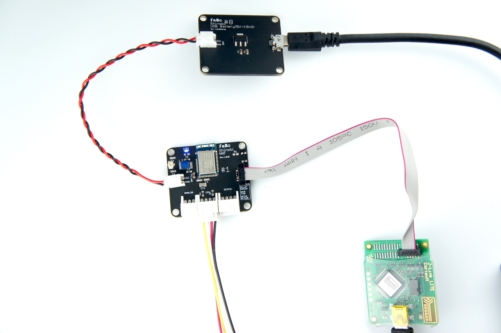
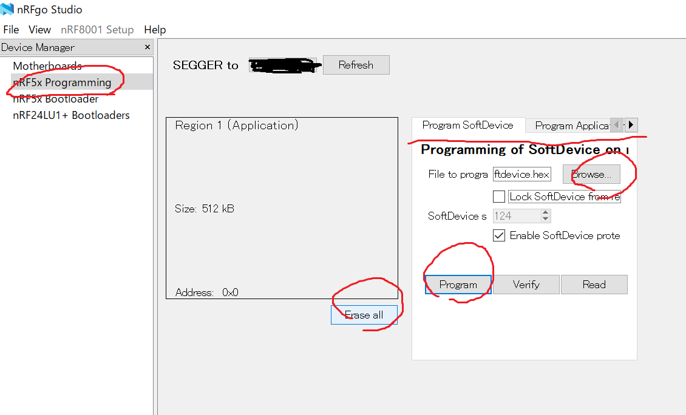

# nRFgo Stduio

nRFgo Stduioは、Nordicセミコンダクター社nRF51,nRF52の開発用アプリケーションです。
テストやファームウェアの書き込みに使用できます。対応はWindowsです。

## ファームウェアの書き込み

アプリケーションがソフトデバイス（プロトコルスタック）を利用している場合は、ソフトデバイスの書き込みのあと、上位空き領域に、アプリケーションの書き込みを計２回行います。ソフトデバイスには、３種類ありペリフェラル、セントラル、ペリフェラルまたはセントラルの種類があります。

## ダウンロード

画面で操作でプログラミング（ファームウェアの焼きこみ）nRFgo Studio-Win64をダウンロードします。

https://www.nordicsemi.com/eng/nordic/Products/nRFgo-Studio/nRFgo-Studio-Win64/14964

解凍し、nRFgoStudio　インストール終了後、自動的にダイヤログが開き、J-linkドライバもインストールします。

## SDKダウンロード

開発に必要なサンプル及びコンポーネント（ソフトデバイスなど）がダウンロードされます。
https://www.nordicsemi.com/eng/Products/Bluetooth-low-energy/nRF5-SDK

## nRFgoStduioでファーウェア書き込み

下記のように接続します。J-link liteをShinobiに接続し、Shinobiの電源（3V）もONにします。

プロジェクトフォルダからビルドした、hexファイルを用意し、nRFgoStudioを起動、左の画面　DeviceManegerのnRF5x Programmingをクリック。
しばらくすると、正常に接続されている場合、Region1,またはRegion0,Region1など領域を表す画面が出てきます。

## 消去

Erase allボタンを押します。

## ソフトデバイスインストール

ソフトデバイスが必要な場合は、Browseボタンを押し、ProgramSoftDeivceタブをクリックしてさきほど、ダウンロードしたSDKの中に\components\softdevice\s132\hexから対象となるソフトデバイス（hexファイル）をProgramボタンをクリックいてインストールします。

## アプリケーションインストール

Program ApplicationタブをクリックしBrowse対象のhexファイルであるアプリケーションファイル選択し、Programボタンをクリックしてインストールします。

画面の下にsuccessfullyが表示されるはずです。
