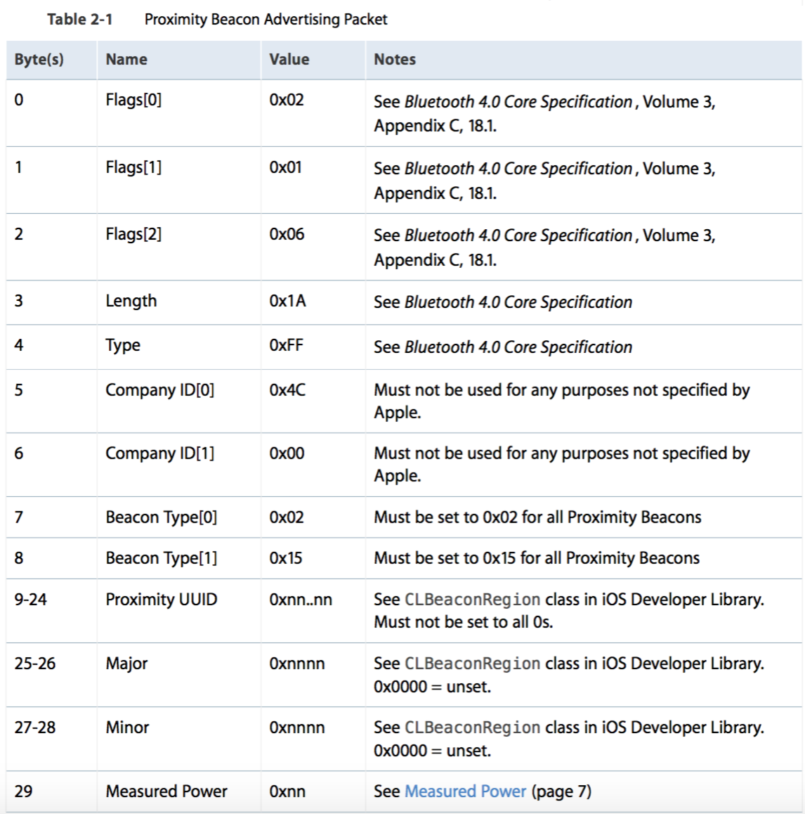

# Beacon

## iBeacon Format

iBeaconは、Apple社の定義するProximity Beaconである。

https://developer.apple.com/ibeacon/

のページにて、iBeaconのFormat情報が公開されている。

iBeaconは、開始当初は、MFiプログラム下のiBeacon Programの契約の元で、NDA情報としてFormat情報が開示されていたが、2015年9月より、Webで誰でもアクセス可能な形でFormatが開示されている。

自社製品に、iBeaconのロゴや記述を掲載する場合は、

https://developer.apple.com/ibeacon/

に開示されている条件に従えば、使用することが可能になった。

