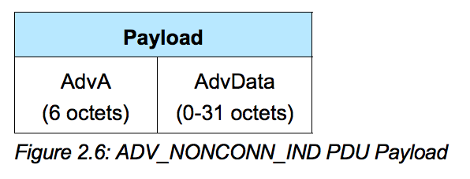
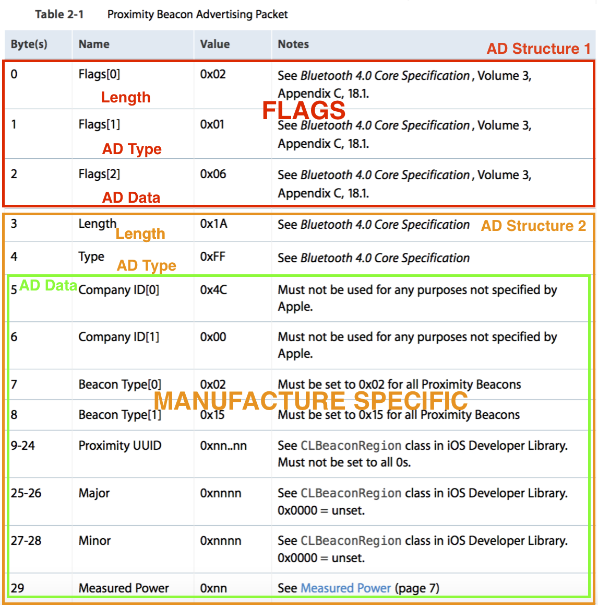

# Advertising Data

# Advertising Data フォーマット

| Type | フォーマット |
| -- | -- |
| ADV_NONCONN_IND |  |

iBeaconは、ADV_NONCONN_INDでアドバータイズされるが、ADV_NONCONN_INDでは、AdvAが6オクテット、AdvDataが0-31オクテットで構成される。

# AdvA

AdvAは、6オクテット(48bit)のアドレスにより構成される。デバイスを識別するためのアドレスになる。

AdvAのアドレスは、PUD HeaderのTxAdd, RxAddの記述により、publicとrandomのアドレスが割り振られる。

| 仕様 | AdvAの挙動 |
| -- | -- |
| Public address | IEEE Registration Authorityにより登録されたアドレス。48 bitのアドレスは、24bitがCompany ID (CID)で、24bitがMac Addressで構成。デバイスが存在する間は同じ値。 |
| Random Static address | 電源がOnになった際に割り振られるランダムな値。Rebootがかかると違う値に。 |
| Private Non-Resolvable address |  identity resolving key (IRK)と乱数により生成。接続中も値を変えることができる。 |
| Private Non-Resolvable address | Randomな値を任意のタイミングで割り振る。あまり一般的ではない。 |

SoftDeviceでは、これらの設定値は、[GAP Address Type](https://developer.nordicsemi.com/nRF51_SDK/nRF51_SDK_v7.x.x/doc/7.0.1/s110/html/a00801.html)で定義されている。

```c
#define 	BLE_GAP_ADDR_TYPE_PUBLIC   0x00
#define 	BLE_GAP_ADDR_TYPE_RANDOM_STATIC   0x01
#define 	BLE_GAP_ADDR_TYPE_RANDOM_PRIVATE_RESOLVABLE   0x02
#define 	BLE_GAP_ADDR_TYPE_RANDOM_PRIVATE_NON_RESOLVABLE   0x03
``` 

SoftDeviceでは、[sd_ble_gap_address_set](https://developer.nordicsemi.com/nRF51_SDK/nRF51_SDK_v8.x.x/doc/8.0.0/s110/html/a01045.html#gaaf0deb48ed35d1e6ede6222dd72fe12c)で、反映することができるが、今回のiBeaconのサンプルでは使用しない。

# AdvData

AdvertisingのDataフォーマットは、Core Bluetooth 4.0 Core Specificationにより定義されている。


Advertisingのデータのフォーマットでは、AD Structureという構造により構成される。AD Structureは、長さ+AD Type + AD Dataの3要素により定義される。AD Typeで定義可能な値は、以下の通りである。

| 値 | AD Type | 情報|
| -- | -- |
| 0x01 | FLAGS | |
| 0x02 |SERVICE |	 More 16-bit UUIDs available |
| 0x03 | SERVICE | Complete list of 16-bit UUIDs available	|
| 0x04 | SERVICE  | More 32-bit UUIDs available |	 
| 0x05	| SERVICE	 | Complete list of 32-bit UUIDs available	|
| 0x06 | SERVICE	| More 128-bit UUIDs available |	 
| 0x07| SERVICE	| Complete list of 128-bit UUIDs available	| 
| 0x08 | LOCAL NAME | Shortened local name |
| 0x09 | LOCAL NAME | Complete local name	|
| 0x0A | TX POWER LEVEL | 0xXX:-127 to +127dBm |
| 0x0D |  SIMPLE PAIRING OPTIONAL OOB TAGS | Class of device |   
| 0x0E | SIMPLE PAIRING OPTIONAL OOB TAGS  | Simple Pairing Hash C |  
| 0x0F |  SIMPLE PAIRING OPTIONAL OOB TAGS | Simple Pairing Randomizer R | 
| 0x10 | SECURITY MANAGER TK VALUE | SECURITY MANAGER TK VALUE |
| 0x11 | SECURITY MANAGER OOB FLAGS | SECURITY MANAGER OOB FLAGS |
| 0x12 | SLAVE CONNECTION INTERVAL RANGE | SLAVE CONNECTION INTERVAL RANGE |
| 0x14 | SERVICE SOLICITATION | List of 16 bit Service UUIDs|
| 0x15 | SERVICE SOLICITATION | List of 128 bit Service UUIDs|
| 0x16 | SERVICE DATA | The first 2 octets contain the 16 bit Service UUID followed by additional service data|
| 0xFF | Manufacture Specific | The first 2 octets contain the Company Identifier Code followed by additional manufacturer specific data |

BLUETOOTH SPECIFICATION Version 4.0 [Vol 3] P401-P403から抜粋

iBeaconのAdvertisingのパケットは、下記のような値と構造になっている。




## iBeaconのFLAGS


[Proximity Beacon
Specification
Release R1 P6より抜粋](https://developer.apple.com/ibeacon/)

iBeaconでは

    02 01 06

から始まる。

    02 01 06

は、Flagsを定義している。SoftDeviceは、
[S110 GAP Advertisement Flags](https://developer.nordicsemi.com/nRF51_SDK/nRF51_SDK_v8.x.x/doc/8.0.0/s110/html/a00825.html#gacb3630594402e27c96515eb80080f2a3) の値がそれに対応する。

[S110 GAP Advertisement Flags](https://developer.nordicsemi.com/nRF51_SDK/nRF51_SDK_v8.x.x/doc/8.0.0/s110/html/a00825.html#gacb3630594402e27c96515eb80080f2a3)　では、下記の値が定義されている。

| 定数 |  意味　|
| -- | -- |
| BLE_GAP_ADV_FLAG_BR_EDR_NOT_SUPPORTED  | BR/EDR not supported. |
| BLE_GAP_ADV_FLAG_LE_BR_EDR_CONTROLLER    | Simultaneous LE and BR/EDR, Controller. |
| BLE_GAP_ADV_FLAG_LE_BR_EDR_HOST   |  Simultaneous LE and BR/EDR, Host. |
| BLE_GAP_ADV_FLAG_LE_GENERAL_DISC_MODE    | LE General Discoverable Mode.  |
| BLE_GAP_ADV_FLAG_LE_LIMITED_DISC_MODE  |  LE Limited Discoverable Mode. |
| BLE_GAP_ADV_FLAGS_LE_ONLY_GENERAL_DISC_MODE | LE General Discoverable Mode, BR/EDR not supported. |
| BLE_GAP_ADV_FLAGS_LE_ONLY_LIMITED_DISC_MODE | LE Limited Discoverable Mode, BR/EDR not supported. |


    02 01 06

は

| 値 | 意味 | 概要 | 
| -- | -- |
| 02 | length | 命令の長さ |
| 01 | AD Type | 命令のタイプ |
| 06 | flags | flagsの値|

という構造になっており、最後の0x06がflagsにあたる。0x06は、BLE_GAP_ADV_FLAG_LE_GENERAL_DISC_MODEと BLE_GAP_ADV_FLAG_BR_EDR_NOT_SUPPORTEDの論理和にあたる。

    BLE_GAP_ADV_FLAGS_LE_ONLY_LIMITED_DISC_MODE (BLE_GAP_ADV_FLAG_LE_LIMITED_DISC_MODE | BLE_GAP_ADV_FLAG_BR_EDR_NOT_SUPPORTED)

で定義されているように、BLE_GAP_ADV_FLAGS_LE_ONLY_LIMITED_DISC_MODEをflagsでは使う。

プログラム内では、下記の通り定義する。

```c
uint8_t flags = BLE_GAP_ADV_FLAGS_LE_ONLY_GENERAL_DISC_MODE;
```

## iBeaconのManufacture Specific

Bluetooth 4.0 Core Specificationの定義では、


iBeaconのManufacture Specificは

    1A FF 4c 00 02 15 00 nn..nn nnnn nnnn nn

で定義されている。

FFは、AD Typeでは、Manufacture Specificを意味している。Manufacture Specificでは、続く2バイトで、Company識別子を入れるルールになっている。

AppleのCompany識別子では、0x004Cなので、ここに0x004Cが入っている。

企業識別子の一覧

https://www.bluetooth.org/ja-jp/specification/assigned-numbers/company-identifiers

企業識別子、各 Bluetooth SIG メンバー企業が一つ申請する一意の数字識別子になっており、申請するとBluetooth SIG によって割り当てられる。

そのあとは、Apple独自のフォマーットになっているので、それに従う。

```c
#define APP_BEACON_INFO_LENGTH     0x17                              /**< Total length of information advertised by the Beacon. */
#define APP_ADV_DATA_LENGTH 		0x15                              /**< Length of manufacturer specific data in the advertisement. */
#define APP_DEVICE_TYPE			0x02                              /**< 0x02 refers to Beacon. */
#define APP_MEASURED_RSSI 		0xC3                              /**< The Beacon's measured RSSI at 1 meter distance in dBm. */
#define APP_COMPANY_IDENTIFIER	0x002C                           /**< Company identifier for Nordic Semiconductor ASA. as per www.bluetooth.org. */
#define APP_MAJOR_VALUE                 0x01, 0x02                        /**< Major value used to identify Beacons. */ 
#define APP_MINOR_VALUE                 	0x03, 0x04                        /**< Minor value used to identify Beacons. */ 
#define APP_BEACON_UUID                 	0x01, 0x12, 0x23, 0x34, \
							0x45, 0xaa, 0x67, 0x78, \
							0x89, 0xba, 0x13, 0xbc, \
							0x33, 0x1a, 0x22, 0xf0            /**< Proprietary UUID for Beacon. */

static uint8_t m_beacon_info[APP_BEACON_INFO_LENGTH] =                  /**< Information advertised by the Beacon. */
{
    APP_DEVICE_TYPE,     // Manufacturer specific information. Specifies the device type in this 
                         // implementation. 
    APP_ADV_DATA_LENGTH, // Manufacturer specific information. Specifies the length of the 
                         // manufacturer specific data in this implementation.
    APP_BEACON_UUID,     // 128 bit UUID value. 
    APP_MAJOR_VALUE,     // Major arbitrary value that can be used to distinguish between Beacons. 
    APP_MINOR_VALUE,     // Minor arbitrary value that can be used to distinguish between Beacons. 
    APP_MEASURED_RSSI    // Manufacturer specific information. The Beacon's measured TX power in 
                         // this implementation. 
};
```

```c
	uint32_t err_code;
	ble_advdata_t advdata;
	uint8_t flags = BLE_GAP_ADV_FLAGS_LE_ONLY_GENERAL_DISC_MODE;
	
	ble_advdata_manuf_data_t manuf_specific_data;
	manuf_specific_data.company_identifier = APP_COMPANY_IDENTIFIER;

	manuf_specific_data.data.p_data = (uint8_t *) m_beacon_info;
	manuf_specific_data.data.size   = APP_BEACON_INFO_LENGTH;
	
	memset(&advdata, 0, sizeof(advdata));
	advdata.flags = flags;
	advdata.p_manuf_specific_data = &manuf_specific_data;

	err_code = ble_advdata_set(&advdata, NULL);
	APP_ERROR_CHECK(err_code);
```

## Name

Advertising Data Encoder でname_typeが定義されているので、それも設定する。

```c
enum ble_advdata_name_type_t { 
  BLE_ADVDATA_NO_NAME, 
  BLE_ADVDATA_SHORT_NAME, 
  BLE_ADVDATA_FULL_NAME 
}
```

| 定数 | 意味　 |
| -- | -- |
| BLE_ADVDATA_NO_NAME | デバイス名を定義しない。AD Structure自体が追加されない |
| BLE_ADVDATA_SHORT_NAME | AD Type 0x08のAD Structureが追加される |
| BLE_ADVDATA_FULL_NAME | AD Type 0x09のAD Structureが追加される |


```c
	uint32_t err_code;
	ble_advdata_t advdata;
	uint8_t flags = BLE_GAP_ADV_FLAGS_LE_ONLY_GENERAL_DISC_MODE;
	
	ble_advdata_manuf_data_t manuf_specific_data;
	manuf_specific_data.company_identifier = APP_COMPANY_IDENTIFIER;

	manuf_specific_data.data.p_data = (uint8_t *) m_beacon_info;
	manuf_specific_data.data.size   = APP_BEACON_INFO_LENGTH;
	
	memset(&advdata, 0, sizeof(advdata));
	advdata.name_type             = BLE_ADVDATA_NO_NAME;	
	advdata.flags = flags;
	advdata.p_manuf_specific_data = &manuf_specific_data;

	err_code = ble_advdata_set(&advdata, NULL);
	APP_ERROR_CHECK(err_code);
```