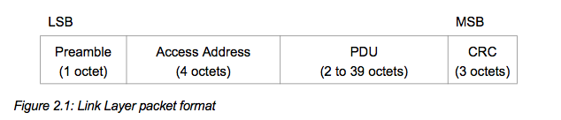
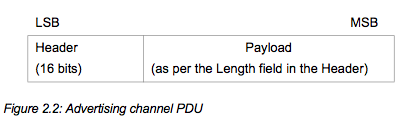
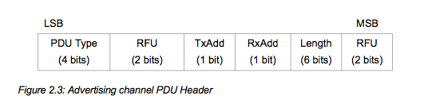
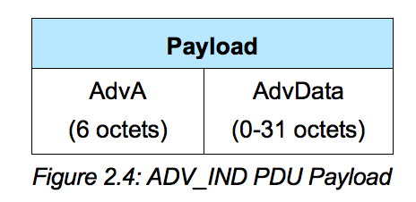
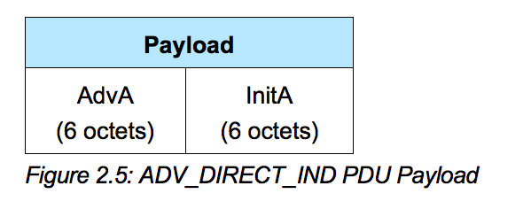
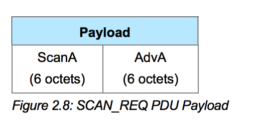
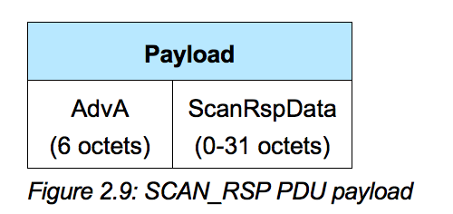
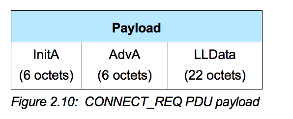

# Advertising Parameter

Bluetooth Low EnergyのLink Layerのパケットは、Preamble、AccessAddress、PDU、CRCにより構成される。



BLUETOOTH SPECIFICATION Version 4.0 [Vol 6] P36より

## Access Address

AccessAddressは4オクテットで構成され、Advertising時は、0x8E89BED6の値がもちられる。接続時には、それぞれ個別のアドレスが割り振られる。

    0x8E89BED6

BLUETOOTH SPECIFICATION Version 4.0 [Vol 6] P36に記載

## PDU

PDUは、HeaderとPayloadにより構成される。Payloadの長さや書式は、Headerで定義されたTypeにより変化する。



PDU Headerは、16ビットしか割り振りがないので、ビット単位で構成される。最初の4ビットがPDU Typeが定義される。

| 領域名 | 長さ | 意味 |
| -- | -- | -- |
| PDU Type | 4bit | PDUのタイプを定義 |
| RFU | 2bit | 現在は使用していない。(未定義の領域)|
| TxAdd |1bit| AdvA, InitA, ScanAなどがpublicな場合0、randomの場合1。 PDU Typeにより定義がかわる。|
| RxAdd | 1bit | AdvA, InitA, ScanAなどがpublicな場合0、randomの場合1。PDU Typeにより定義がかわる。|
| Length | 6bit | PDU Typeや、Payloadの中身によっても変化 |
| RFU | 2bit | 現在は使用していない。(未定義の領域)|




HeaderのTypeは下図の値で定義される。


BLUETOOTH SPECIFICATION Version 4.0 [Vol 6] P39に記載。

Advertisingに関連するPDU Typeは以下の通りである。

| Type | 意味 |
| -- | -- |
| ADV_IND | 不特定多数デバイスから接続可能なアドバタイズイベント(undirected) |
| ADV_DIRECT_IND | 特定デバイスから接続可能なアドバイタイズイベント(directed)|
| ADV_NONCONN_IND |  不特定多数デバイスから接続不可能なアドバイタイズイベント(undirected)|
| ADV_SCAN_IND | 不特定多数デバイスからスキャン可能なアドバタイズイベント(undirected) |

iBeaconでは、ADV_NONCONN_INDを使用する。また、PDU Type別のフォーマットは下表のように定義されている。

| Type | フォーマット |
| -- | -- |
| ADV_IND |  <br>TxAdd 0:AdvA public<br>TxAdd 1:AdvA random  |
| ADV_DIRECT_IND | <br>TxAdd 0:AdvA public<br>TxAdd 1:AdvA random<br>RxAdd 0:InitA public<br>RxAdd 1:InitA random |
| ADV_NONCONN_IND |  <br>TxAdd 0:AdvA public<br>TxAdd 1:AdvA random|
| SCAN_REQ |  <br>TxAdd 0:ScanA public<br>TxAdd 1:ScanA random<br>RxAdd 0:AdvA public<br>RxAdd 1:AdvA random|
| SCAN_RSP |  <br>TxAdd 0:AdvA public<br>TxAdd 1:AdvA random|
| CONNECT_REQ |  <br>TxAdd 0:InitA public<br>TxAdd 1:InitA random<br>RxAdd 0:AdvA public<br>RxAdd 1:AdvA random|
| ADV_SCAN_IND |  <br>TxAdd 0:AdvA public<br>TxAdd 1:AdvA random|


BLUETOOTH SPECIFICATION Version 4.0 [Vol 6] P39-P41より抜粋

```c
#define NON_CONNECTABLE_ADV_INTERVAL    MSEC_TO_UNITS(100, UNIT_0_625_MS) /**< The advertising interval for non-connectable advertisement (100 ms). This value can vary between 100ms to 10.24s). */
```

```c
	ble_gap_adv_params_t m_adv_params;  
	memset(&m_adv_params, 0, sizeof(m_adv_params));
	m_adv_params.type = BLE_GAP_ADV_TYPE_ADV_NONCONN_IND; // ADV_NONCONN_IND
	m_adv_params.p_peer_addr = NULL; // 不特定多数デバイスから接続可能に
	m_adv_params.fp = BLE_GAP_ADV_FP_ANY; // 不特定多数デバイスから接続可能に
	m_adv_params.interval = NON_CONNECTABLE_ADV_INTERVAL; // 発信周期
	m_adv_params.timeout = 0;

```
