# Debug Logger

[Debug Logger](
http://infocenter.nordicsemi.com/index.jsp?topic=%2Fcom.nordic.infocenter.sdk51.v10.0.0%2Fgroup__app__trace.html&cp=4_1_0_6_7_20)では、UARTを用いたログの表示が可能です。

## 環境構築

今回は、main.c以外に、custom_board.hを追加する。

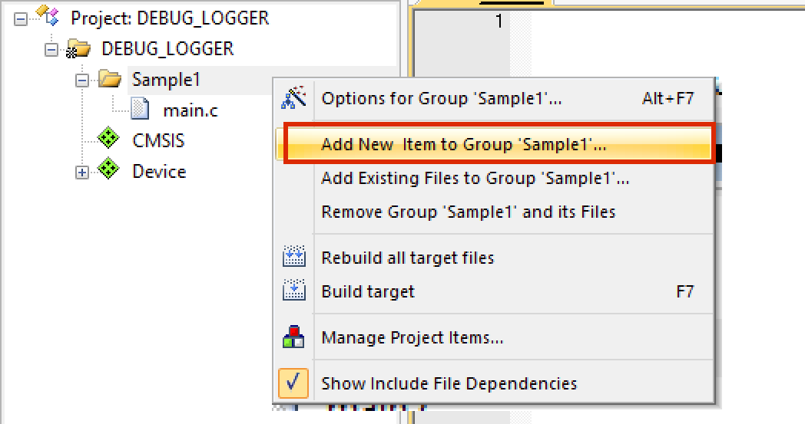

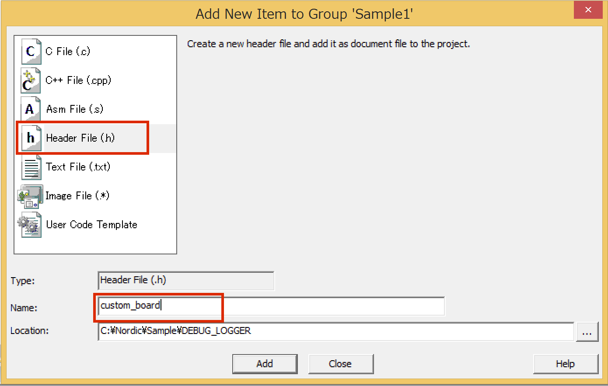

新規作成しただけでは、リストに表示されないので、Sample1付近で右クリックを押し表示されるショートカットメニューの[Add Existing Files to Group 'Sample1'...]を選択し、custom_board.h を選ぶ。

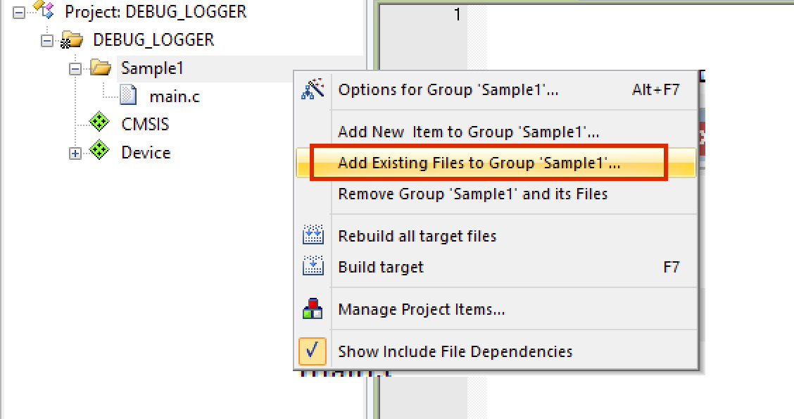

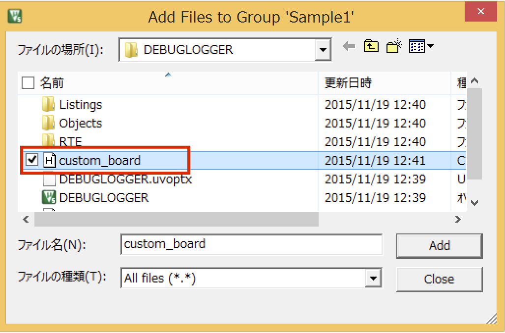

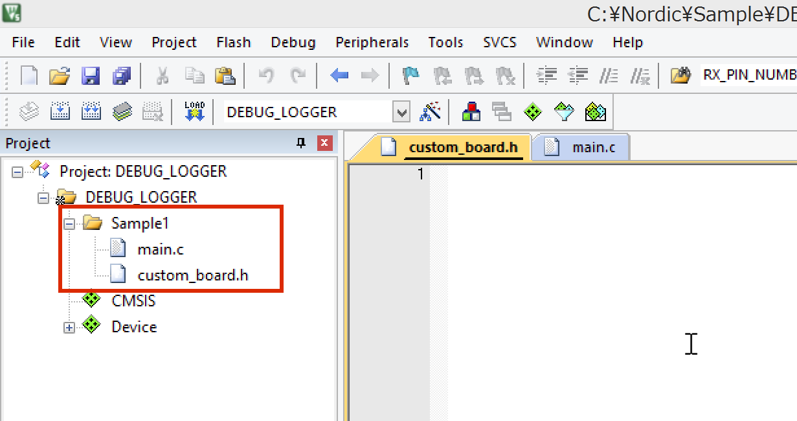

次に、Optionの設定で、C/C++タブで、defineに、BOARD_CUSTOMとENABLE_DEBUG_LOG_SUPPORTを追記する。


| 項目 | 意味 |
| -- | -- |
| BOARD_CUSTOM | custom_board.hを追加することで、カスタムボードのPIN設定を反映できるようになる |
| ENABLE_DEBUG_LOG_SUPPORT | Debug Loggerを有効にする|

また、custom_board.hが存在するフォルダにパスを通しておく。

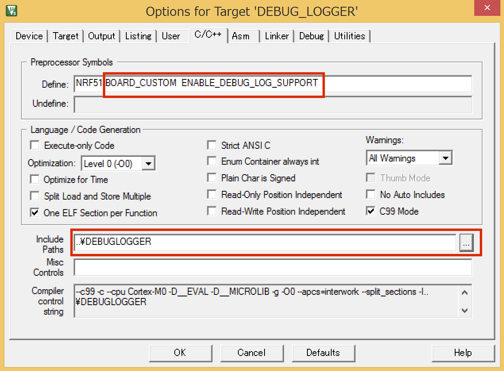

## SourceCode

main.c
```c
#include <stdbool.h>
#include "nrf_delay.h"
#include "app_trace.h"

int counter = 0;

/**
 * @brief Main処理.
 */
int main(void)
{
	app_trace_init();
	
   while (true)
   {
			app_trace_log("\n\rCounter:%d.\r\n", counter);
			nrf_delay_ms(1000);
			counter++;
	 }
}
```

cuntom_board.h
```h
// UARTのPortを定義.
#define RX_PIN_NUMBER 9
#define TX_PIN_NUMBER  11
#define CTS_PIN_NUMBER 100
#define RTS_PIN_NUMBER 100
```

## 追加するソフトウェアコンポーネント

nRF_Librariesからapp_traceを選択する。足りないパッケージがあるためオレンジ色になるので、左したのResolvボタンを押す。

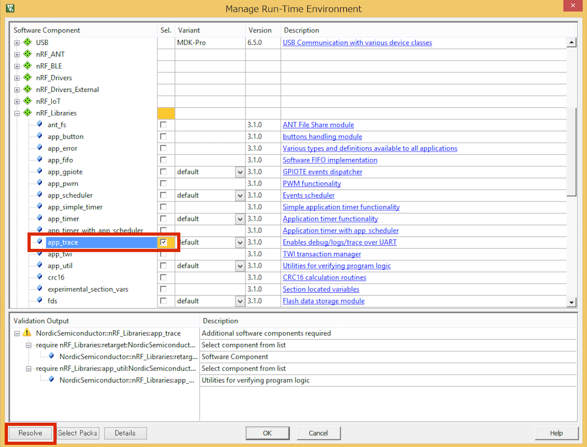

nRF_Driverのnrf_errorがオレンジ色になっているので、No_softdeviceに選択を変える。

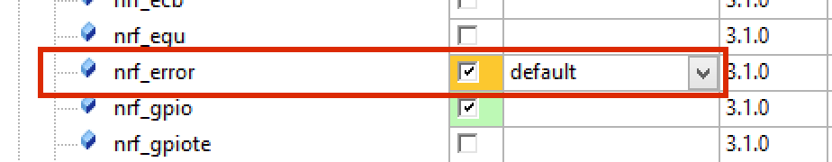

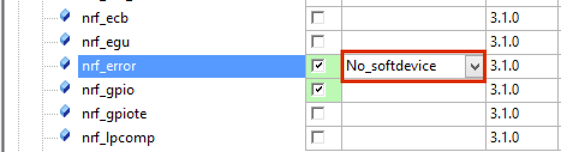

app_uartは、Fifoに変えておく。これをやらないと、1文字しか文字が表示されない。

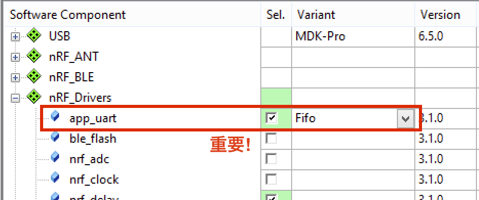

また、Board Supportのbspを追加する。オレンジ色になるので、resolveボタンを選択する。

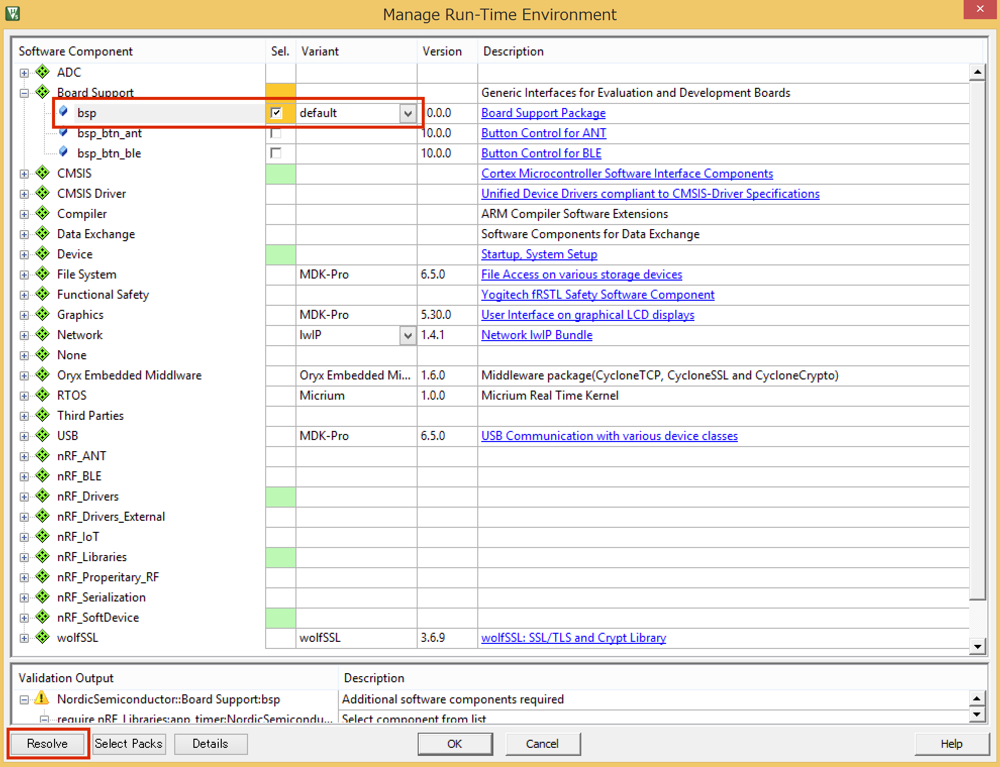

| Board Support | nRF_Driver | nRF_Libraries | nRF_SoftDevice |
| -- | -- | -- |
| 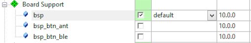 | 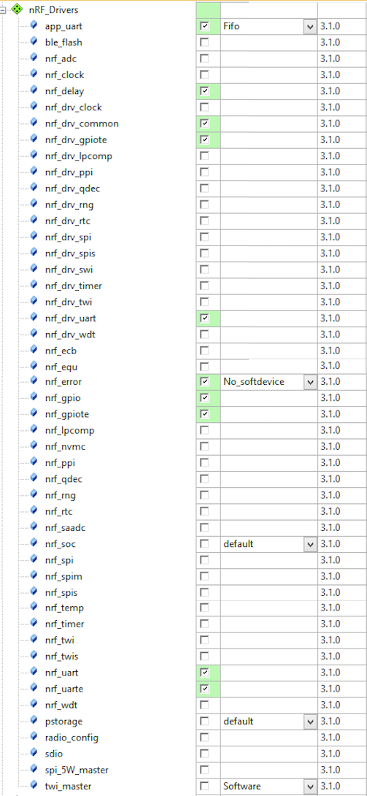 | 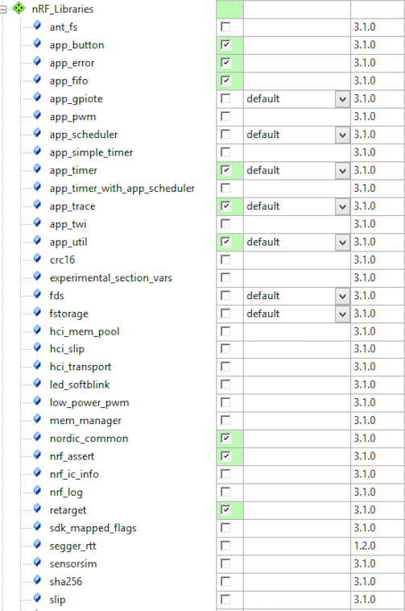 | 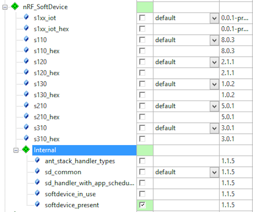 |

## nrf_drv_config.hファイルを修正する

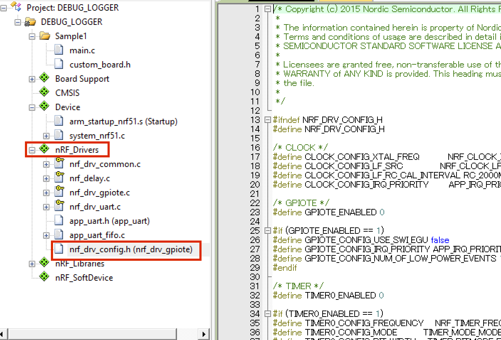

GPIOTEを有効にするため

    #define GPIOTE_ENABLED 1

にする。

```c
/* GPIOTE */
#define GPIOTE_ENABLED 1

#if (GPIOTE_ENABLED == 1)
#define GPIOTE_CONFIG_USE_SWI_EGU false
#define GPIOTE_CONFIG_IRQ_PRIORITY APP_IRQ_PRIORITY_LOW
#define GPIOTE_CONFIG_NUM_OF_LOW_POWER_EVENTS 1
#endif
```

UARTを有効にするため

    #define UART0_ENABLED 1

にする。

```c
/* UART */
#define UART0_ENABLED 1

#if (UART0_ENABLED == 1)
#define UART0_CONFIG_HWFC         NRF_UART_HWFC_DISABLED
#define UART0_CONFIG_PARITY       NRF_UART_PARITY_EXCLUDED
#define UART0_CONFIG_BAUDRATE     NRF_UART_BAUDRATE_38400
#define UART0_CONFIG_PSEL_TXD     0
#define UART0_CONFIG_PSEL_RXD     0
#define UART0_CONFIG_PSEL_CTS     0
#define UART0_CONFIG_PSEL_RTS     0
#define UART0_CONFIG_IRQ_PRIORITY APP_IRQ_PRIORITY_LOW
#ifdef NRF52
#define UART0_CONFIG_USE_EASY_DMA false
//Compile time flag
#define UART_EASY_DMA_SUPPORT     1
#define UART_LEGACY_SUPPORT       1
#endif //NRF52
#endif
```

## Buildして転送


