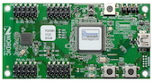

#nrf51x, nrf52x開発環境

## 開発ボード

| 開発ボード型番 | ボード情報 | 写真 |
| -- | -- |
| PCA10001 | [DevZone](https://devzone.nordicsemi.com/documentation/nrf51/4.3.0/html/group__nrf518__examples__pca10001.html#details) | |
| PCA10028 | [DevZone]() ||
| PCA10036 | [DevZone]() ||

## 開発環境(Nordic系)

nRF51822の開発環境構築について。

Windows編(標準環境)とMac(GCC)について説明します。
もちろんMac以外でGCC環境でやることも可能です。

## Windows編

開発に関しては色々便利＆簡単。
ただし開発環境(IDE)が有料になる。
無料で使う場合はコードサイズが32k制限。

### 環境構築手順

* IDE<br>
[https://www.keil.com/demo/eval/arm.htm](https://www.keil.com/demo/eval/arm.htm)

ここからダウンロード＆インストール。これが32k制限あり。

* SDK<br>
[https://www.nordicsemi.com/eng/Products/Bluetooth-R-low-energy/nRF51822](https://www.nordicsemi.com/eng/Products/Bluetooth-R-low-energy/nRF51822)

* SDK(旧バージョン)<br>
http://developer.nordicsemi.com/

ここから「nRF518-SDK」をダウンロード＆インストール。
ダウンロードにはシリアルナンバーが必要。

* JLink<br>
https://www.segger.com/jlink-software.html

ここからダウンロード＆インストール。ボード上のSEGGERチップに書いてある番号が必要。

### ビルド＆実行

> C:\Nordic Semiconductor\nRF51 SDK_v5.2.0.39364\Nordic\nrf51822\Board\pca10001\blinky_example\arm\blinky.uvproj
 
を開いて実行。LEDがチカチカすれば成功。

### BLEスタック
スタックを別で書き込まないとBLEとして動作しないです。
[https://www.nordicsemi.com/eng/Products/Bluetooth-R-low-energy/nRF51822](https://www.nordicsemi.com/eng/Products/Bluetooth-R-low-energy/nRF51822)

ここから「nRFgo Studio」と「S110-SD-v6」をダウンロード。
「nRFgo Studio」をインストール。「S110-SD-v6」は展開して適当なフォルダへ。 S110がペリフェラル用BLEスタックでnRFgoがROM書きツールになります。
nRFgoで「Program SoftDevice」からS110内のhexファイルを選択してProgram。
その後、プログラム部分を書き込む。例えば、

> C:\Nordic Semiconductor\nRF51 SDK_v5.2.0.39364\Nordic\nrf51822\Board\pca10001\s110\ble_app_beacon\arm\ble_app_beacon.uvproj

を書き込めばiBeaconとして動きます。

## Mac編

Makeファイルの作成など不便な点が多い。
コードサイズの上限は無い。Mac上で開発＆書き込みが出来る。

### 環境構築手順

* SDK&SoftDevice<br>
[https://www.nordicsemi.com/eng/Products/Bluetooth-R-low-energy/nRF51822](https://www.nordicsemi.com/eng/Products/Bluetooth-R-low-energy/nRF51822)

ここから「nRF51-SDK-zip」と「S110-SD-v6」をダウンロード。

* JLink<br>
[http://www.segger.com/jlink-software.html?step=1&file=JLinkMacOSX_484](http://www.segger.com/jlink-software.html?step=1&file=JLinkMacOSX_484)

ここからダウンロード＆インストール。ボード上のSEGGERチップに書いてある番号が必要。
Xcodeコマンドラインツール
ターミナルで以下のコマンドを実行する。

> xcode-select --install

* ARM用GCC<br>
[https://launchpad.net/gcc-arm-embedded/4.8/4.8-2013-q4-major](https://launchpad.net/gcc-arm-embedded/4.8/4.8-2013-q4-major)

ここからMac用をDLし適当な場所に展開。

* ビルド

[sdk]/nrf51_sdk/nrf51822/Source/templates/gcc
内にMakefile.macを作成し以下の内容を記述。

```
GNU_INSTALL_ROOT := [インストールした場所]/gcc-arm-none-eabi
GNU_VERSION := 4.8
GNU_PREFIX := arm-none-eabi
```

Makefile.commonの9行目付近を以下のように修正。

```
#ifeq ($(OS),Windows_NT)
#include $(TEMPLATE_PATH)Makefile.windows
#else
#include $(TEMPLATE_PATH)Makefile.posix
#endif
include $(TEMPLATE_PATH)Makefile.mac
```

後は、例えば下記フォルダ内でMakeを実行すると_buildファイル内にbinファイルができる。

```
[sdk]/nrf51_sdk/nrf51822/Board/pca10001/blinky_example/gcc
```

* 書き込み
ターミナルでJLinkを操作してビルドで生成したbinファイルを書き込む。
下記のようにコマンドを実行すれば書き込まれるはずです。

J-Link接続
```
$  JLinkExe -Device nrf51822 -if SWD
SEGGER J-Link Commander V4.84 ('?' for help)
Compiled Mar 28 2014 16:35:14
Info: Device "NRF51822_XXAA" selected (257 KB flash, 16 KB RAM).
DLL version V4.84, compiled Mar 28 2014 16:35:10
Firmware: J-Link OB-SAM3U128 V1 compiled Dec 11 2013 20:20:11
Hardware: V1.00
S/N: 480203827 
VTarget = 3.300V
Info: Found SWD-DP with ID 0x0BB11477
Info: Found Cortex-M0 r0p0, Little endian.
Info: FPUnit: 4 code (BP) slots and 0 literal slots
Found 1 JTAG device, Total IRLen = 4:
Cortex-M0 identified.
Target interface speed: 100 kHz
J-Link>
```

### 転送
```
J-Link>loadbin _build/blinky_gcc_xxaa.bin 0x0
```

### 終了
```
J-Link>q
```
ちなみにS110を書き込んである場合は0x0を0x14000に変更してください。

コマンド集

デバイスの設定
```
device nrf51822
```

スピードの設定
```
speed 1000
```

Flash全体の削除
```
w4 4001e504 2
w4 4001e50c 1
w4 4001e514 1
r
```

Flashに書き込めるようにする
```
w4 4001e504 1
```
おまけ

VTarget = 0.000Vだと基板に電源はいっていない

```
J-Link>q
akira-air:gcc akira$  JLinkExe -Device nrf51822 -if SWD
SEGGER J-Link Commander V4.84 ('?' for help)
Compiled Mar 28 2014 16:35:14
Info: Device "NRF51822_XXAA" selected (257 KB flash, 16 KB RAM).
DLL version V4.84, compiled Mar 28 2014 16:35:10
Firmware: J-Link Lite-Cortex-M V8 compiled Aug 29 2012 15:24:23
Hardware: V8.00
S/N: 518005916 
Feature(s): GDB 
VTarget = 0.000V
J-Link>
```

PCA10001では一度、認識しなくなると、再起動が必要になる。

0x00014000ではうまくいく
```
J-Link>loadbin _build/blinky_gcc_xxaa.bin 0x00014000
Downloading file... [_build/blinky_gcc_xxaa.bin]
Info: J-Link: Flash download: Flash programming performed for 1 range (3072 bytes)
Info: J-Link: Flash download: Total time needed: 1.661s (Prepare: 0.759s, Compare: 0.010s, Erase: 0.000s, Program: 0.570s, Verify: 0.004s, Restore: 0.315s)
J-Link>
```

```
Hello NRF51822
```

```
#include <stdbool.h>
#include <stdint.h>
#include "nrf_delay.h"
#include "nrf_gpio.h"
#include "boards.h"

/**
 * @brief Function for application main entry.
 */
int main(void)
{
  // Configure LED-pins as outputs
  nrf_gpio_cfg_output(LED_0);
  nrf_gpio_cfg_output(LED_1);
  
  // LED 0 and LED 1 blink alternately.
  while(true)
  {
    nrf_gpio_pin_clear(LED_0);
    nrf_gpio_pin_set(LED_1);
    
    nrf_delay_ms(500);
    
    nrf_gpio_pin_clear(LED_1);
    nrf_gpio_pin_set(LED_0);
    
    nrf_delay_ms(500);
  }
}
```

## SPI Pin

PCA10001
```
#define SPIS_MISO_PIN  20    // SPI MISO signal. 
#define SPIS_CSN_PIN   21    // SPI CSN signal. 
#define SPIS_MOSI_PIN  22    // SPI MOSI signal. 
#define SPIS_SCK_PIN   23    // SPI SCK signal.
```

PCA10028
```
#define SPIS_MISO_PIN  28    // SPI MISO signal. 
#define SPIS_CSN_PIN   12    // SPI CSN signal. 
#define SPIS_MOSI_PIN  25    // SPI MOSI signal. 
#define SPIS_SCK_PIN   29    // SPI SCK signal.
```
## LED Pin

PCA10001
```
#define LED_START      18
#define LED_0          18
#define LED_1          19
#define LED_STOP       19
```

PCA10028
```
#define LED_START      21
#define LED_1          21
#define LED_2          22
#define LED_3          23
#define LED_4          24
#define LED_STOP       24
```

## URAT Pin

PCA10001
```
#define RX_PIN_NUMBER  11
#define TX_PIN_NUMBER  9
```

PCA10028
```
#define RX_PIN_NUMBER  11
#define TX_PIN_NUMBER  9
```