# 開発環境(SoftDevice 8.02/Keil MDK5.16)

# SoftDeviceを使ったプログラムの作成方法 

## 使用した環境
* MDK-Lite Ver. 5.16a
* Windows 7
* nRF51822 Development Dongle (PCA10000)
* [リファレンス](http://infocenter.nordicsemi.com/index.jsp?topic=%2Fcom.nordic.infocenter.sdk51.v9.0.0%2Findex.html&cp=4_1_0)

## 手順

### SoftDeviceを書き込むためのTarget作成

nRFgo StudioでもSoftDeviceの書き込みはできるが、Keil上に構築しておけばSoftDeviceとApplicationの書き込みの両方を同じツール上でできるので便利になる。

1. Keil uVision5を起動する

2. PackでSoftDeviceをインストールする  
 2.1. PackInstallerを起動する  
  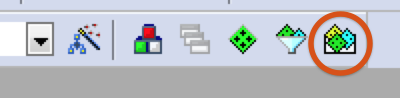  
 2.2. 左ペインのDevicesからNordicを選択する  
 2.3. 右ペインのPacksからSoftDevice_S110をInstallする
    
 2.4. PackInstallerを閉じる

3. uVision5のProjectメニューから新たにプロジェクトを作成する

4. Deviceの設定を聞かれるのでSofware PacksのnRF51822_xxAAを選択する
  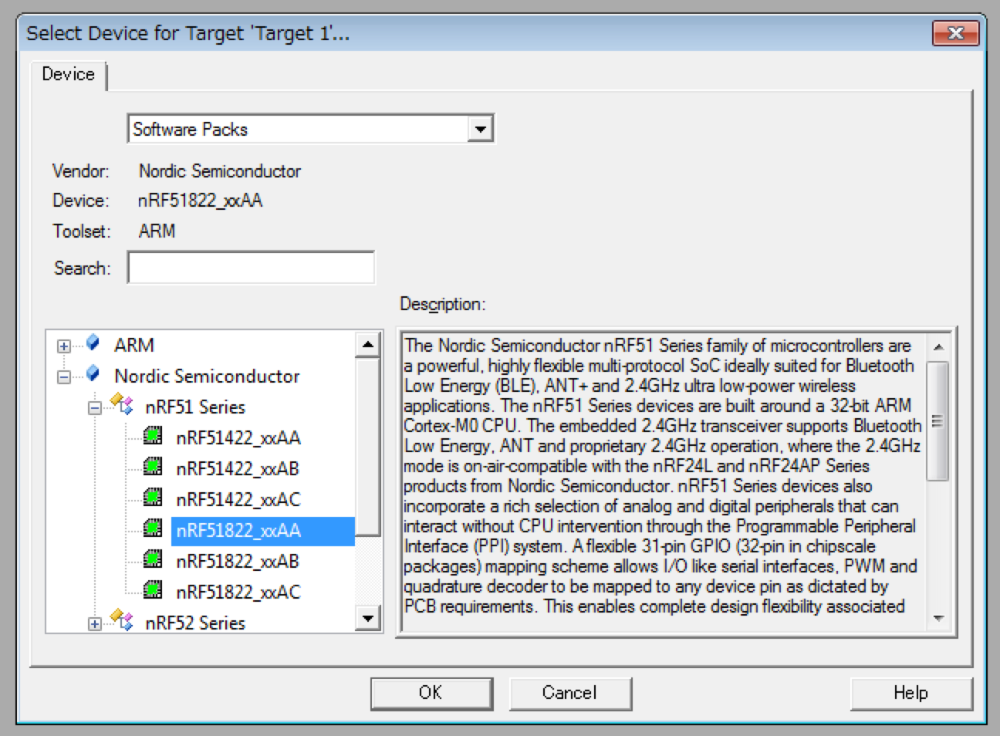  

5. Targetの作成  
 5.1. ManageProjectItemsを選択する  
    
 5.2. Target名とGropusを設定する  
      今回は「FlashSoftDevice」と「Application」とする
  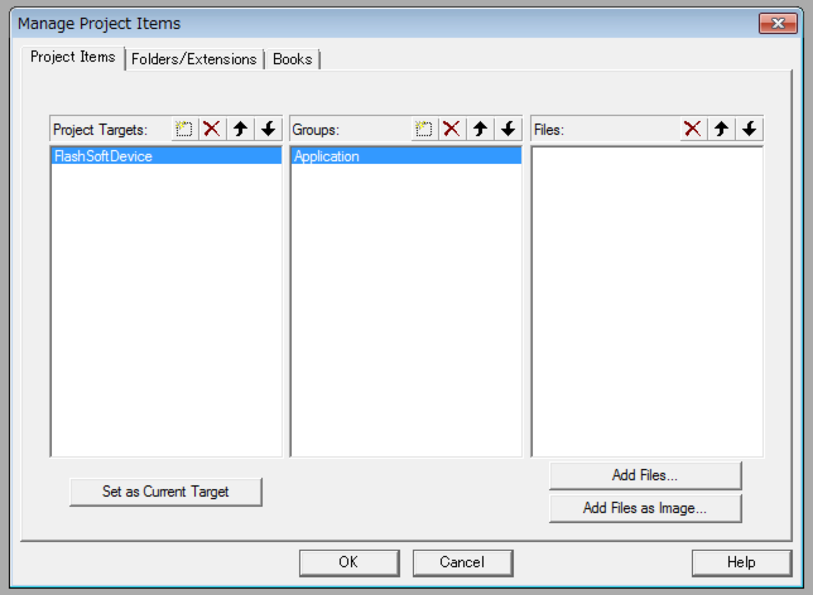

6. SoftDeviceの読み込み  
 6.1. Manage Run-Time Environmentを選択する  
  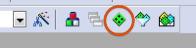  
 6.2. nRF_SoftDeviceからs110_hexを選択する  
      この時オレンジ色になり依存関係のエラーが表示されますが、左下のResolveボタンを押せば修正されます。  
  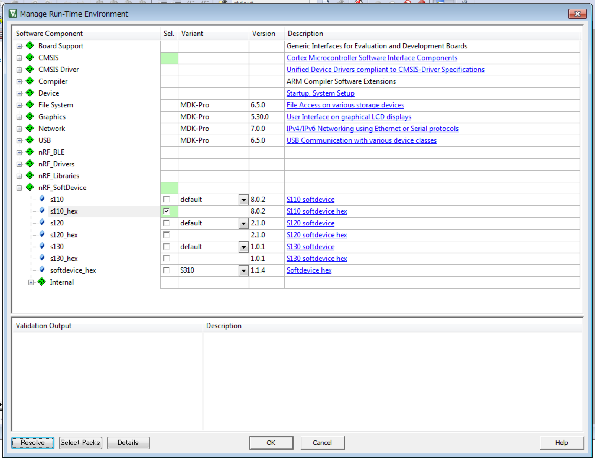  
 6.3. OKを押して閉じる

7. Targetの設定  
 7.1. Options for Targetを選択する  
    
 7.2. OutputタブのSelect Folder for Objects...を選択し、プロジェクトフォルダ下の"\RTE\nRF_SoftDevice\nRF51822_xxAA"を選択する  
 7.3. Name of Executableに"s110_softdevice.hex"とファイル名を入力する
  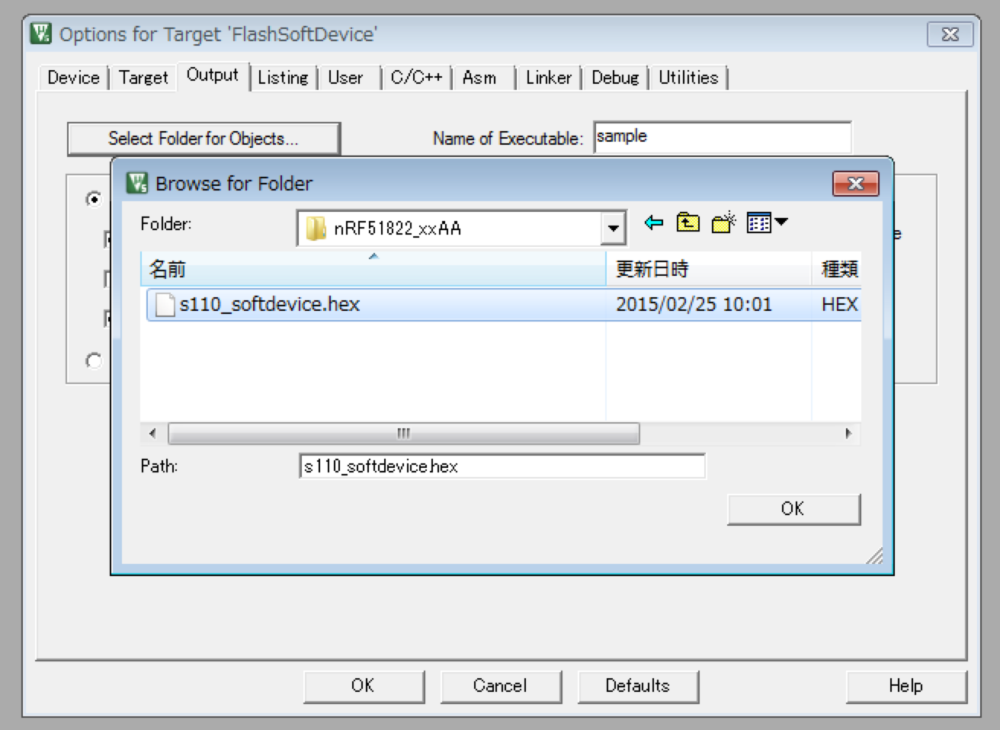  
 7.4. DebugタブのUseを"J-LINK / J-TRACE Cortex"に変更する  
  
 7.5. PortをSWに変更する
  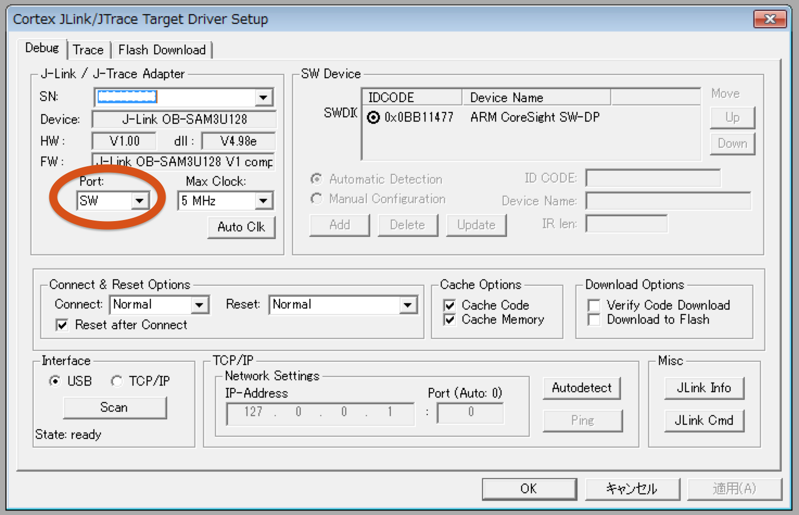
 7.6. Sizeを0x2000に(メモリマップのRAM_BASEの値)する  
      Addを選択して"nRF51xxx External ..."を追加する  
      古いAlgorithmはRemoveで削除する  
  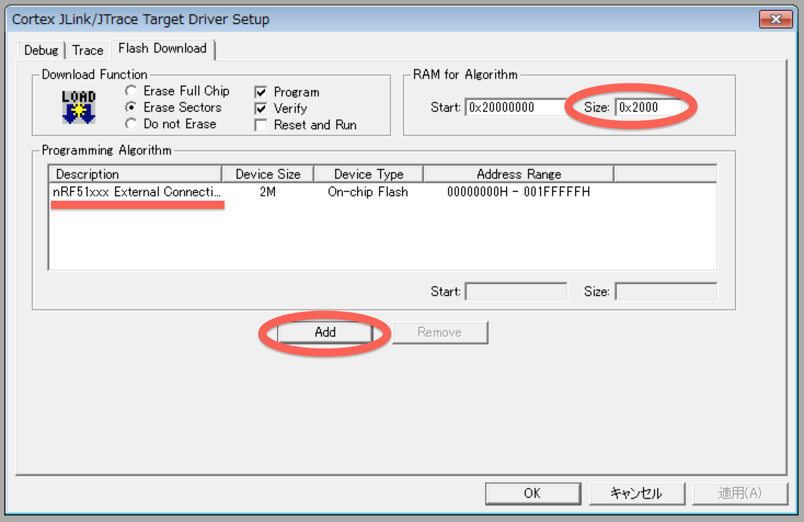

8. USBにPCA10000を差し込む

9. LOADボタンを押すとSoftDeviceの書き込みが開始されます  
 

### SoftDeviceを利用しないApplication作成

まず、まっさらなプロジェクトを作成するために、SoftDeviceの機能は利用しないが、SoftDeviceと共存する無機能のApplicationを作成する  
次にLEDを光らせ、最後にSoftDeviceの機能を利用するように段階的に説明する

1. Application用のTargetを作成  

 1.1. ManageProjectItemsを選択する  
    

 1.2. 新しいTargetを作成する  
      今回は"nRF51822_s110"とする
  

 1.3. 新しいターゲットを選択する  
  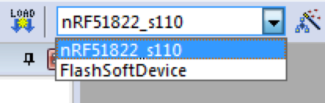

2. hexファイルをビルドターゲットから外す  

 2.1. nRF_SoftDeviceを右クリックし、"Options for Component..."を選択する  
  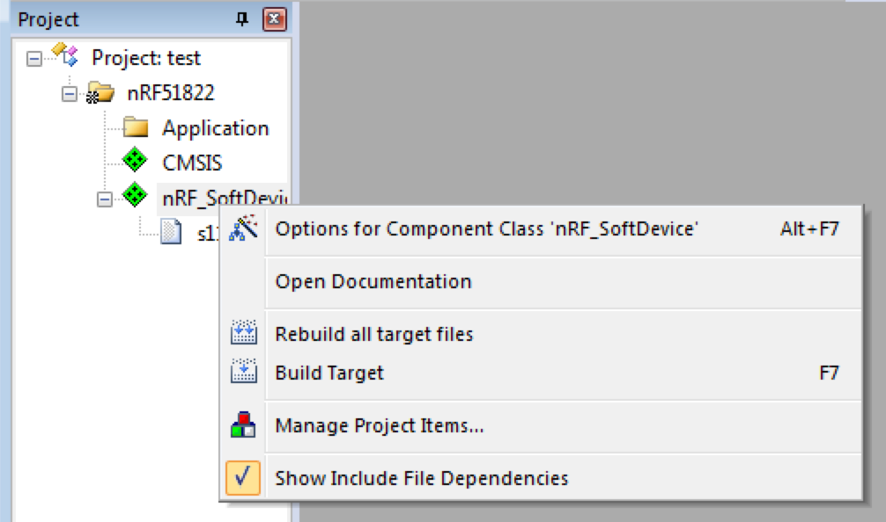  

 2.2. "Include in target build"のチェックを外す
  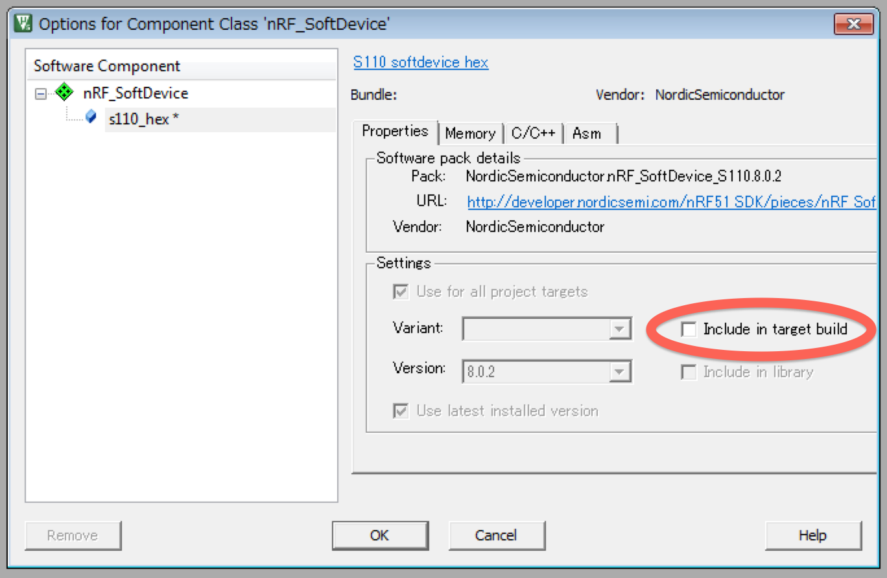

3. 設定を変更する  

 3.1. Options for Targetを選択する  
    

 3.2. Targetタブの設定を変更する  
  * Xtal:16.0
  * Use MicroLIB: ON
  * IROM1 Start: 0x18000
  * IROM1 Size: 0x28000
  * IRAM1 Start: 0x20002000
  * IRAM1 Size: 0x6000
   
  Xtalは発振器の速度、MicroLIBは最適化オプション、MemoryAreaはメモリマップを参考にROMにはAPP_CODE_BASE、RAMにはAPP_RAM_BASEを入力する  
    

 3.3. Outputタブの設定を変更する   
    * "Select Folder for Objects.."で出力フォルダを選択する  
    * ここでは"_build"とする  
    * "Name of Executable"に出力hex名を入力する  
    * "Create HEX File"をチェックする  
   

 3.4. Listingタブの設定を変更する 
    * "Select Folder for Listings.."でOutputで設定したフォルダを選択する
   
   
 3.5. Linkerタブの設定を変更する
    * "Use Memory Layout from Target Dialog"をチェックし、メモリマップをTargetタブでの設定と同じくする
   

 3.6. JLinkの設定を変更する
    * "Reset and Run"をチェックし、書き込み時にリセット＆実行を行う
   
 
4. 必要なPackをインストールする  
 4.1. Manage Run-Time Environmentを選択する  
    
 4.2. DeviceのStartupを選択し、Bootに必要なプログラムをインストールする  
  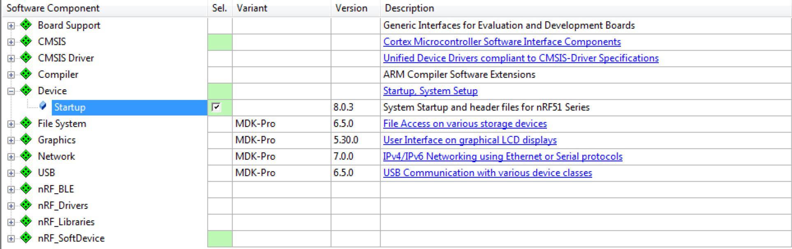

5. Applicationを作成する  
 5.1. Project内のグループ名(今回はApplication)を右クリックし、"Add New Item to.."を選択する
  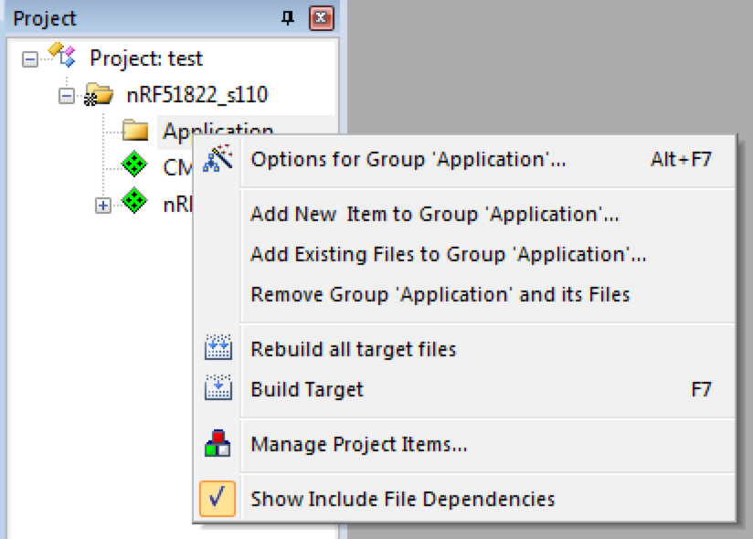
 5.2. main.cを作成する
  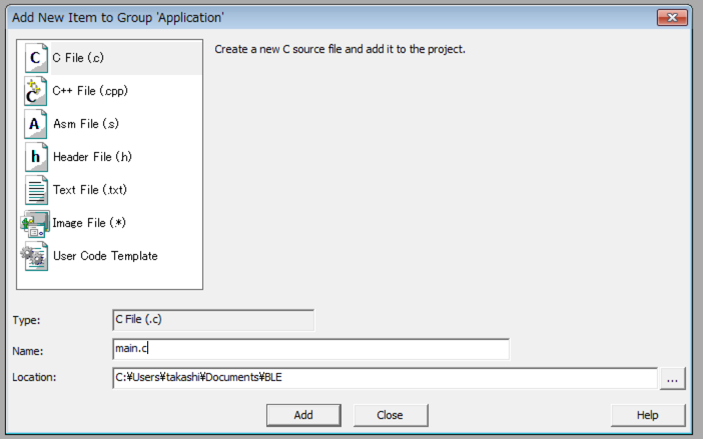
 5.3. 今回は無機能のApplicationなので、空のmain文のみにする

  ```int main() {  
  }
  ```

6. ビルドして実機にダウンロードする  
 6.1. ビルドボタンをクリックするとビルドされます  
 
 
 6.2. LOADボタンを押すとSoftDeviceの書き込みが開始されます  
 


## メモ

### デバッグログ

シリアルでログ出力する場合はapp_traceを利用する。  
packでnRF_Libraries->app_traceを追加する。  
このままだと１文字しか出力されないので、nRF_Drivers->app_uartのドロップダウンからFifoを選択する。

### SOFTDEVICE_HANDLER_INIT(CLOCK_SOURCE, EVT_HANDLER)

Akabeaconでは水晶に[ABS05](http://www.mouser.jp/ProductDetail/ABRACON/ABS05-32768KHZ-9-T/?qs=Pyu0ZBy%2FIJbsNYnIET1z3A%3D%3D)を利用している。  
スペックを見ると誤差20ppmなので、NRF_CLOCK_LFCLKSRC_XTAL_20_PPMを指定する。  
外部水晶がない場合は、NRF_CLOCK_LFCLKSRC_RC_250_PPM_4000MS_CALIBRATIONなどを指定すると内部水晶を利用する。  
内部水晶は250ppmなので時々補正が必要で、4000MS秒毎に補正を行うという意味。  

### ble_gap_conn_params_t

* min_conn_interval / max_conn_interval  
 CentralがPeripheralにデータを取得に行く間隔。7.5ms~4s。

* slave_latency
 送信するデータがない場合に接続を無視できる回数。

* conn_sup_timeout
 接続が切れたと判断するまでの時間。


#### Basic Rate/Enchanced Data Rate（BR/EDR）

BLEじゃない普通のBluetooth。


#### User Information Configuration Registers (UICR)

設定値を固定レジスタに書いておくことでビルド不要で設定値を変更する仕組み。  
プログラムで下記のように値を設定する。

```uint32_t UICR_ADDR_0x80 __attribute__((at(0x10001080))) __attribute__((used)) = 0x12345678;```

この値をJ-Linkで下記のようにする事で書き換える事ができる。

``` nrfjprog --snr <Segger-chip-Serial-Number> --memwr 0x10001080 --val 0xabcd0102```