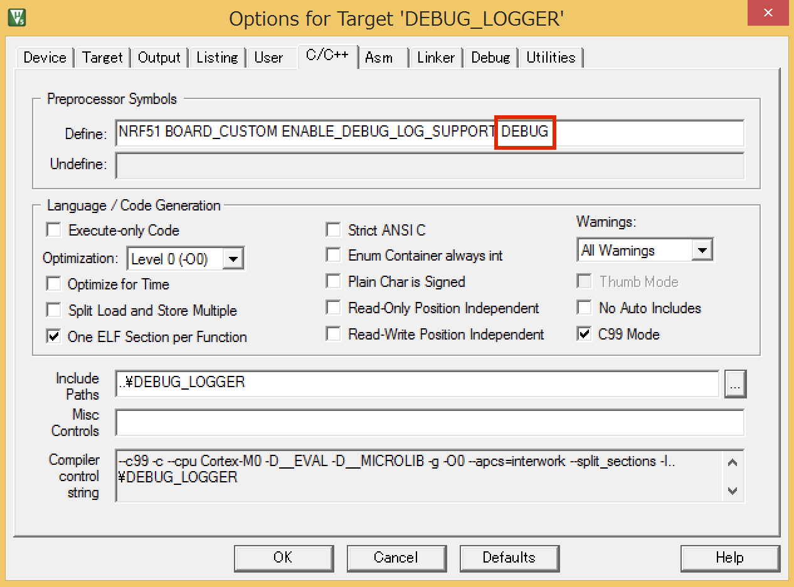
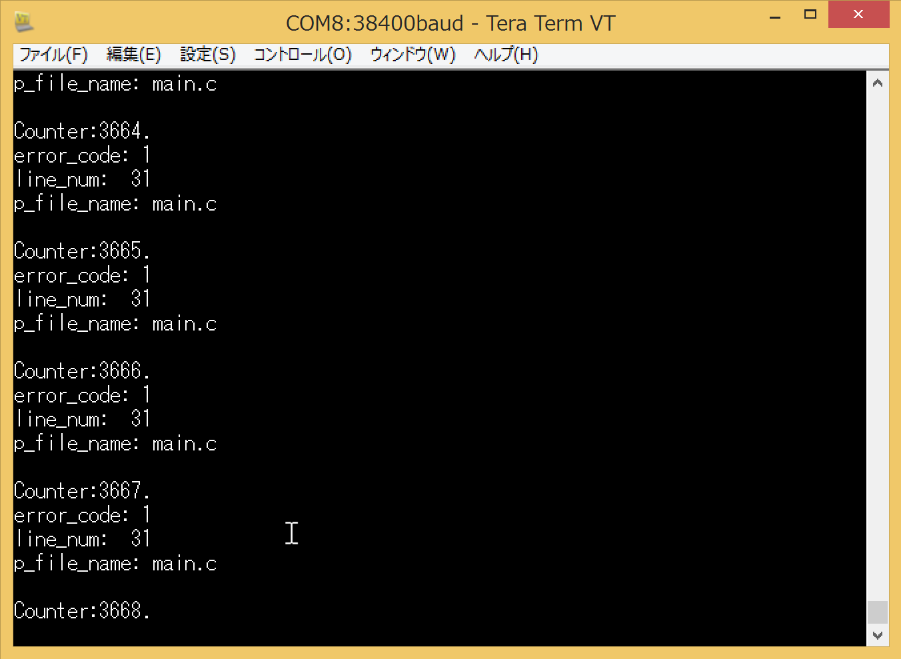

# Common application error handler

## SourceCode
[Common application error](http://infocenter.nordicsemi.com/index.jsp?topic=%2Fcom.nordic.infocenter.sdk51.v10.0.0%2Fgroup__app__error.html&resultof=%22app_error_handler%22%20)では、APP_ERROR_HANDLER(ERR_CODE)、APP_ERROR_CHECK(ERR_CODE)、APP_ERROR_CHECK_BOOL(BOOLEAN_VALUE)等をプログラム内に記述することで、エラーをハンドリングできる。

app_trace部分は、[Debug Logger](debug.md)の項目を参照。

main.c
```c
#include <stdbool.h>
#include "nrf_delay.h"
#include "app_trace.h"
#include "app_error.h"

int counter = 0;

/**
 * @brief エラーハンドラ.APP_ERROR_CHECKでエラーが発生している場合は、呼ばれる.
 */
void app_error_handler	(uint32_t error_code, uint32_t line_num, const uint8_t *p_file_name) 
{
	app_trace_log("error_code: %d\r\n", error_code);
	app_trace_log("line_num:  %d\r\n", line_num);
	app_trace_log("p_file_name: %s\r\n", p_file_name);
}

/**
 * @brief Main処理.
 */
int main(void)
{
    app_trace_init();

    while (true)
    {
        app_trace_log("\n\rCounter:%d.\r\n", counter);
        nrf_delay_ms(1000);
        counter++;
		
		APP_ERROR_CHECK(1);
    }
}

```

## Optionの設定

Common application error handlerを有効にするには、C/C++タブのDefineにDEBUGの記述を追記する。



## 出力例


