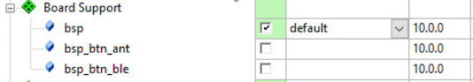
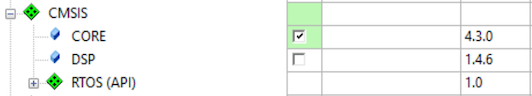
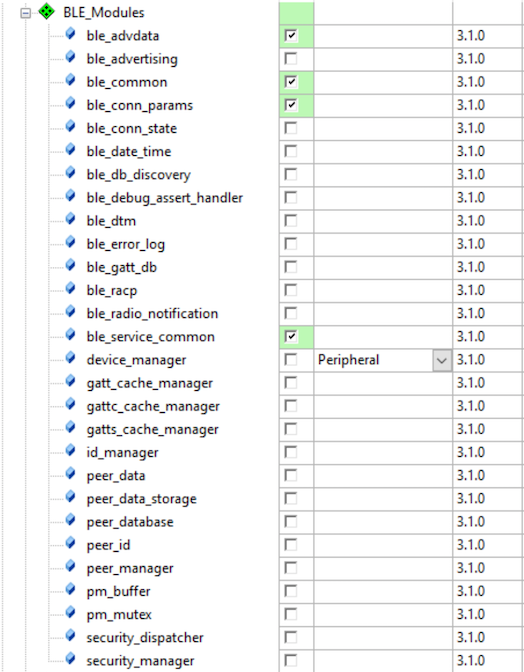
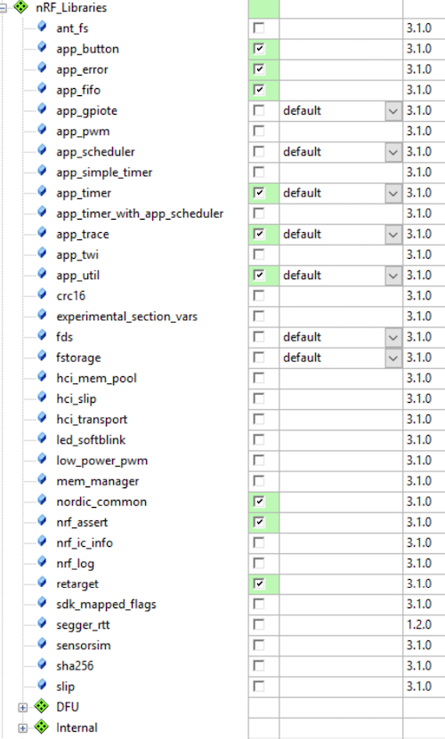

# SoftDeviceを有効にする

Nordicが提供しているnRF5xシリーズ向けのプロトコルスタック。BLE用はS110 SoftDevice, S120 SoftDevice, S130 SoftDeviceと３種類あり、それぞれ用途が異なる。ちなみにS210 SoftDeviceのANT/ANT+用のスタックで、S330 SoftDeviceはBLEとANT/ANT+用のスタックになる。

Bluetooth 4.2向けにはS132 SoftDevice, S212 SoftDevice, S332 SoftDeviceが提供され、これらは、nRF52シリーズのみでサポートされる。
    
## SoftDeviceの組み込み

[Debug Logger](debug.md)と[Common application error handler](error.md)を事前に組み込む。
 
## Source Code

main.c
```c
#include <stdbool.h>
#include "nrf_delay.h"
#include "app_trace.h"
#include "app_error.h"
#include "softdevice_handler.h"
#include "ble_conn_params.h"
#include "custom_board.h"

/**
 * @brief エラーハンドラ.APP_ERROR_CHECKでエラーが発生している場合は、呼ばれる.
 */
void app_error_handler(uint32_t error_code,
				uint32_t line_num,
				const uint8_t *p_file_name )
{
    app_trace_log("error_code: %d\r\n", error_code);
    app_trace_log("line_num:  %d\r\n", line_num);
    app_trace_log("p_file_name: %s\r\n", p_file_name);
}

/**
 * @brief 関連するModule群にシステムイベントを送出する関数.
 *
 * @details システムイベントが発生したあとに、システムイベント割り込みハンドラから呼び出される.
 *
 * @param[in]  sys_evt システムスタックイベント
 */
static void sys_evt_dispatch(uint32_t sys_evt)
{
}

/**
 * @brief BLEスタックイベントに関連するすべてのModule群にBLEスタックイベントを送出するための関数.
 *
 * @details BLEスタックイベントを受信したあと、メインループの中のスケジューラーから呼び出される.
 *          
 * @param[in]   p_ble_evt   Bluetoothスタックイベント.
 */
static void ble_evt_dispatch(ble_evt_t * p_ble_evt)
{
}

/**@brief Function for the Power manager.
 */
static void power_manage(void)
{
	uint32_t err_code = sd_app_evt_wait();
	APP_ERROR_CHECK(err_code);
}

int main() { 
	uint32_t err_code;
	
	// Denug loggerの初期化.
	app_trace_init();
	
	SOFTDEVICE_HANDLER_INIT(NRF_CLOCK_LFCLKSRC_RC_250_PPM_8000MS_CALIBRATION, NULL);

	// BLEスタックを有効にする. 
	ble_enable_params_t ble_enable_params;
	memset(&ble_enable_params, 0, sizeof(ble_enable_params));
	//ble_enable_params.gatts_enable_params.service_changed = IS_SRVC_CHANGED_CHARACT_PRESENT;
	err_code = sd_ble_enable(&ble_enable_params);
	APP_ERROR_CHECK(err_code);

	// BLEイベントを登録する.
	err_code = softdevice_ble_evt_handler_set(ble_evt_dispatch);
	APP_ERROR_CHECK(err_code);

	// BLEイベント群のためのSoftDeviceハンドラモジュールを登録.
	err_code = softdevice_sys_evt_handler_set(sys_evt_dispatch);
	APP_ERROR_CHECK(err_code);

	while(true){
		power_manage();
	}
}
```

custom_board.h
```c
#define RX_PIN_NUMBER 9
#define TX_PIN_NUMBER 11
#define RTS_PIN_NUMBER 100
#define CTS_PIN_NUMBER 100
```

## Optionの設定


Define:

    DEBUG BOARD_CUSTOM ENABLE_DEBUG_LOG_SUPPORT BLE_STACK_SUPPORT_REQD

BLEスタックを使えるようにするには、Defineに、BLE_STACK_SUPPORT_REQDを追記する。

    BLE_STACK_SUPPORT_REQD
    
## ソフトウェアコンポーネントの追加

|nRF_SoftDevice |
| -- | -- |
|  | 


| Board Support | CMSIS | Device|
| -- | -- |
|  |  |  |

| BLE Modules | nRF_Devices | nRF_Libraries|
| -- | -- |
|  |  |  |


