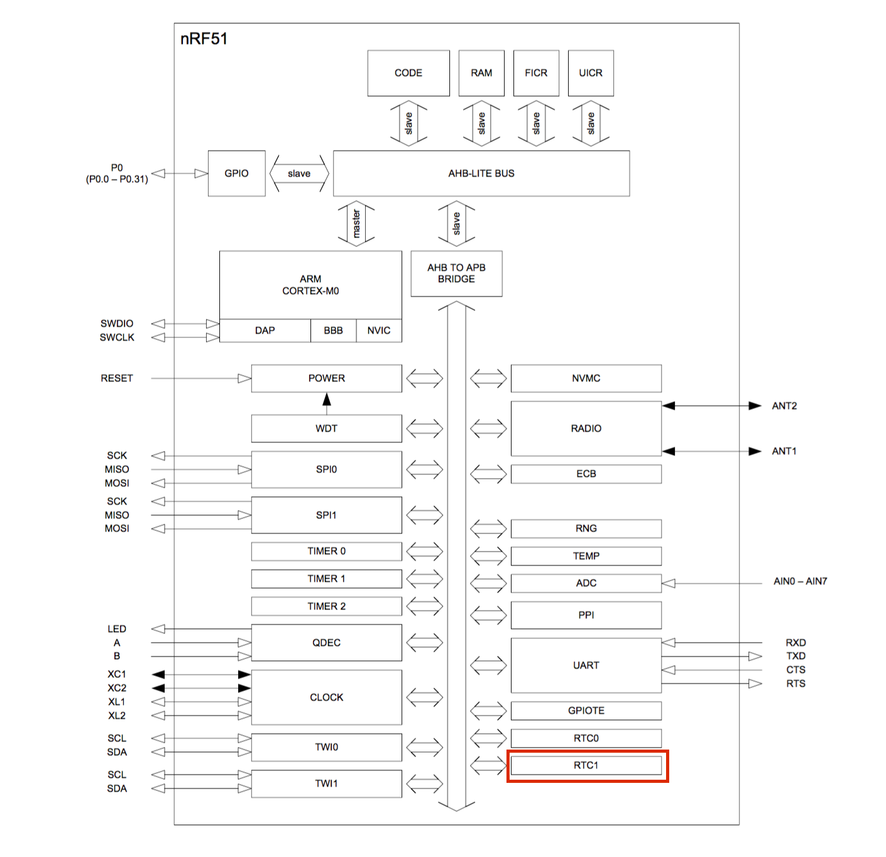

# Application Timer

[Appplication Timer](http://infocenter.nordicsemi.com/index.jsp?topic=%2Fcom.nordic.infocenter.sdk51.v10.0.0%2Fgroup__app__timer.html&resultof=%22Application%22%20%22applic%22%20%22timer%22%20)は、Real Time Counter1(RTC1)を用いた複数のTimerインスタンスを生成することができるモジュール。

nRF51内部には、Real Time Counterが2つ搭載されている(RTC0とRTC1)。Application TimerではRTC1を使用。RTC0は、SoftDeviceで使用。RTC1のアドレス番地は、0x40011000。(参考: [Table 2. Peripheral protection and usage by SoftDevice](http://infocenter.nordicsemi.com/index.jsp?topic=%2Fcom.nordic.infocenter.130.sds.v1.0.0%2Fsd_resource_reqs%2Fhw_block_interrupt_vector.html) )



nRF51 Series Reference Manual
Version 1.1 P7 より抜粋

## 事前準備

 [Debug Logger](dev/nrf51debug.md)と [Common application error handler](dev/nrf51error.md)の環境を構築しておく。

## SourceCode

main.c
```c
#include "stdbool.h"
#include "app_trace.h"
#include "nrf_delay.h"
#include "app_timer.h"

// アプリケーションタイマーの設定. 
#define APP_TIMER_PRESCALER             16    // RTC1 PRESCALER registerの値.
#define APP_TIMER_MAX_TIMERS            2     // このアプリケーションで使う最大のTimer数.
#define APP_TIMER_OP_QUEUE_SIZE         3     // Timer操作キーのサイズ.


int counter = 0;

void app_error_handler    (uint32_t error_code, uint32_t line_num, const uint8_t *p_file_name) 
{
	app_trace_log("error_code: %d\r\n", error_code);
	app_trace_log("line_num:  %d\r\n", line_num);
	app_trace_log("p_file_name: %s\r\n", p_file_name);
}

static void timer_handler(void *p_context){
	app_trace_log("App timer counter:%d\r\n", counter);
	counter++;
}


int main() {
    
    // Debug loggerの初期化.
	app_trace_init();
	
	// TimerIDを定義.
	APP_TIMER_DEF(mytimer_id);

    // Application Timerの初期化.
	APP_TIMER_INIT(APP_TIMER_PRESCALER, APP_TIMER_OP_QUEUE_SIZE, false);
	
	NRF_CLOCK->TASKS_LFCLKSTART = 1;
    while (NRF_CLOCK->EVENTS_LFCLKSTARTED == 0);
	
	uint32_t error_code;
	app_timer_id_t mytimer_id;
	
	// Timerの作成.
	error_code = app_timer_create(&mytimer_id, APP_TIMER_MODE_REPEATED, timer_handler);
	APP_ERROR_CHECK(error_code);
	
	// Timerの開始.
	error_code = app_timer_start(mytimer_id, APP_TIMER_TICKS(1000, APP_TIMER_PRESCALER), NULL);
	APP_ERROR_CHECK(error_code);
	
	while(true){
			
	}

}

```

## Reference

* [Application timer tutorial](https://devzone.nordicsemi.com/tutorials/19/application-timer-and-scheduler-tutorial/)