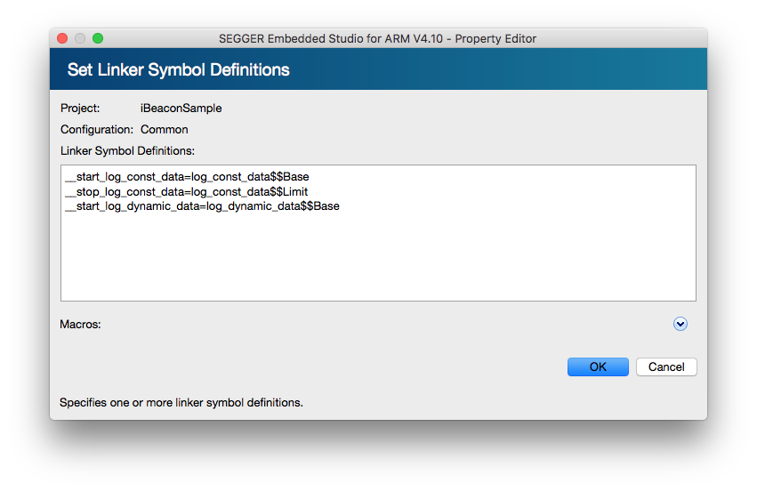

# LOGの出力　

## Build Optionの設定
Project ExplorerでProject選択後、OptionsボタンからOption画面を開く。その後、左上のdrop-down listでPrivate ConfigurationのCommonを選択し、以下のOptionを追加設定する

### Preprocessor -> User Include Directories
|Path|
|:--|
|(SDK_PATH)/modules/nrfx/drivers/src/prs|
|(SDK_PATH)/modules/nrfx/drivers/src|
|(SDK_PATH)/components/libraries/atomic|
|(SDK_PATH)/components/libraries/ringbuf|
|(SDK_PATH)/modules/nrfx/drivers/include|
|(SDK_PATH)/integration/nrfx/legacy|
|(SDK_PATH)/external/fprintf|
|(SDK_PATH)/components/libraries/balloc|
|(SDK_PATH)/components/libraries/memobj|
|(SDK_PATH)/components/libraries/log/src|
|(SDK_PATH)/components/libraries/strerror|
|(SDK_PATH)/components/libraries/experimental_section_vars|
|(SDK_PATH)/components/libraries/log|

### Linker -> Linker Symbol Definitions
|Symbol|
|:--|
|__start_log_const_data=log_const_data$$Base|
|__stop_log_const_data=log_const_data$$Limit|
|__start_log_dynamic_data=log_dynamic_data$$Base|



## SDK Source Fileの取り込み
Projectに以下のSourceを取り込む

|Source|
|:--|
|(SDK_PATH)/components/libraries/util/app_error.c|
|(SDK_PATH)/components/libraries/util/app_error_handler_gcc.c|
|(SDK_PATH)/components/libraries/util/app_error_weak.c|
|(SDK_PATH)/components/libraries/util/app_util_platform.c|
|(SDK_PATH)/components/libraries/atomic/nrf_atomic.c|
|(SDK_PATH)/components/libraries/balloc/nrf_balloc.c|
|(SDK_PATH)/integration/nrfx/legacy/nrf_drv_uart.c|
|(SDK_PATH)/external/fprintf/nrf_fprintf.c|
|(SDK_PATH)/external/fprintf/nrf_fprintf_format.c|
|(SDK_PATH)/components/libraries/log/src/nrf_log_backend_serial.c|
|(SDK_PATH)/components/libraries/log/src/nrf_log_backend_uart.c|
|(SDK_PATH)/components/libraries/log/src/nrf_log_default_backends.c|
|(SDK_PATH)/components/libraries/log/src/nrf_log_frontend.c|
|(SDK_PATH)/components/libraries/log/src/nrf_log_str_formatter.c|
|(SDK_PATH)/components/libraries/memobj/nrf_memobj.c|
|(SDK_PATH)/components/libraries/ringbuf/nrf_ringbuf.c|
|(SDK_PATH)/components/libraries/strerror/nrf_strerror.c|
|(SDK_PATH)/modules/nrfx/drivers/src/prs/nrfx_prs.c|
|(SDK_PATH)/modules/nrfx/drivers/src/nrfx_uart.c|
|(SDK_PATH)/modules/nrfx/drivers/src/nrfx_uarte.c|

## System Fileの編集
Cortex_M_Startup.sファイルを開き、以下の編集を行う

Cortex_M_Startup.s
```c
*** 省略 ***
ISR_HANDLER ExternalISR0
ISR_HANDLER ExternalISR1
ISR_HANDLER UARTE0_UART0_IRQHandler *変更
ISR_HANDLER ExternalISR3
ISR_HANDLER ExternalISR4
ISR_HANDLER ExternalISR5
ISR_HANDLER ExternalISR6
ISR_HANDLER ExternalISR7
ISR_HANDLER ExternalISR8
ISR_HANDLER ExternalISR9
*** 省略 ***
```

## Linker Scriptの編集
SEGGER_Flash.icfファイルを開き、以下の編集を行う

SEGGER_Flash.icf
```c
/*** 省略 ***/
//
// Block definitions
//
/*** 省略 ***/
define block log_const_data   { section .log_const_data*   }; //追加
define block log_dynamic_data { section .log_dynamic_data* }; //追加
//
// Explicit initialization settings for sections
//
/*** 省略 ***/
place in FLASH                           {
                                           block tdata_load,                       // Thread-local-storage load image
                                           section .nrf_balloc,   //追加
                                           section .log_backends, //追加
                                           block log_const_data,  //追加
                                           block log_dynamic_data //追加
                                         };
/*** 省略 ***/
```
main.c
```c
#include "app_error.h"
#include "bsp.h"

#define NRF_LOG_MODULE_NAME iBEACON_SAMPLE
#include "nrf_log.h"
NRF_LOG_MODULE_REGISTER();
#include "nrf_log_ctrl.h"
#include "nrf_log_default_backends.h"

#define LED1    BSP_BOARD_LED_0

void    log_init(void) {
    APP_ERROR_CHECK(NRF_LOG_INIT(NULL));
    NRF_LOG_DEFAULT_BACKENDS_INIT();
}

int main(void) {
    log_init();
    NRF_LOG_INFO("iBEACON_SAMPLE");
    NRF_LOG_FLUSH();

    bsp_board_init(BSP_INIT_LEDS);

    bsp_board_led_on(LED1);

    while(true) {
    }
}
```
