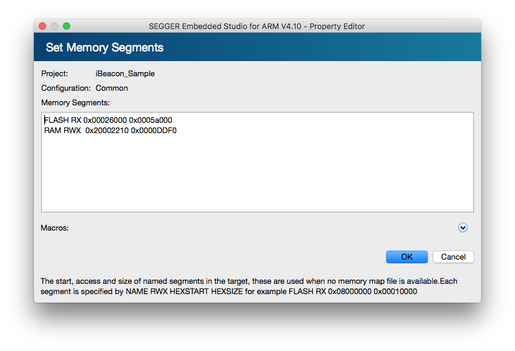

# SoftDeviceの焼き込み

## Build Optionの設定
Project ExplorerでProject選択後、OptionsボタンからOption画面を開く。その後、左上のdrop-down listでPrivate ConfigurationのCommonを選択し、以下のOptionを追加設定する

### Loader -> Additional Load File[0]
|S132 SoftDevice|
|:--|
|(SDK_PATH)/components/softdevice/s132/hex/s132_nrf52_6.1.0_softdevice.hex|

### Build -> Memory Segments
FLASH領域の開始アドレスを0x00026000、サイズを0x0005a000に設定する。更にRAM領域の開始アドレスを0x20002210、サイズを0x0000DDF0に設定する

### Preprocessor -> Preprocessor Definitions
|Option|
|:--|
|SOFTDEVICE_PRESENT|

### Preprocessor -> User Include Directories
|Path|
|:--|
|(SDK_PATH)/components/softdevice/s132/headers|
