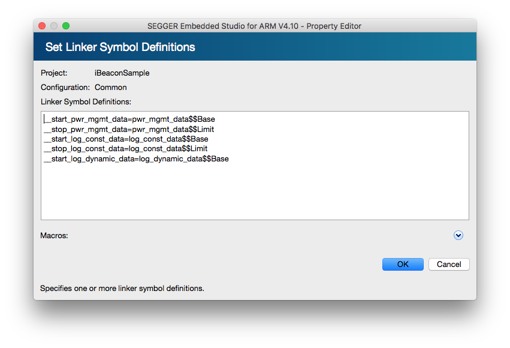

# PowerManage

パワーマネージの処理を実装。

## Build Optionの設定
Project ExplorerでProject選択後、OptionsボタンからOption画面を開く。その後、左上のdrop-down listでPrivate ConfigurationのCommonを選択し、以下のOptionを追加設定する

### Preprocessor -> User Include Directories
|Path|
|:--|
|(SDK_PATH)/components/softdevice/common|
|(SDK_PATH)/components/libraries/mutex|
|(SDK_PATH)/components/libraries/pwr_mgmt|

### Liker -> Linker Symbol Definitions
|Symbol|
|:--|
|__start_pwr_mgmt_data=pwr_mgmt_data$$Base|
|__stop_pwr_mgmt_data=pwr_mgmt_data$$Limit|



## SDK Source Fileの取り込み
Projectに以下のSourceを取り込む

|Source|
|:--|
|(SDK_PATH)/components/libraries/pwr_mgmt/nrf_pwr_mgmt.c|
|(SDK_PATH)/components/softdevice/common/nrf_sdh.c|
|(SDK_PATH)/components/libraries/experimental_section_vars/nrf_section_iter.c|

## Linker Scriptの編集
SEGGER_Flash.icfファイルを開き、以下の編集を行う

SEGGER_Flash.icf
```c
/*** 省略 ***/
define block log_const_data   { section .log_const_data*   };
define block log_dynamic_data { section .log_dynamic_data* };
define block pwr_mgmt_data    { section .pwr_mgmt_data*    }; //追加
//
// Explicit initialization settings for sections
//
/*** 省略 ***/
place in FLASH                           {
                                           block tdata_load,                       // Thread-local-storage load image
                                           section .nrf_balloc,
                                           section .log_backends,
                                           block log_const_data,
                                           block log_dynamic_data,
                                           block pwr_mgmt_data //追加
                                         };
/*** 省略 ***/
```
main.c
```c
#include "app_error.h"
#include "bsp.h"
#include "nrf_pwr_mgmt.h"

#define NRF_LOG_MODULE_NAME iBEACON_SAMPLE
#include "nrf_log.h"
NRF_LOG_MODULE_REGISTER();
#include "nrf_log_ctrl.h"
#include "nrf_log_default_backends.h"

#define LED1    BSP_BOARD_LED_0

void    log_init(void) {
    APP_ERROR_CHECK(NRF_LOG_INIT(NULL));
    NRF_LOG_DEFAULT_BACKENDS_INIT();
}

int main(void) {
    log_init();
    NRF_LOG_INFO("iBEACON_SAMPLE");
    NRF_LOG_FLUSH();

    bsp_board_init(BSP_INIT_LEDS);

    APP_ERROR_CHECK(nrf_pwr_mgmt_init());

    bsp_board_led_on(LED1);

    while(true) {
        if(NRF_LOG_PROCESS() == false) {
            nrf_pwr_mgmt_run();
        }
    }
}
```
