# #101 LED Brick

<center>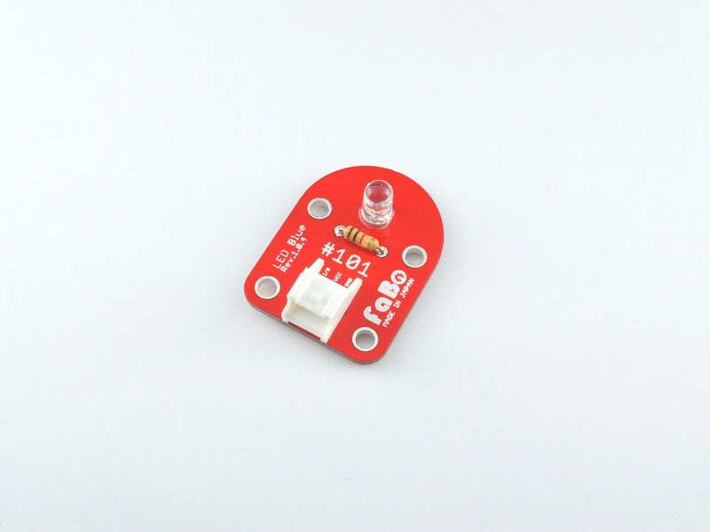
<!--COLORME-->

## Overview
LEDのBrickです。発光色は5色（青・緑・赤・白・黄）あります。Lチカのおともにもどうぞ。

※購入時は色の間違いにご注意ください。

## Connecting
アナログコネクタ(A0〜A5)、またはデジタルコネクタ(2〜13)のいずれかに接続します。（サンプルはA0に接続します。）

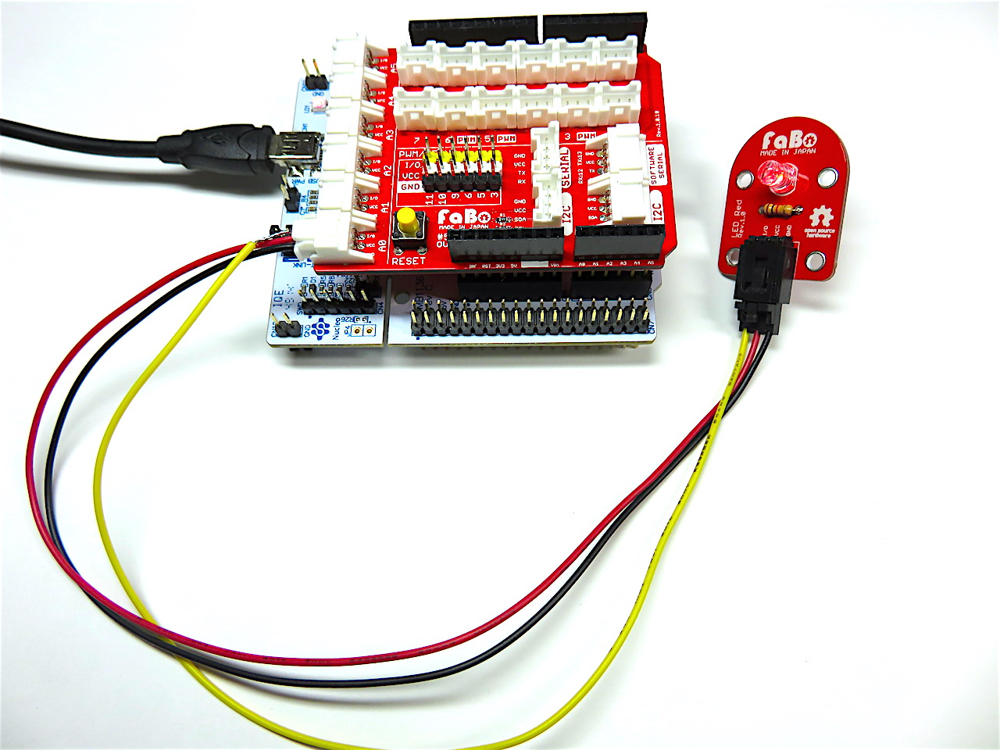

## Schematic


## Sample Code
A0コネクタにLED Brickを接続し、一定時間(1秒=1000ms)ごとに点灯/消灯（Lチカ）させています。

汎用入出力であるGPIOを使ってLEDを点滅させます。Ardunoなどとは違い、LEDを点滅するだけでも、GPIOの初期化、クロック、タイマのクロックなどの、たくさんの手続きを記述しなくてはいけないので、自動的にテンプレートを作成してくれるソフトウェアSTM32CubeMXを使用します。それに伴いHALライブラリがインストールされます。ST32シリーズは、これまでは機種ごとにライブラリを使い分けをしなくてはいけなかったのですが、Necleoが発表されHALライブラリが登場。機種が違っても、ほぼ共通のライブラリがそのまま使えます。

コンフィグレーションアンドコードジェネレータSTM32CubeMXの入手先
http://www.st.com/content/st_com/en/products/development-tools/software-development-tools/stm32-software-development-tools/stm32-configurators-and-code-generators/stm32cubemx.html

ダウンロードしインストールします。
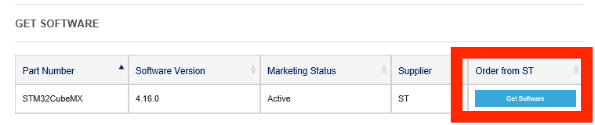


STM32CubeMXの起動します。New Projectを選びます。


ターゲットとなるボートを選びます。BoardSelectorタブをクリックし、下記のように選び、OKを押します。


ArduinoピンのA0であるMCUのピンに対応するピンアサインはPA0になります。したがってGPIOAのピン０となります。
PA0を右クリックしてGPIO_OUTPUTにします。


GenerateCordeボタンをクリックします。

使用しているIDEを選びます。任意のプロジェクト名を記入しMDK-ARM V5を選択。OKボタンをクリックします。HALライブラリが読み込まれます。しばらくすると、ダイヤログが表示されOpne Folderを選びます。


参考～HALライブラリAPI Description of STM32F4xx HAL drivers
http://www.st.com/content/ccc/resource/technical/document/user_manual/2f/71/ba/b8/75/54/47/cf/DM00105879.pdf/files/DM00105879.pdf/jcr:content/translations/en.DM00105879.pdf

手間のかかる設定などは、自動設定され、以下のプロジェクトのフォルダー群が生成されます。それに伴いコンポーネントやソースファイルがフォルダで分けられます。

Driversフォルダ（ライブラリ）
Incフォルダ（ヘッダーファイル）
MDK-ARM（Keilのプロジェクトファイル）
Srcフォルダ（ソースファイル）
iocのファイル（STM32CubeMXのファイル）

MDK-ARMフォルダをクリックします。また、sample_led.iocはSTM32CubeMXのファイルでGPIOなど追加したいとき再設定が可能です。


プロジェクト名\Src\ディレクトリにmain.c（ユーザーが記入する）,stm32f4xx_hal_msp.c（コード生成によるMSP初期化）、stm32f4xx_it.c（割り込みの定義）の３つのファイルが作られます。


ARMでは不可欠となるSystemClock_Config（システムクロック設定）とvoid MX_GPIO_Init(GPIO初期化)やＧＰＩＯの設定（入出力、プルアッププルダウン、ＧＰＩＯのクロック）など自動でコードが生成されます。（一部）

```c
/** System Clock Configuration
*/
void SystemClock_Config(void)
{

  RCC_OscInitTypeDef RCC_OscInitStruct;
  RCC_ClkInitTypeDef RCC_ClkInitStruct;

  __HAL_RCC_PWR_CLK_ENABLE();

  __HAL_PWR_VOLTAGESCALING_CONFIG(PWR_REGULATOR_VOLTAGE_SCALE2);

  RCC_OscInitStruct.OscillatorType = RCC_OSCILLATORTYPE_HSI;
  RCC_OscInitStruct.HSIState = RCC_HSI_ON;
  RCC_OscInitStruct.HSICalibrationValue = 16;
  RCC_OscInitStruct.PLL.PLLState = RCC_PLL_NONE;
  if (HAL_RCC_OscConfig(&RCC_OscInitStruct) != HAL_OK)
  {
    Error_Handler();
  }

  RCC_ClkInitStruct.ClockType = RCC_CLOCKTYPE_HCLK|RCC_CLOCKTYPE_SYSCLK
                              |RCC_CLOCKTYPE_PCLK1|RCC_CLOCKTYPE_PCLK2;
  RCC_ClkInitStruct.SYSCLKSource = RCC_SYSCLKSOURCE_HSI;
  RCC_ClkInitStruct.AHBCLKDivider = RCC_SYSCLK_DIV1;
  RCC_ClkInitStruct.APB1CLKDivider = RCC_HCLK_DIV1;
  RCC_ClkInitStruct.APB2CLKDivider = RCC_HCLK_DIV1;
  if (HAL_RCC_ClockConfig(&RCC_ClkInitStruct, FLASH_LATENCY_0) != HAL_OK)
  {
    Error_Handler();
  }

  HAL_SYSTICK_Config(HAL_RCC_GetHCLKFreq()/1000);

  HAL_SYSTICK_CLKSourceConfig(SYSTICK_CLKSOURCE_HCLK);

  /* SysTick_IRQn interrupt configuration */
  HAL_NVIC_SetPriority(SysTick_IRQn, 0, 0);
}

static void MX_GPIO_Init(void)
{

  GPIO_InitTypeDef GPIO_InitStruct;

  /* GPIO Ports Clock Enable */
  __HAL_RCC_GPIOA_CLK_ENABLE();

  /*Configure GPIO pin Output Level */
  HAL_GPIO_WritePin(GPIOA, GPIO_PIN_0, GPIO_PIN_RESET);

  /*Configure GPIO pin : PA0 */
  GPIO_InitStruct.Pin = GPIO_PIN_0;
  GPIO_InitStruct.Mode = GPIO_MODE_OUTPUT_PP;
  GPIO_InitStruct.Pull = GPIO_NOPULL;
  GPIO_InitStruct.Speed = GPIO_SPEED_FREQ_LOW;
  HAL_GPIO_Init(GPIOA, &GPIO_InitStruct);

}


```

OptionsforTagetボタンを押しC/C++タブで確認してみましょう。SM32CubeMXで生成された場合、インクルードパス（コンポーネント、ソースファイル）はプロジェクトファイルとは別フォルダにあります。プリプロセッサーシンボルが設定され、Optimization（最適化）は、最高レベルのLEVEL3に設定されていますが状況に合わせて調整し、MiscControlsはコンパイラに対する命令で、C言語の規格はC99となります。

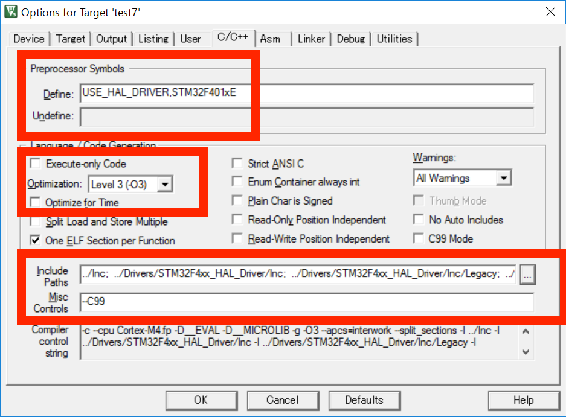


参照先のフォルダ(インクルードパス)


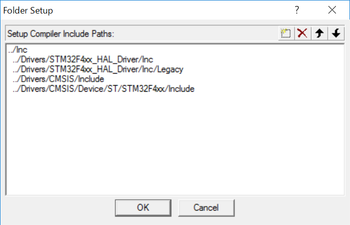


以上準備ができ、while文の中身だけを記述。 /* USER CODE BEGIN 3 */ と/* USER CODE END 3 */の間に記述するようにすると、あとでＳＴＭ32CubeＭXで変更されても、その中身はだけ変更されます。

```c

int main(void)
{
  HAL_Init();
  SystemClock_Config();
  MX_GPIO_Init();
  while (1)
  {
    /* USER CODE END WHILE */
    HAL_GPIO_WritePin(GPIOA,GPIO_PIN_0,GPIO_PIN_SET);
	  HAL_Delay(1000);
	  HAL_GPIO_WritePin(GPIOA,GPIO_PIN_0,GPIO_PIN_RESET);
	  HAL_Delay(1000);
     /* USER CODE BEGIN 3 */
  }
}

```

Buildボタンをクリック。（ショートカットF7キー）
Buildは変更されたターゲットファイルのみビルドします。rebuildは、すべてのターゲットファイルをビルドします。ビルドに成功すると0 error 0warningと表示されます。

<Build>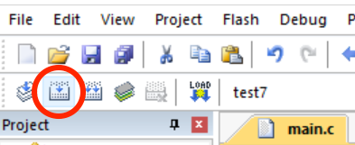

Ｄｏｗｎｌｏａｄボタンをクリック。（ショートカットF８キー）

<download>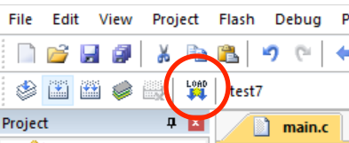

書き込みが成功すると。

<sccess>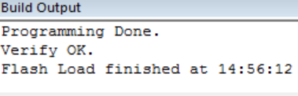

マイコンの起動にはリセットが必要で実行にはブートローダープログラム（メモリ,システムクロック,レジスタ初期化,設定）を動かす必要があります。これは自動的にファームウェアに含まれます。リセットボタンを押して、Brick LEDが点滅したかどうか動作をご確認ください。

##タイマー割り込みによるLチカ
A0にLED Brickを接続し、１秒ごとにLチカ（点滅）させます。
先ほどは、HAL_Delayを使い遅延を起こしてLチカさせていましたが、遅延を実行中は、なにもできません。
また、他の優先させたい処理等があれば、割り込ませるとこができます。
Necleoにはタイマー(TIM)がいくつかありまして、今回は、TIM1を使用します。
タイマーの周波数８４MHｚを8400分割して、１０KHZにします。１クロックあたり、１００μ秒となります。
ピリオドはタイマーの最大１６bitのカウンタ（最大65535まで）でいっぱいになるとゼロにもどります。
今回のピリオドは、１秒にしたいので、1*10^6/100=10000とします。
プリスケーラの値は、１少ない、8399となります。

クロック（オシレータ）は、外部内部ともに４つあります。外部はオプションとなっております。外部クロックを使えば正確な発振が可能で水晶またはセラミック振動子が使用可能です。低速なクロックを使用することで消費電力を抑えることができます。内部動作クロックも自由に設定できますが、周波数をあげれば消費電力は上昇してしまうので注意が必要です。

高速外部クロック(4から26MHz)
HSE

低速外部クロック（0から1000KHz）
LSE

高速内部クロック(16MHz)
HSI

低速内部クロック(32KHz)
LSI

###バスの周波数
AHB BUSは、APB1とAPB2に繋がっているバスです。周辺機器の周波数であるAPB1,APB2。これらは、Necleoによって最大周波数が異なります。最大周波数を超えると赤く表示されます。超えないようにしてください。APB2はAPB1よりも高速に動作します。周波数が高いほど高速に動作しますが、消費電力は上昇します。
timerclockが８４MHZになるように設定します。
<download>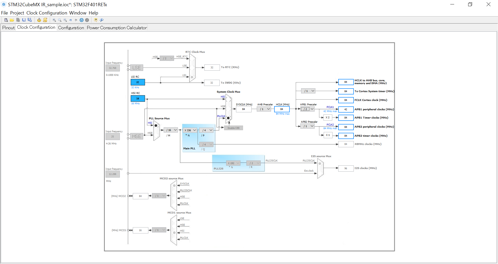
TIM1を選びます。
<download>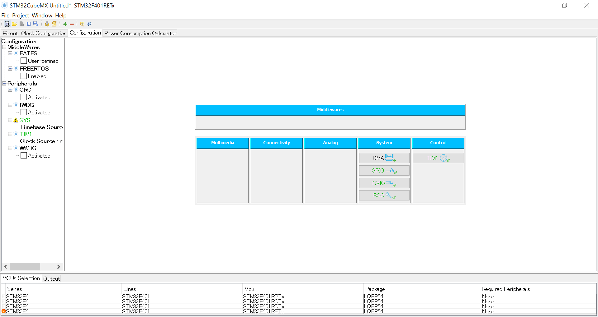
チェックさせます。
<download>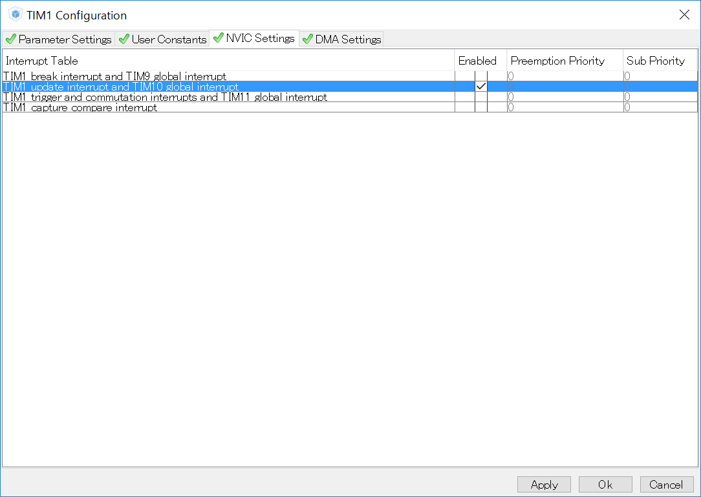
下記のように設定します。
<download>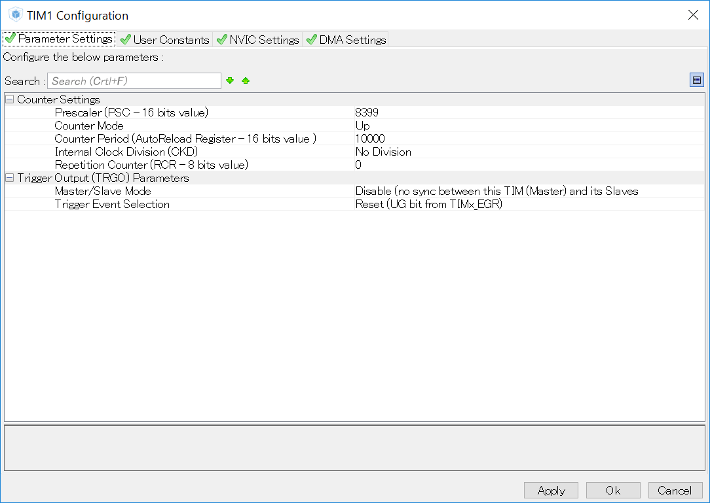

CodeGenerateします。コードが自動的に生成されます。

main.cファイルに次のコールバック関数を追記します。ピリオドが１００００回ごとに呼ばれます。

```c
void HAL_TIM_PeriodElapsedCallback(TIM_HandleTypeDef *htim){
HAL_GPIO_TogglePin(GPIOA,GPIO_PIN_0);
}
```

main関数にはTIM１をスタートさせる関数、HAL_TIM_Base_Start_IT(&htim1);を追記します。

```c

int main(void)
{

  /* USER CODE BEGIN 1 */

  /* USER CODE END 1 */

  /* MCU Configuration----------------------------------------------------------*/

  /* Reset of all peripherals, Initializes the Flash interface and the Systick. */
  HAL_Init();

  /* Configure the system clock */
  SystemClock_Config();

  /* Initialize all configured peripherals */
  MX_GPIO_Init();
  MX_TIM1_Init();

  /* USER CODE BEGIN 2 */

	HAL_TIM_Base_Start_IT(&htim1);


  /* USER CODE END 2 */

  /* Infinite loop */
  /* USER CODE BEGIN WHILE */
  while (1)
  {


  /* USER CODE END WHILE */

  /* USER CODE BEGIN 3 */

  }
  /* USER CODE END 3 */

}

```

## 構成パーツParts
- 5mm LED(各色)

## GitHub
- https://github.com/FaBoPlatform/FaBo/tree/master/101_led
