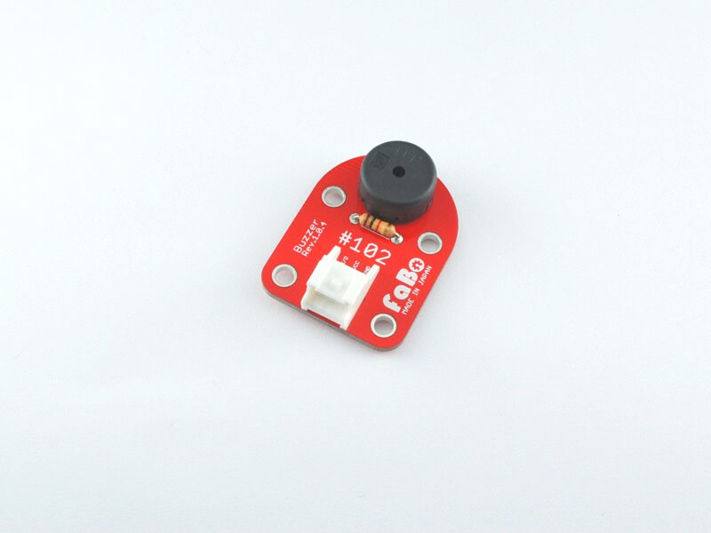
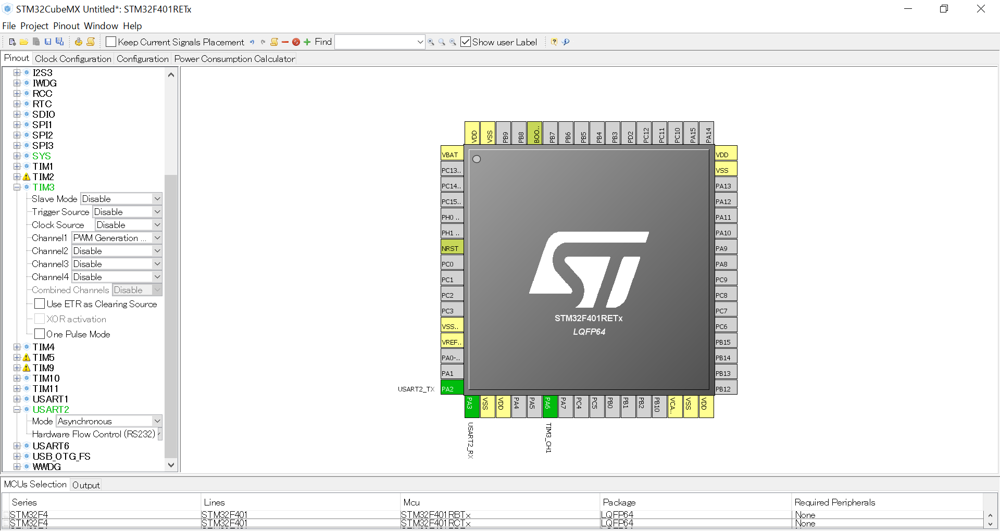
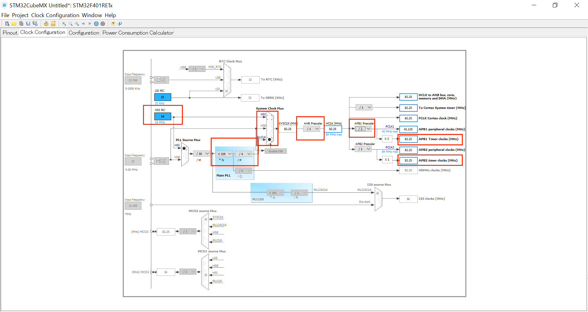
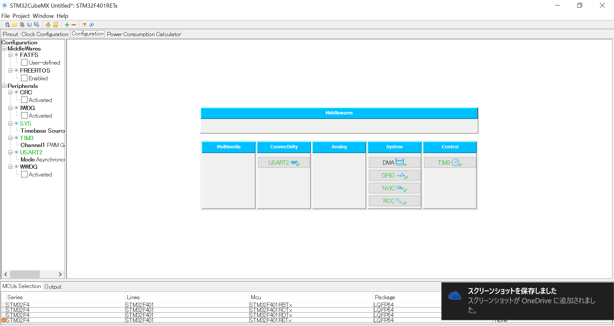
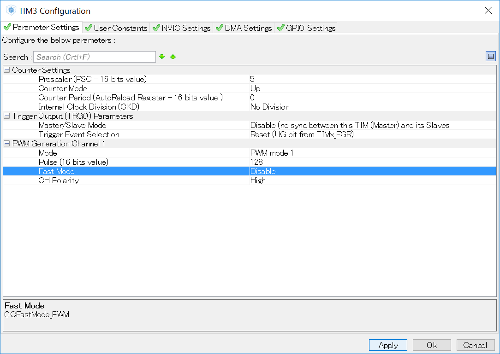

# #102 Buzzer Brick

<center>
<!--COLORME-->

## Overview
圧電ブザーを使ったBrickです。I/Oピンより、鳴らす音や音の長さを制御することができます。

## Connecting
アナログコネクタ(A0〜A5)、またはデジタルコネクタ(2〜13)のいずれかに接続します。今回はD13にBuzzer Brickを、A0には、Angle Brickをつないでください。


## Schematic


## Sample Code
###PWMによる出力

D12コネクタにBuzzer Brickを接続し、ビープ音を鳴らしています。
音の波形は矩形波でPWM出力します。マイコンが高速にスイッチングすることにより、周波数や波長が変えやすくモーター制御などによく使われます。
highとlowの割合をディーティー比といいます。


## 出力するPWMの設定

enum nrf_pwm_mode_t
PWM modes of operation.

Enumerator
NRF_PWM_MODE_UP 	
Up counter (edge-aligned PWM duty cycle).

NRF_PWM_MODE_UP_AND_DOWN 	
Up and down counter (center-aligned PWM duty cycle).


enum nrf_pwm_dec_load_t
PWM decoder load modes.

The selected mode determines how the sequence data is read from RAM and spread to the compare registers.

Enumerator
NRF_PWM_LOAD_COMMON 	
1st half word (16-bit) used in all PWM channels (0-3).

NRF_PWM_LOAD_GROUPED 	
1st half word (16-bit) used in channels 0 and 1; 2nd word in channels 2 and 3.

NRF_PWM_LOAD_INDIVIDUAL 	
1st half word (16-bit) used in channel 0; 2nd in channel 1; 3rd in channel 2; 4th in channel 3.

NRF_PWM_LOAD_WAVE_FORM 	
1st half word (16-bit) used in channel 0; 2nd in channel 1; ... ; 4th as the top value for the pulse generator counter.

enum nrf_pwm_clk_t
PWM base clock frequencies.
NRF_PWM_CLK_16MHz 	
NRF_PWM_CLK_8MHz 	
NRF_PWM_CLK_4MHz
NRF_PWM_CLK_2MHz 	
NRF_PWM_CLK_1MHz 	
NRF_PWM_CLK_500kHz 	
NRF_PWM_CLK_250kHz 	
NRF_PWM_CLK_125kHz 	

enum nrf_pwm_dec_step_t
PWM decoder next step modes.

The selected mode determines when the next value from the active sequence is loaded.

Enumerator
NRF_PWM_STEP_AUTO 	
Automatically after the current value is played and repeated the requested number of times.

NRF_PWM_STEP_TRIGGERED 	
When the NRF_PWM_TASK_NEXTSTEP task is triggered.


###ビープ音でドレミを演奏。
BuzzerBrickをD12に差し込み、STM32CubeMXから新たにプロジェクトを立ち上げます。
ピンは、以下のようになります。PA0からPWM出力します。


クロックを設定します。の内部クロックHSI RCT 16Mhz内部クロックから、PLLを使い逓倍して、Prescalerで分割させ、Timerclocksの周波数を84MHzまで大きくします。


設定画面に移動してTIM3を選びます。


プリスケーラーを５に設定します。


Generatecordeします。


main.cのファイルです。（抜粋）

以下のコードを追記します。valueは幅となります。
ディーティー比は５０％であり、その半分が波長となります。

```c

void soundBeep(uint16_t value)
{
	uint16_t widht;
	TIM_OC_InitTypeDef sConfigOC;

	widht=value/2;

 	HAL_TIM_PWM_Stop(&htim3,TIM_CHANNEL_1);
	HAL_TIM_PWM_DeInit(&htim3);
	htim3.Init.Period = value;
	HAL_TIM_PWM_Init(&htim3);

	sConfigOC.OCMode = TIM_OCMODE_PWM1;
	sConfigOC.Pulse = widht;
	sConfigOC.OCPolarity = TIM_OCPOLARITY_HIGH;
	sConfigOC.OCFastMode = TIM_OCFAST_DISABLE;
	HAL_TIM_PWM_ConfigChannel(&htim3, &sConfigOC, TIM_CHANNEL_1);

	HAL_TIM_PWM_Start(&htim3,TIM_CHANNEL_1);

}

```

main関数は以下のようにします。前に、タイマークロックは８４MHZ、プリスケーラは５に設定したことによりそれぞれの音階の周期を求めます。

```c

int main(void)
{

  /* USER CODE BEGIN 1 */
uint16_t codeF[8]={0xFAD5,0xDF78,0xC716,0xBBEA,0xA769,0x9525,0x84E0,0x7D6A};
  /* USER CODE END 1 */

  /* MCU Configuration----------------------------------------------------------*/

  /* Reset of all peripherals, Initializes the Flash interface and the Systick. */
  HAL_Init();

  /* Configure the system clock */
  SystemClock_Config();

  /* Initialize all configured peripherals */

	MX_GPIO_Init();
  MX_TIM3_Init();
  MX_USART2_UART_Init();

  /* USER CODE BEGIN 2 */

  /* USER CODE END 2 */

  /* Infinite loop */
  /* USER CODE BEGIN WHILE */
  while (1)
  {
  /* USER CODE END WHILE */
		for (int i=0;i<8;i++){
			soundBeep(codeF[i]);
			HAL_Delay(1500);
		}

  /* USER CODE BEGIN 3 */

  }
  /* USER CODE END 3 */

}


```


## 参照　API
nrf_drv_pwm_config_t Struct Referenc
https://infocenter.nordicsemi.com/index.jsp?topic=%2Fcom.nordic.infocenter.sdk5.v11.0.0%2Fstructnrf__drv__pwm__config__t.html
Software Development Kit > nRF5 SDK > nRF5 SDK v12.3.0 > Data Structures > Data Structures
PWM HAL
Software Development Kit > nRF5 SDK > nRF5 SDK v12.3.0 > API Reference > Peripheral drivers > PWM HAL and driver
PWM
Software Development Kit > nRF5 SDK > nRF5 SDK v12.1.0 > Hardware Drivers

## 構成Parts
- 圧電ブザー

## GitHub
