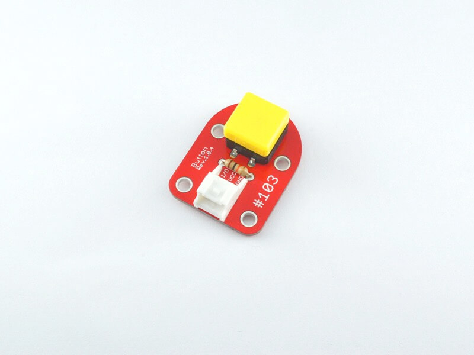

# #103 Button Brick

<center>
<!--COLORME-->

## Overview
ボタンを使ったBrickです。I/OピンよりボタンのON/OFFの状態を取得することができます。

※ボタンカバー部分の色はランダムで送付するため色のご指定はできません。あらかじめご了承ください。

## Connecting
アナログコネクタ(A0〜A5)、またはデジタルコネクタ(2〜13)のいずれかに接続します。


## Schematic


## Sample Code

A1コネクタに接続したButton Brickの入力により、A0コネクタに接続したLED Brick の点灯/消灯を制御しています。
101_brick_analog_ledのソースコードを変えます。SM32CubeMXを再設定して、新たにPA1をGPIO_Inputに設定します。
```c
int main(void)
{

  /* USER CODE BEGIN 1 */

  /* USER CODE END 1 */

  /* MCU Configuration----------------------------------------------------------*/

  /* Reset of all peripherals, Initializes the Flash interface and the Systick. */
  HAL_Init();

  /* Configure the system clock */
  SystemClock_Config();

  /* Initialize all configured peripherals */
  MX_GPIO_Init();

  /* USER CODE BEGIN 2 */

  /* USER CODE END 2 */

  /* Infinite loop */
  /* USER CODE BEGIN WHILE */
  while (1)
  {
  /* USER CODE END WHILE */

  /* USER CODE BEGIN 3 */

  if(HAL_GPIO_ReadPin(GPIOA,GPIO_PIN_1)==GPIO_PIN_RESET){
    HAL_GPIO_WritePin(GPIOA,GPIO_PIN_0,GPIO_PIN_SET);
  }else{
    HAL_GPIO_WritePin(GPIOA,GPIO_PIN_0,GPIO_PIN_RESET);
  }
  /* USER CODE END 3 */


```
書き込みに成功しましたら、リセットを押します。

##チャッタリング対策
チャッタリングは、スイッチの接点の影響でスイッチを入れた瞬間、あるいはスイッチを切った瞬間、ノイズが発生します。このノイズは高速にON/OFFを繰り返します。場合によっては不具合などの原因となります。チャッタリング対策として、ディレイ方式、サンプリング方式などあります。今回は、サンプリング方式で対策します。A0にButton Brickを接続しターミナルソフトで確認します。サンプリングをとるタイミングは、システムタイマを使用します。

同じようにSTM32CubeMXを起動し、A0をINPUT,USART2をAsynchrousに設定してCodegenerateにしてください。
コードが自動生成されたら、次を確認してください。
  下記はシステムクロックを設定しております。STM32CubeMXのClockSettisで設定簡単に設定することができます。HAL_SYSTICK_Config(HAL_RCC_GetHCLKFreq()/1000);で１ｍｓを定義しております。HAL_RCC_GetHCLKFreq()は内部にあるHCLKクロックを取得しております。その１０００分の１ですので1msとなるわけです。

```c
void SystemClock_Config(void)
{

  RCC_OscInitTypeDef RCC_OscInitStruct;
  RCC_ClkInitTypeDef RCC_ClkInitStruct;

  __HAL_RCC_PWR_CLK_ENABLE();

  __HAL_PWR_VOLTAGESCALING_CONFIG(PWR_REGULATOR_VOLTAGE_SCALE2);

  RCC_OscInitStruct.OscillatorType = RCC_OSCILLATORTYPE_HSI;
  RCC_OscInitStruct.HSIState = RCC_HSI_ON;
  RCC_OscInitStruct.HSICalibrationValue = 16;
  RCC_OscInitStruct.PLL.PLLState = RCC_PLL_ON;
  RCC_OscInitStruct.PLL.PLLSource = RCC_PLLSOURCE_HSI;
  RCC_OscInitStruct.PLL.PLLM = 16;
  RCC_OscInitStruct.PLL.PLLN = 336;
  RCC_OscInitStruct.PLL.PLLP = RCC_PLLP_DIV4;
  RCC_OscInitStruct.PLL.PLLQ = 4;
  if (HAL_RCC_OscConfig(&RCC_OscInitStruct) != HAL_OK)
  {
    Error_Handler();
  }

  RCC_ClkInitStruct.ClockType = RCC_CLOCKTYPE_HCLK|RCC_CLOCKTYPE_SYSCLK
                              |RCC_CLOCKTYPE_PCLK1|RCC_CLOCKTYPE_PCLK2;
  RCC_ClkInitStruct.SYSCLKSource = RCC_SYSCLKSOURCE_PLLCLK;
  RCC_ClkInitStruct.AHBCLKDivider = RCC_SYSCLK_DIV1;
  RCC_ClkInitStruct.APB1CLKDivider = RCC_HCLK_DIV2;
  RCC_ClkInitStruct.APB2CLKDivider = RCC_HCLK_DIV1;
  if (HAL_RCC_ClockConfig(&RCC_ClkInitStruct, FLASH_LATENCY_2) != HAL_OK)
  {
    Error_Handler();
  }

  HAL_SYSTICK_Config(HAL_RCC_GetHCLKFreq()/1000);

  HAL_SYSTICK_CLKSourceConfig(SYSTICK_CLKSOURCE_HCLK);

  /* SysTick_IRQn interrupt configuration */
  HAL_NVIC_SetPriority(SysTick_IRQn, 0, 0);
}


以下のコールバック関数を挿入します。void HAL_SYSTICK_Callback(void)は1msごとに呼ばれる関数です。ボタンの状態を返すのは25msごとにチェックしております。

```c
//ボタンを一定間隔で常に押されたかチェックする。
volatile _Bool state=0;
int samplecount=0;
void HAL_SYSTICK_Callback(void)
{
	samplecount++;

	if(samplecount>26){


		if(HAL_GPIO_ReadPin(GPIOA,GPIO_PIN_0)==GPIO_PIN_SET){
			state=1;
		}else{
			state=0;
		}
			samplecount=0;
	}
}

```

main関数と変数の定義を追記します。ボタンを押すごとにカウントアップできます。チャッタリングがないかご確認ください。

```c

int countup=0;
char buf[15];

/* USER CODE END 0 */

int main(void)
{

  /* USER CODE BEGIN 1 */

  /* USER CODE END 1 */

  /* MCU Configuration----------------------------------------------------------*/

  /* Reset of all peripherals, Initializes the Flash interface and the Systick. */
  HAL_Init();

  /* Configure the system clock */
  SystemClock_Config();

  /* Initialize all configured peripherals */
  MX_GPIO_Init();
  MX_TIM1_Init();
  MX_USART2_UART_Init();

  /* USER CODE BEGIN 2 */
							sprintf(buf, "CountUp start!\n\r");
							HAL_UART_Transmit(&huart2,(uint8_t *)&buf,strlen(buf),1000);

  /* USER CODE END 2 */

  /* Infinite loop */
  /* USER CODE BEGIN WHILE */
  while (1)
  {

		//スイッチからの入力がhighからlow変化するのを待機する
		while(!state);
		while(state);
	//スイッチ押された回数をカウントする。
		countup++;
		sprintf(buf, "count:%d\n\r",countup);
		HAL_UART_Transmit(&huart2,(uint8_t *)buf,strlen(buf),1000);


		/* USER CODE END WHILE */

  /* USER CODE BEGIN 3 */


  }
  /* USER CODE END 3 */

}


```

リセットボタンを押して、ターミナルソフトで確認します。


## 構成Parts
- 12mm角タクトスイッチ

## GitHub
- https://github.com/FaBoPlatform/FaBo/tree/master/103_button
