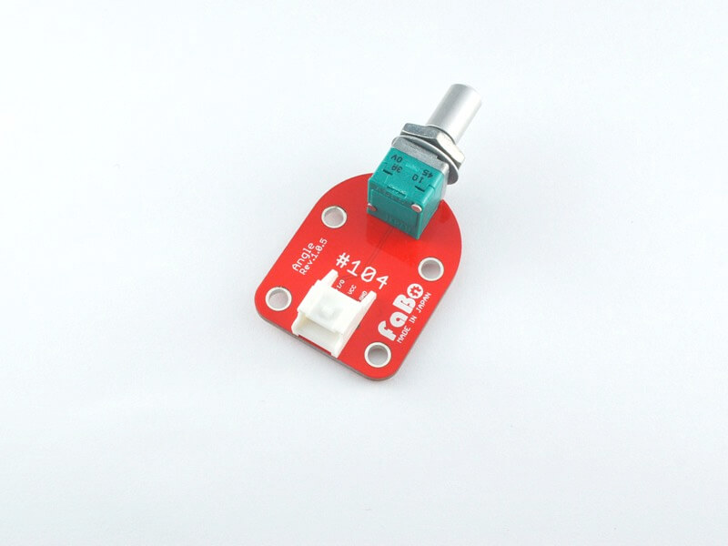

# #104 Angle Brick

<center>
<!--COLORME-->

## Overview
ボリューム抵抗を使ったBrickです。

I/Oピンからアナログ値を取得することができます。

LED Brickの明るさを調節する際などに使用します。

## Connecting

Shinobi ANA6を使用します。


## Schematic


## Sample Code

A1コネクタにAngleを接続して、アナログ値を読み。A1コネクタに接続したLED Brickをつなぎ、LEDの点灯間隔の時間をボリュームをかえることによって変化させます。

STM32CubeMXを起動し、ADC１(PA1),USART2をAnsynchrous,GPIO（PA0）は、OUTPUTを設定します。また、パソコンのターミナルソフトから変化量が見れます。


Configurationボタンを押して、次の画面が出てきたら、ADCを選びます。


NVIC Settingボタンを押し,Enabledにチェックします。


GPIO Settingボタンを押し、User LabelはADCとします。


CodeGenerateします。

Keilを立ち上げ、main.cファイルに以下のコードを追記します。

コードの一部（抜粋）
stdio.h,string.hを追記。

```c
/* Includes ------------------------------------------------------------------*/
#include "stm32f4xx_hal.h"

/* USER CODE BEGIN Includes */
#include <stdio.h>
#include <string.h>
/* USER CODE END Includes */
```

ADCPinの値を入れる変数を用意。
```c
/* Private variables ---------------------------------------------------------*/

int value=0;

/* USER CODE END PV */
```

HAL_ADC_GetValueでアナログ値（ADC 12bit 値の範囲0~4095）を取得。
```c
/* USER CODE BEGIN PFP */
/* Private function prototypes -----------------------------------------------*/

char adcFlag=0;
void HAL_ADC_ConvCpltCallback(ADC_HandleTypeDef* hadc)
{
	value=HAL_ADC_GetValue(hadc);
	adcFlag =1;
}

```

メイン関数は以下のようになります。100ms点灯し、0~4095ms消灯します。
```c
int main(void)
{

  /* USER CODE BEGIN 1 */

		char buffer[16];

  /* USER CODE END 1 */

  /* MCU Configuration----------------------------------------------------------*/

  /* Reset of all peripherals, Initializes the Flash interface and the Systick. */
  HAL_Init();

  /* Configure the system clock */
  SystemClock_Config();

  /* Initialize all configured peripherals */
  MX_GPIO_Init();
  MX_ADC1_Init();
  MX_USART2_UART_Init();

  /* USER CODE BEGIN 2 */

	adcFlag=0;
  HAL_ADC_Start_IT(&hadc1);

  /* USER CODE END 2 */

  /* Infinite loop */
  /* USER CODE BEGIN WHILE */
  while (1)
  {
		while(adcFlag != 0);
		sprintf(buffer,"%dms\n\r",value);
		HAL_UART_Transmit(&huart2,(uint8_t*)buffer,strlen(buffer),0x1111);
		HAL_GPIO_WritePin(GPIOA,GPIO_PIN_0,GPIO_PIN_SET);
		HAL_Delay(100);
		HAL_GPIO_WritePin(GPIOA,GPIO_PIN_0,GPIO_PIN_RESET);
		HAL_Delay(value);
		adcFlag=0;
		HAL_ADC_Start_IT(&hadc1);	  
  /* USER CODE END WHILE */

  /* USER CODE BEGIN 3 */

  }
  /* USER CODE END 3 */

}


```


## 構成Parts
- ボリューム抵抗器A 10k

## GitHub
