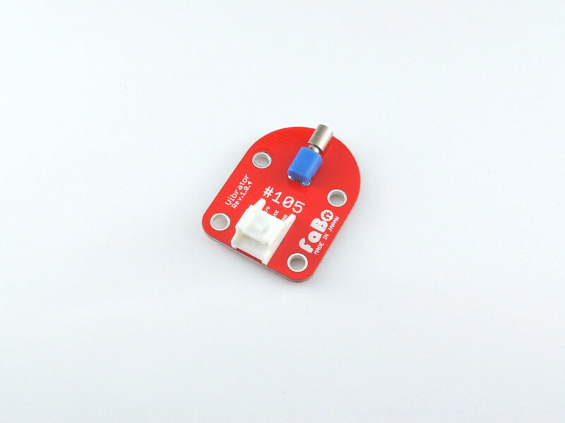

# #105 Vibrator Brick

<center>
<!--COLORME-->

## Overview
振動モーターを使用したBrickです。

I/Oピンから振動モーターのON/OFFを制御することができます。

## Connecting

アナログコネクタ(A0〜A5)、またはデジタルコネクタ(2〜13)のいずれかに接続します。


## Parts Specification
| Document |
|:--|
| [LA3R5-480AH1](http://akizukidenshi.com/catalog/g/gP-06744/) |

## Schematic
<center>
## Sample Code

A0コネクタに接続したButton Brickの入力により、D2コネクタに接続したVibrator Brick のON/OFFを制御しています。
ボタンを押すとバイブレーターが始動します。

STM32CubeMXを起動して、Pinout設定します。GPIO PA0はINPUT GPIO PA10はOUTPUTに設定します。
<center>

PA0 GPIO INPUTをPullUPします。
<center>

GenerateCodeをします。

自動的に初期コードが生成されます。

main.cのソースコード（一部抜粋）
下記のコードは、GPIOを初期化する関数です。PA0はスイッチを入力するポートになります。電圧は供給し通常をHighの状態にし（Pullup）、誤作動を防止します。

```c
static void MX_GPIO_Init(void)
{

  GPIO_InitTypeDef GPIO_InitStruct;

  /* GPIO Ports Clock Enable */
  __HAL_RCC_GPIOA_CLK_ENABLE();

  /*Configure GPIO pin : PA0 */
  GPIO_InitStruct.Pin = GPIO_PIN_0;
  GPIO_InitStruct.Mode = GPIO_MODE_INPUT;
  GPIO_InitStruct.Pull = GPIO_PULLUP;
  HAL_GPIO_Init(GPIOA, &GPIO_InitStruct);

  /*Configure GPIO pin : PA10 */
  GPIO_InitStruct.Pin = GPIO_PIN_10;
  GPIO_InitStruct.Mode = GPIO_MODE_OUTPUT_PP;
  GPIO_InitStruct.Pull = GPIO_NOPULL;
  GPIO_InitStruct.Speed = GPIO_SPEED_FREQ_LOW;
  HAL_GPIO_Init(GPIOA, &GPIO_InitStruct);

  /*Configure GPIO pin Output Level */
  HAL_GPIO_WritePin(GPIOA, GPIO_PIN_10, GPIO_PIN_RESET);

```

main関数
```c
int main(void)
{

  /* USER CODE BEGIN 1 */

  /* USER CODE END 1 */

  /* MCU Configuration----------------------------------------------------------*/

  /* Reset of all peripherals, Initializes the Flash interface and the Systick. */
  HAL_Init();

  /* Configure the system clock */
  SystemClock_Config();

  /* Initialize all configured peripherals */
  MX_GPIO_Init();

  /* USER CODE BEGIN 2 */

  /* USER CODE END 2 */

  /* Infinite loop */
  /* USER CODE BEGIN WHILE */
  while (1)
  {
		if(HAL_GPIO_ReadPin(GPIOA,GPIO_PIN_0)==GPIO_PIN_RESET){
			HAL_GPIO_WritePin(GPIOA,GPIO_PIN_10,GPIO_PIN_RESET);
		}else{
			HAL_GPIO_WritePin(GPIOA,GPIO_PIN_10,GPIO_PIN_SET);
		}
  /* USER CODE END WHILE */

  /* USER CODE BEGIN 3 */

  }
  /* USER CODE END 3 */

}

```

ビルドして、書き込みが成功したら、リセットボタンを押し動作を確認します。

## 構成Parts
- 振動モーター LA3R5-480AH1

## GitHub
