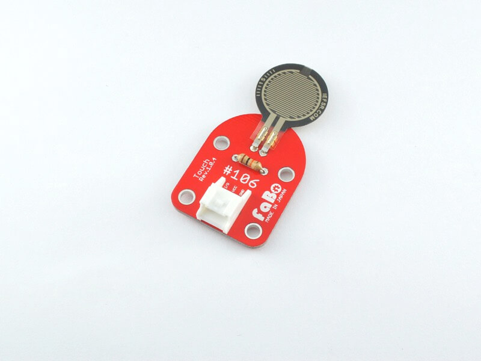

# #106 Touch Brick
<center>
<!--COLORME-->

## Overview
感圧センサーを使用したタッチセンサーBrickです。
I/Oピンより、感圧部分に加えられた力の大きさの変化をアナログ値で取得することができます。

## Connecting

アナログコネクタ(A0〜A5)のいずれかに接続します。


## Datasheet
| Document |
|:--|
| [Datasheet](http://interlinkelectronics.com/datasheets/Datasheet_FSR.pdf) |

## Schematic


## Sample Code

A1コネクタに接続したTouch Brickの感圧によって、A0コネクタに接続したLED Brickを点灯/消灯させています。

```c
int main(void)
{

  /* USER CODE BEGIN 1 */


  /* USER CODE END 1 */

  /* MCU Configuration----------------------------------------------------------*/

  /* Reset of all peripherals, Initializes the Flash interface and the Systick. */
  HAL_Init();

  /* Configure the system clock */
  SystemClock_Config();

  /* Initialize all configured peripherals */
  MX_GPIO_Init();

  /* USER CODE BEGIN 2 */

  /* USER CODE END 2 */

  /* Infinite loop */
  /* USER CODE BEGIN WHILE */
  while (1)
  {
  /* USER CODE END WHILE */
		 if(HAL_GPIO_ReadPin(GPIOA,GPIO_PIN_1)==GPIO_PIN_RESET){
    HAL_GPIO_WritePin(GPIOA,GPIO_PIN_0,GPIO_PIN_SET);
  }else{
    HAL_GPIO_WritePin(GPIOA,GPIO_PIN_0,GPIO_PIN_RESET);
  }

  /* USER CODE BEGIN 3 */

  }
  /* USER CODE END 3 */

}

```

## 構成Parts
- 感圧センサー

## GitHub
