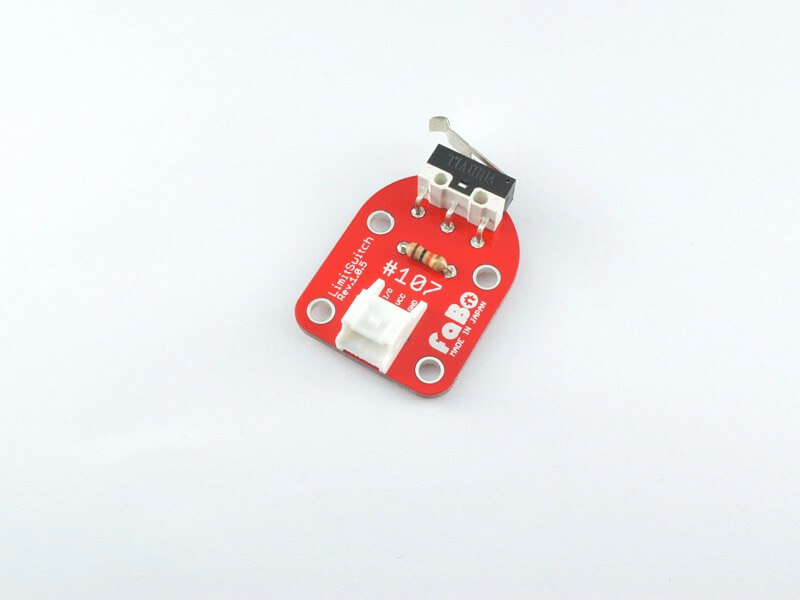

# #107 LimitSwitch Brick

<center>
<!--COLORME-->

## Overview
リミットスイッチを使ったBrickです。

I/OピンよりスイッチのON/OFFの状態を取得することができます。

機械の自動停止や位置検出の際に使用します。

## Connecting

### Arduino
アナログコネクタ(A0〜A5)、またはデジタルコネクタ(2〜13)のいずれかに接続します。


###Raspberry PI
GPIOコネクタのいずれかに接続します。

### IchigoJam
OUTコネクタのいずれかに接続します。


## Support
|Arduino|RaspberryPI|IchigoJam|
|:--:|:--:|:--:|
|◯|◯|◯|

## Schematic


## Sample Code
A1コネクタにLimitSwitch Brickを接続し、A0コネクタに接続したLED Brickの点灯/消灯を制御しています。

```c
STM32CubeMXを起動して、GPIO設定します。PA0をOUTPUT PA1をINPUTにします。Codegenerateして、main.cに以下のコードを追記するだけです。
```c
int main(void)
{

  /* USER CODE BEGIN 1 */


  /* USER CODE END 1 */

  /* MCU Configuration----------------------------------------------------------*/

  /* Reset of all peripherals, Initializes the Flash interface and the Systick. */
  HAL_Init();

  /* Configure the system clock */
  SystemClock_Config();

  /* Initialize all configured peripherals */
  MX_GPIO_Init();

  /* USER CODE BEGIN 2 */

  /* USER CODE END 2 */

  /* Infinite loop */
  /* USER CODE BEGIN WHILE */
  while (1)
  {
  /* USER CODE END WHILE */
		 if(HAL_GPIO_ReadPin(GPIOA,GPIO_PIN_1)==GPIO_PIN_RESET){
    HAL_GPIO_WritePin(GPIOA,GPIO_PIN_0,GPIO_PIN_RESET);
  }else{
    HAL_GPIO_WritePin(GPIOA,GPIO_PIN_0,GPIO_PIN_SET);
  }

  /* USER CODE BEGIN 3 */

  }
  /* USER CODE END 3 */

}
```

## 構成Parts
- リミットスイッチ

## GitHub
