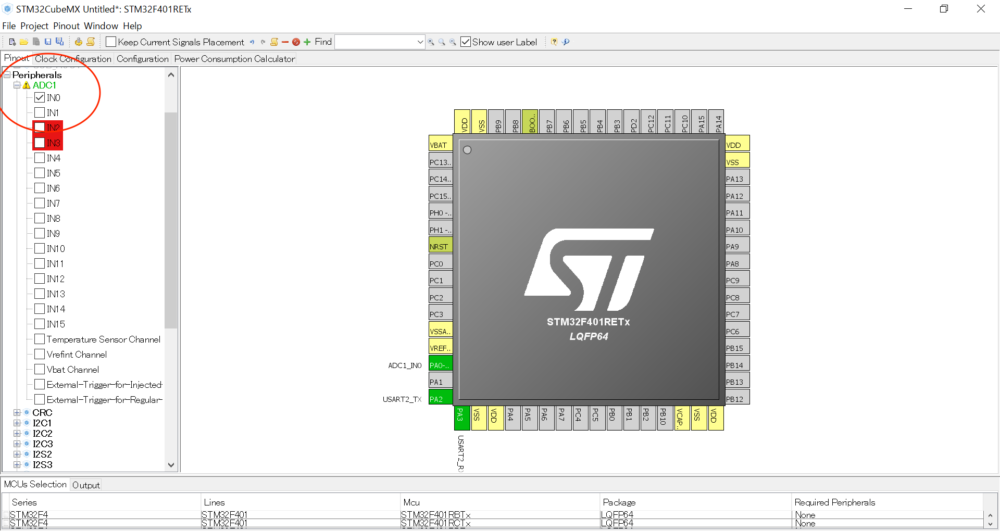
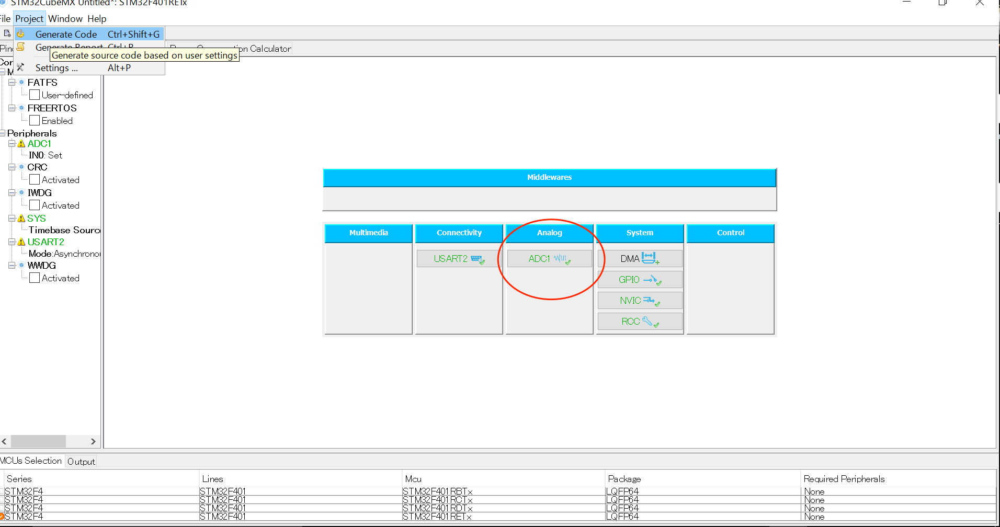
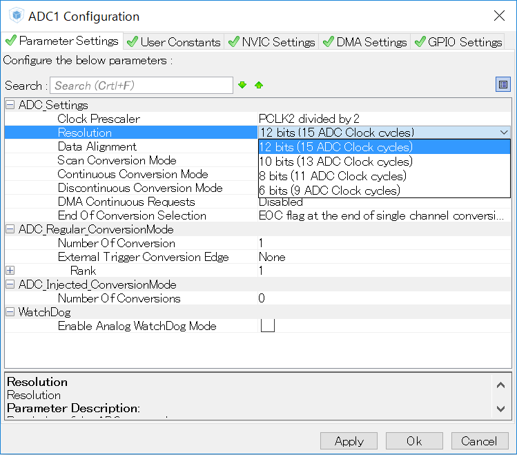
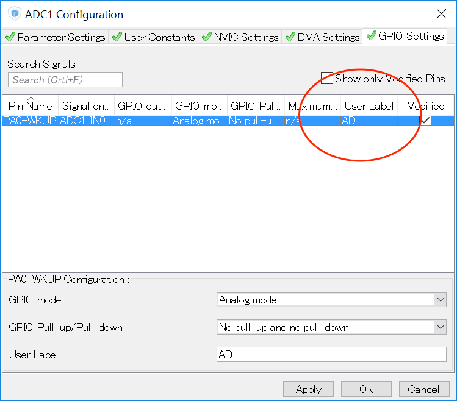

# #108 Temperature Brick
<center>
<!--COLORME-->

## Overview
温度を計測するBrickです。

アナログ値(ADC 12bitの場合　0〜4096)を取得でき、変換することで−30度から100度までの温度を計測することができます。

## Connecting

アナログコネクタ(A0〜A5)のいずれかに接続します。


## LM61CIZ Datasheet
| Document |
|:--|
| [LM61CIZ Datasheet](http://akizukidenshi.com/catalog/g/gI-02726/) |

## Schematic


## Sample Code

A0コネクタにTemprature Brickを接続して、取得した温度をシリアルモニタへ出力します。
STM32CubeMXを起動してnewProjectを選び、ターゲットとなるボードを選ぶ。
HALライブラリがダウンロードすると、Pinout画面表示されます。

Brickを接続するコネクタをA0に接続するため、ADC1をIN0をチェックインして、USART2をAnsynchrousに設定しターミナルモニタで温度を確認できるようにする。



ADC１を選びます。


ParameterSettingsで解像度が12bitであるかを確認します。


GPIO Settingsを選び、UserLabelを追加します。


GenerateCordeを実行し、Keilを起動させます。

main.cに自動で追加されるコード（抜粋）
STM32CubeMXで設定が反映され自動追加されています。

```c

/* ADC1 init function */
static void MX_ADC1_Init(void)
{

  ADC_ChannelConfTypeDef sConfig;

    /**Configure the global features of the ADC (Clock, Resolution, Data Alignment and number of conversion)
    */
  hadc1.Instance = ADC1;
  hadc1.Init.ClockPrescaler = ADC_CLOCK_SYNC_PCLK_DIV2;
  hadc1.Init.Resolution = ADC_RESOLUTION_12B;
  hadc1.Init.ScanConvMode = DISABLE;
  hadc1.Init.ContinuousConvMode = DISABLE;
  hadc1.Init.DiscontinuousConvMode = DISABLE;
  hadc1.Init.ExternalTrigConvEdge = ADC_EXTERNALTRIGCONVEDGE_NONE;
  hadc1.Init.DataAlign = ADC_DATAALIGN_RIGHT;
  hadc1.Init.NbrOfConversion = 1;
  hadc1.Init.DMAContinuousRequests = DISABLE;
  hadc1.Init.EOCSelection = ADC_EOC_SINGLE_CONV;
  if (HAL_ADC_Init(&hadc1) != HAL_OK)
  {
    Error_Handler();
  }

    /**Configure for the selected ADC regular channel its corresponding rank in the sequencer and its sample time.
    */
  sConfig.Channel = ADC_CHANNEL_0;
  sConfig.Rank = 1;
  sConfig.SamplingTime = ADC_SAMPLETIME_3CYCLES;
  if (HAL_ADC_ConfigChannel(&hadc1, &sConfig) != HAL_OK)
  {
    Error_Handler();
  }

}

```


main.cのコード（抜粋）

```c
/* Includes ------------------------------------------------------------------*/
#include "stm32f4xx_hal.h"

/* USER CODE BEGIN Includes */
#include <stdio.h>
#include <string.h>
```


main.c関数のコードを下記のように追加します。12bitであるから0~4096　3.3Vの時その時の電圧の値は4095になります。0.6Vの時は0℃,1.6Vで100℃となり、１℃上がるごとに0.01V上昇することになる。

```c
int main(void)
{

  /* USER CODE BEGIN 1 */
	int adc_Value;
	double	tmp_Value;
	char str[16];
  ADC_ChannelConfTypeDef sConfig;
  /* USER CODE END 1 */

  /* MCU Configuration----------------------------------------------------------*/

  /* Reset of all peripherals, Initializes the Flash interface and the Systick. */
  HAL_Init();

  /* Configure the system clock */
  SystemClock_Config();

  /* Initialize all configured peripherals */
  MX_GPIO_Init();
  MX_ADC1_Init();
  MX_USART2_UART_Init();

  /* USER CODE BEGIN 2 */
	double ZeroTMP = 0.6 / (3.3 / 4096.0);
  double KatamukiTMP = ((1.6-0.6) / (3.3 / 4096.0)) /100.0;
	/* USER CODE END 2 */

  /* Infinite loop */
  /* USER CODE BEGIN WHILE */
  while (1)
  {
  /* USER CODE END WHILE */
		HAL_ADC_Start(&hadc1);
    HAL_ADC_PollForConversion(&hadc1, 100);
		adc_Value = HAL_ADC_GetValue(&hadc1);
		tmp_Value = (adc_Value - ZeroTMP) /KatamukiTMP;
		sprintf(str,"%02f\n\r",tmp_Value);
		HAL_UART_Transmit(&huart2,(uint8_t *)str,strlen(str),0x1111);
    HAL_ADC_Stop(&hadc1);
		HAL_Delay(200);	  	  
  /* USER CODE BEGIN 3 */

  }
  /* USER CODE END 3 */

}

```

## 構成Parts
- IC温度センサ LM61CIZ

## GitHub
