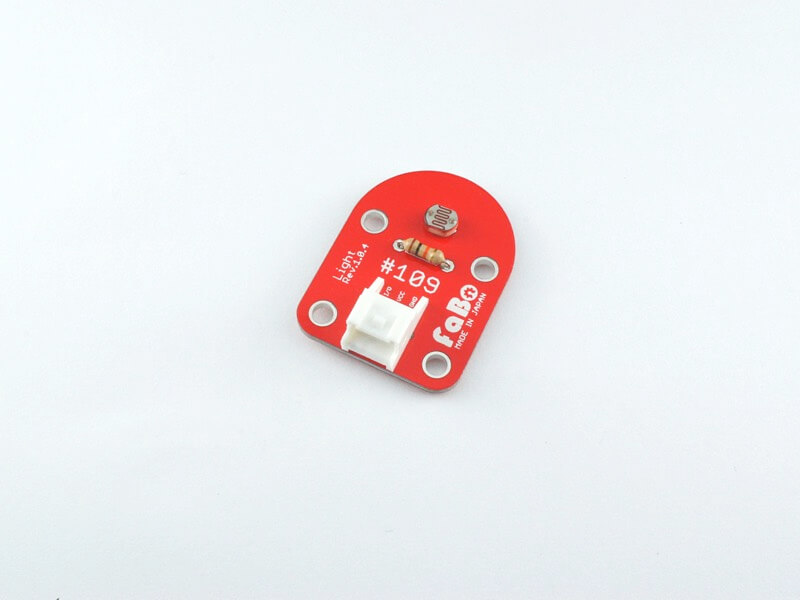

# #109 Light Brick

<center>
<!--COLORME-->

## Overview
CDSセルを使用した光センサーBrickです。

周囲の明るさの変化をアナログ値として取得することができます。

## Connecting
アナログコネクタ(A0〜A5)のいずれかに接続します。


## Parts Specification
| Document |
|:--|
| [MI527](http://akizukidenshi.com/catalog/g/gI-00110/) |

## Schematic
<center>

## Sample Code
A0コネクタにLight Brickを接続して、明るさに応じたアナログ値をシリアルモニタへ出力します。

Light Brickから入力するPA0はINPUTにします。USART2はAsynchronousにします。
<center>

Configration画面へ移動して、ADCを選択します。
<center>

NVIC_Settingsでチェックを入れます。
<center>

USARTは、通信速度は115200bpsになっているか確認します。
<center>

strlenを使用するのでstdio.h,string.hを追記。
```c
/* Includes ------------------------------------------------------------------*/
#include "stm32f4xx_hal.h"

/* USER CODE BEGIN Includes */

#include <stdio.h>
#include <string.h>
```

アナログ値を取得する変数を用意。
```c


/* USER CODE BEGIN PV */
/* Private variables ---------------------------------------------------------*/

int value=0;

/* USER CODE END PV */

```

アナログ値は、コールバック関数から取得します。
```c

char adcFlag=0;
void HAL_ADC_ConvCpltCallback(ADC_HandleTypeDef* hadc)
{
	value=HAL_ADC_GetValue(hadc);
	adcFlag =1;
}

```

main関数
値の結果は一対一の通信であるシリアル通信でパソコンに送ります。
```c
int main(void)
{

  /* USER CODE BEGIN 1 */

	char buffer[16];

  /* USER CODE END 1 */

  /* MCU Configuration----------------------------------------------------------*/

  /* Reset of all peripherals, Initializes the Flash interface and the Systick. */
  HAL_Init();

  /* Configure the system clock */
  SystemClock_Config();

  /* Initialize all configured peripherals */
  MX_GPIO_Init();
  MX_ADC1_Init();
  MX_USART2_UART_Init();

  /* USER CODE BEGIN 2 */

  /* USER CODE END 2 */

  /* Infinite loop */
  /* USER CODE BEGIN WHILE */
  while (1)
  {
  /* USER CODE END WHILE */

		while(adcFlag != 0);
		sprintf(buffer,"%d\n\r",value);
		HAL_UART_Transmit(&huart2,(uint8_t*)buffer,strlen(buffer),0x1111);
		HAL_Delay(100);
		adcFlag=0;
		HAL_ADC_Start_IT(&hadc1);	  
  /* USER CODE END WHILE */

  /* USER CODE BEGIN 3 */

  }
  /* USER CODE END 3 */

}

```

ビルドして書き込み終了後、リセットボタンを押し、動作を確認します。値は０～４０９５で変化し、明るくなるほど、数値が小さくなります。

#### ターミナルソフトから確認する。
Necleoから送られてくるシリアル信号をパソコン上に表示させます。いくつかターミナルソフトはあるのですが、今回はTeraTermを使用します。
TeraTermを起動します。シリアルを選択しNecleoボードを選択します。COMポートの番号はパソコンの設定で変化します。OKボタンを押します。
<center>
設定からシリアルポートを選択します。
<center>
下記のように設定します。Necleoの設定により通信速度9600bpsから115200bps　8bit　パリティなし　ストップビット1bit　フロー制御なしで通信します。
<center>
値が次々と表示されます。
<center>
設定します。

## 構成Parts
- CDSセル(5mm)

## GitHub
