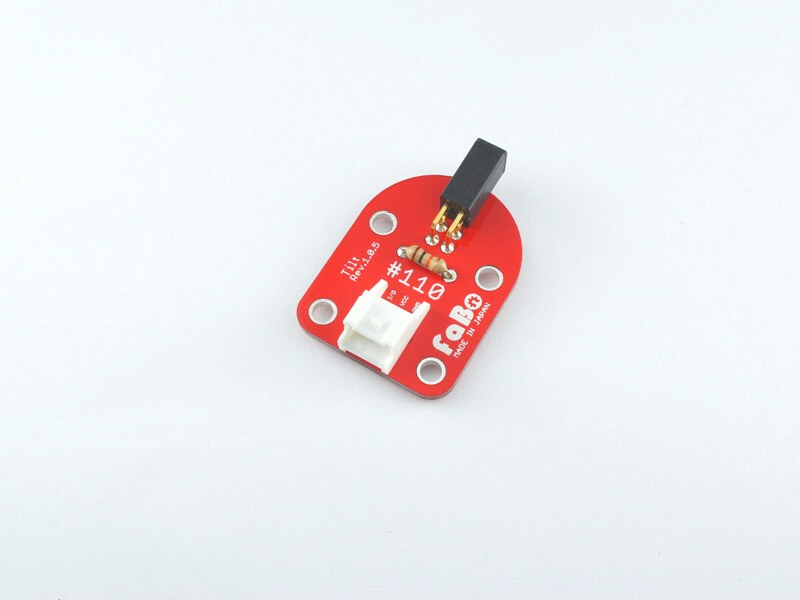

# #110 Tilt Brick

<center>
<!--COLORME-->

## Overview
傾斜センサーを使用したBrickです。

I/Oピンより傾斜センサーの状態をデジタル値(0〜1)取得することができます。

黒い部分の中に玉が入っていて傾くとデジタル値が変化します。

LED Brickを点灯/消灯させる際などに使用します。


## Connecting
アナログコネクタ(A0〜A5)、またはデジタルコネクタ(2〜13)のいずれかに接続します。


## Schematic


## Sample Code

A1コネクタに接続したTilt Brickの傾きによって、A0コネクタに接続したLED Brickを点灯/消灯させています。
STM32CubeMXを起動して、GPIO設定します。PA0をOUTPUT PA1をINPUTにします。Codegenerateして、main.cに以下のコードを追記するだけです。
```c
int main(void)
{

  /* USER CODE BEGIN 1 */


  /* USER CODE END 1 */

  /* MCU Configuration----------------------------------------------------------*/

  /* Reset of all peripherals, Initializes the Flash interface and the Systick. */
  HAL_Init();

  /* Configure the system clock */
  SystemClock_Config();

  /* Initialize all configured peripherals */
  MX_GPIO_Init();

  /* USER CODE BEGIN 2 */

  /* USER CODE END 2 */

  /* Infinite loop */
  /* USER CODE BEGIN WHILE */
  while (1)
  {
  /* USER CODE END WHILE */
		 if(HAL_GPIO_ReadPin(GPIOA,GPIO_PIN_1)==GPIO_PIN_RESET){
    HAL_GPIO_WritePin(GPIOA,GPIO_PIN_0,GPIO_PIN_RESET);
  }else{
    HAL_GPIO_WritePin(GPIOA,GPIO_PIN_0,GPIO_PIN_SET);
  }

  /* USER CODE BEGIN 3 */

  }
  /* USER CODE END 3 */

}
```

## 構成Parts
- 傾斜(振動)スイッチ

## GitHub
