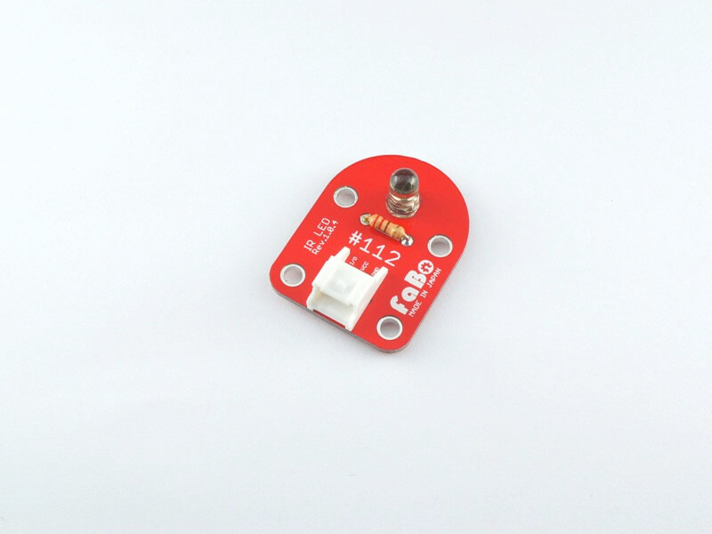
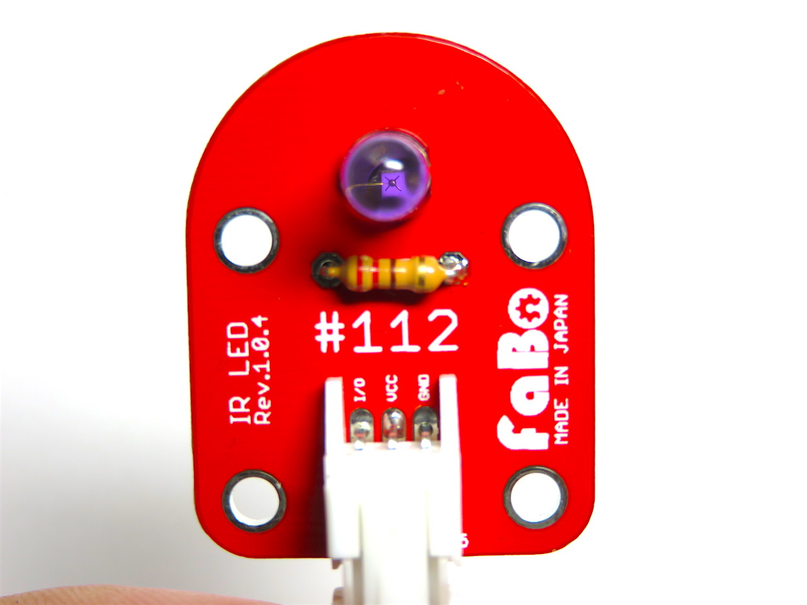

# #112 IR LED Brick

<center>
<!--COLORME-->

## Overview
赤外線LEDを使ったBrickです。

I/Oピンから赤外線LEDをON/OFFを制御することができます。

## Connecting
アナログコネクタ(A0〜A5)、またはデジタルコネクタ(2〜13)のいずれかに接続します。


## Parts Specification
| Document |
|:--|
| [OSI5LA5113A](http://akizukidenshi.com/catalog/g/gI-04311/) |

## Schematic


## Sample Code
### for Arduino
A1コネクタに赤外線LED Brick、A2コネクタにボタンBrickを接続し、ボタンが押されたら赤外線LEDを発光させます。
STM32CubeMXを起動し、A1をGPIO_Output,A2をGPIO_Inputにします。
CodeGenerateします。

main関数

```c
int main(void)
{

  /* USER CODE BEGIN 1 */

  /* USER CODE END 1 */

  /* MCU Configuration----------------------------------------------------------*/

  /* Reset of all peripherals, Initializes the Flash interface and the Systick. */
  HAL_Init();

  /* Configure the system clock */
  SystemClock_Config();

  /* Initialize all configured peripherals */
  MX_GPIO_Init();

  /* USER CODE BEGIN 2 */

  /* USER CODE END 2 */

  /* Infinite loop */
  /* USER CODE BEGIN WHILE */
  while (1)
  {
		if(HAL_GPIO_ReadPin(GPIOA,GPIO_PIN_4)==GPIO_PIN_SET){
			HAL_GPIO_WritePin(GPIOA,GPIO_PIN_1,GPIO_PIN_SET);
		}else{
			HAL_GPIO_WritePin(GPIOA,GPIO_PIN_1,GPIO_PIN_RESET);
		}
  /* USER CODE END WHILE */

  /* USER CODE BEGIN 3 */

  }
  /* USER CODE END 3 */

}
```

ファームウェアをLoadして、リセットボタンを押して、起動させます。
赤外線は可視光線ではないので、カメラのモニタで見ます。ButtonBrickのボタンを押すと、紫色に発光するのが確認できると思います。
iPhoneのカメラでは見えないので他のもので確認願います。

<center>

## 構成Parts
- 5mm 赤外線LED OSI5LA5113A

## GitHub
- https://github.com/FaBoPlatform/FaBo/tree/master/112_ir_led
