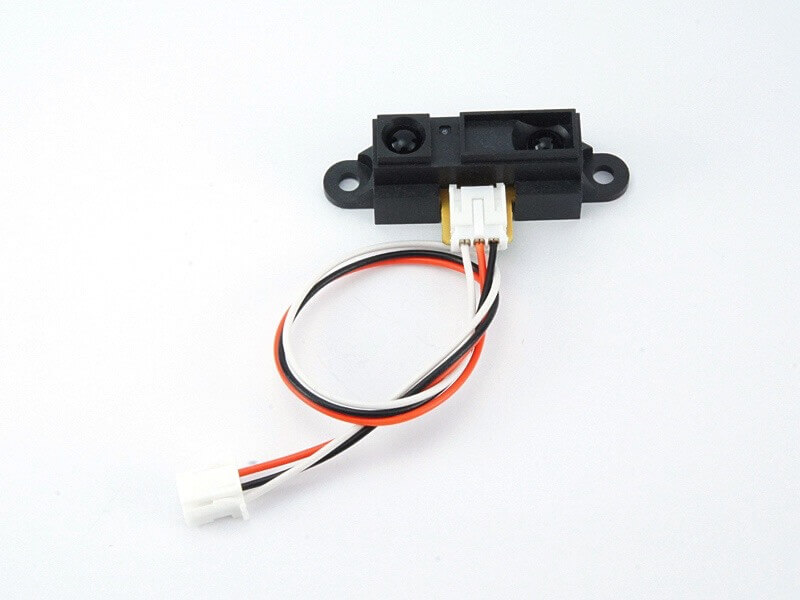
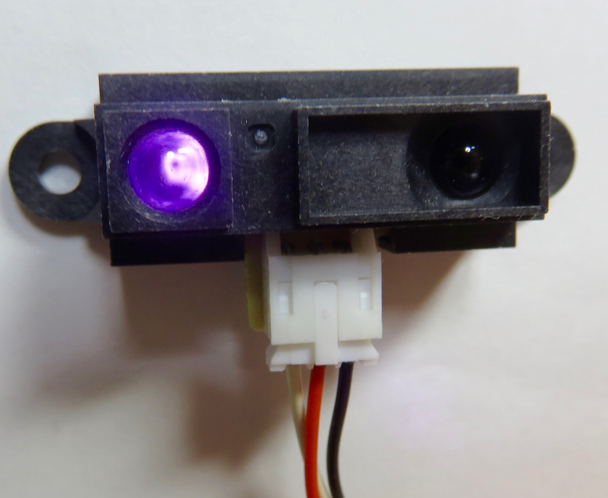
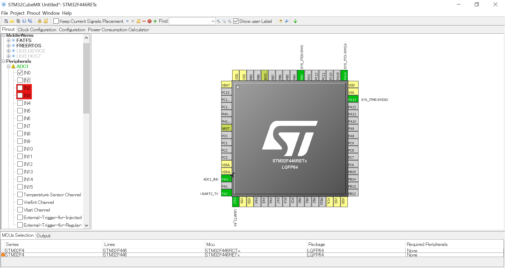
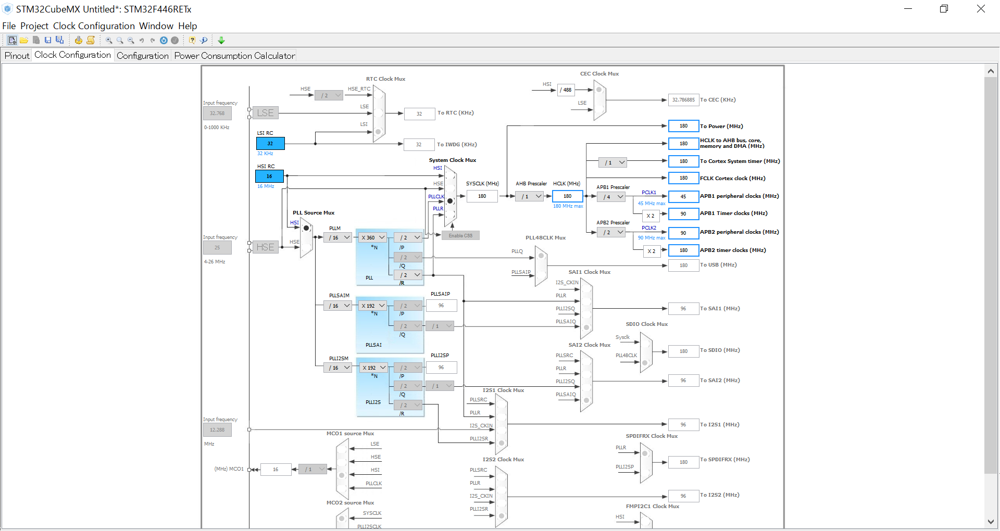
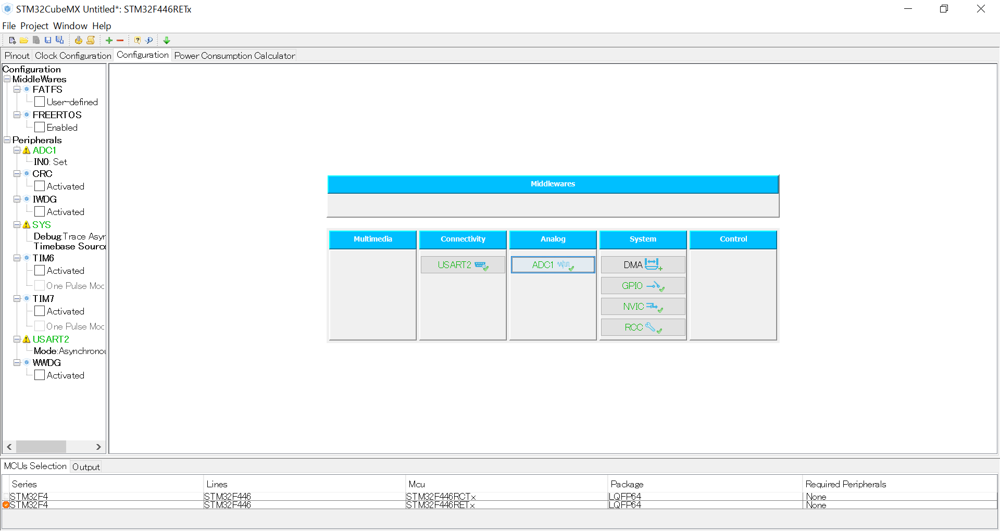
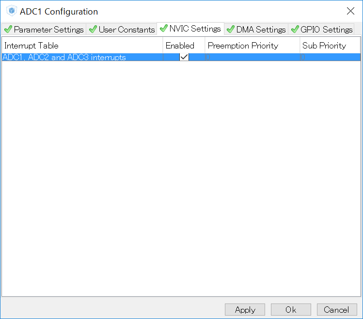
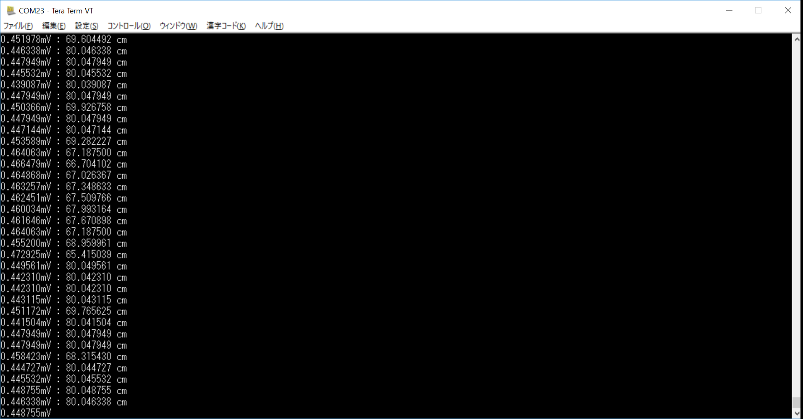

# #116 Distance Brick

<center>
<!--COLORME-->

## Overview
距離センサーモジュールを使用したBrickです。

I/Oピンより距離センサーの正面についているレンズから物体までの距離をアナログ値(0〜1023)で取得することができます。

測定可能な距離は10〜80cmとなっています。

<center>


## Connecting

アナログコネクタ(A0〜A5)のいずれかに接続します。

今回はＡ０に接続します。


## GP2Y0A21YK Datasheet
| Document |
| -- |
| [GP2Y0A21YK Datasheet](http://www.sharpsma.com/webfm_send/1208) |

## Sample Code

A0コネクタに接続して、距離を計測します。

ピン設定します。USART1,USART6をAsyncrousに設定し有効にします。
<center>

クロックは以下のように設定します。
<center>

ADCを設定します。
<center>

NVIC(割り込みコントローラ)をADCに対して有効化します。
<center>

CodeGenarateし、コードやプロジェクトが自動生成されます。Keilを起動させます。

ソースコード（一部）
インクルード、ペリフェラル設定初期化とADCのコールバック関数
```c
/* Includes ------------------------------------------------------------------*/
#include "stm32f4xx_hal.h"

/* USER CODE BEGIN Includes */
#include <stdio.h>
#include <string.h>

/* USER CODE END Includes */

/* Private variables ---------------------------------------------------------*/
ADC_HandleTypeDef hadc1;

UART_HandleTypeDef huart2;

/* USER CODE BEGIN PV */
/* Private variables ---------------------------------------------------------*/

/* USER CODE END PV */

/* Private function prototypes -----------------------------------------------*/
void SystemClock_Config(void);
void Error_Handler(void);
static void MX_GPIO_Init(void);
static void MX_ADC1_Init(void);
static void MX_USART2_UART_Init(void);


/* USER CODE BEGIN PFP */
/* Private function prototypes -----------------------------------------------*/

/* USER CODE END PFP */

int value=0;

/* USER CODE BEGIN 0 */
char adcFlag=0;
void HAL_ADC_ConvCpltCallback(ADC_HandleTypeDef* hadc)
{
    value=HAL_ADC_GetValue(hadc);
    adcFlag =1;
}
```

main関数
データシートより測定ポイントとベクトルを求めて近似値を出しています。
```c
/* USER CODE END 0 */

int main(void)
{

  /* USER CODE BEGIN 1 */
	char buffer[16];


  /* USER CODE END 1 */

  /* MCU Configuration----------------------------------------------------------*/

  /* Reset of all peripherals, Initializes the Flash interface and the Systick. */
  HAL_Init();

  /* Configure the system clock */
  SystemClock_Config();

  /* Initialize all configured peripherals */
  MX_GPIO_Init();
  MX_ADC1_Init();
  MX_USART2_UART_Init();

  /* USER CODE BEGIN 2 */
	//電圧と距離のサンプルデータ
	double distanceChar[14][2] = {{5.00,3.10},{6.20,3.13},{7.00,2.98},{8.00,2.70},{10.00,2.30},
	{12.50,1.70},{20.00,1.30},{22.50,1.05},{30.00,0.93},{40.00,0.75},{50.00,0.60},{60.00,0.51},
	{70.00,0.45},{80.00,0.40}};
	//それぞれのヘクトルを求める。
	double vector[13][2];
		for (int i=0;i<13;i++){
	vector[i][0] = distanceChar[i+1][0]-distanceChar[i][0];
	vector[i][1] = distanceChar[i+1][1]-distanceChar[i][1];
		}

    adcFlag=0;
  HAL_ADC_Start_IT(&hadc1);


  /* USER CODE END 2 */

  /* Infinite loop */
  /* USER CODE BEGIN WHILE */
  while (1)
  {
	/* USER CODE END WHILE */
		   while(adcFlag != 0){
			 }
       //取得した値を電圧に変換
				double voltage = value * (3.3/4096);
			 sprintf(buffer,"%fmV : ",voltage);
        HAL_UART_Transmit(&huart2,(uint8_t*)buffer,strlen(buffer),0x1111);
        //近似値求める。
			 double d;
			if (voltage<0.4){
				sprintf(buffer,"Unmeasurable\n\r");
			 }else if(voltage> distanceChar[0][1]){
				d = (((voltage - distanceChar[0][1])/vector[0][1])* vector[0][0])+distanceChar[0][0];
				sprintf(buffer,"%f cm\n\r",d);
			 }else if(voltage> distanceChar[1][1]){
				d = (((voltage - distanceChar[1][1])/vector[1][1])* vector[1][0])+distanceChar[1][0];
				sprintf(buffer,"%f cm\n\r",d);
			 }else if(voltage> distanceChar[2][1]){
				d = (((voltage - distanceChar[2][1])/vector[2][1])* vector[2][0])+distanceChar[2][0];
				sprintf(buffer,"%f cm\n\r",d);
			 }else if(voltage> distanceChar[3][1]){
				d = (((voltage - distanceChar[3][1])/vector[3][1])* vector[3][0])+distanceChar[3][0];
				sprintf(buffer,"%f cm\n\r",d);
			 }else if(voltage> distanceChar[4][1]){
				d = (((voltage - distanceChar[4][1])/vector[4][1])* vector[4][0])+distanceChar[4][0];
				sprintf(buffer,"%f cm\n\r",d);
			 }else if(voltage> distanceChar[5][1]){
				d = (((voltage - distanceChar[5][1])/vector[5][1])* vector[5][0])+distanceChar[5][0];
				sprintf(buffer,"%f cm\n\r",d);
			 }else if(voltage> distanceChar[6][1]){
				d = (((voltage - distanceChar[6][1])/vector[6][1])* vector[6][0])+distanceChar[6][0];
				sprintf(buffer,"%f cm\n\r",d);
			 }else if(voltage> distanceChar[7][1]){
				d = (((voltage - distanceChar[7][1])/vector[7][1])* vector[7][0])+distanceChar[7][0];
				sprintf(buffer,"%f cm\n\r",d);
			 }else if(voltage> distanceChar[8][1]){
				d = (((voltage - distanceChar[8][1])/vector[8][1])* vector[8][0])+distanceChar[8][0];
				sprintf(buffer,"%f cm\n\r",d);
			 }else if(voltage> distanceChar[9][1]){
				d = (((voltage - distanceChar[9][1])/vector[9][1])* vector[9][0])+distanceChar[9][0];
				sprintf(buffer,"%f cm\n\r",d);
			 }else if(voltage> distanceChar[10][1]){
				d = (((voltage - distanceChar[10][1])/vector[10][1])* vector[10][0])+distanceChar[10][0];
				sprintf(buffer,"%f cm\n\r",d);
			 }else if(voltage> distanceChar[11][1]){
				d = (((voltage - distanceChar[11][1])/vector[11][1])* vector[11][0])+distanceChar[11][0];
				sprintf(buffer,"%f cm\n\r",d);
			 }else if(voltage> distanceChar[12][1]){
				d = (((voltage - distanceChar[12][1])/vector[12][1])* vector[12][0])+distanceChar[12][0];
				sprintf(buffer,"%f cm\n\r",d);
			 }else if(voltage> distanceChar[13][1]){
				d = (((voltage - distanceChar[13][1])/vector[13][1])* vector[13][0])+distanceChar[13][0];
				sprintf(buffer,"%f cm\n\r",d);
			 }
			 HAL_UART_Transmit(&huart2,(uint8_t*)buffer,strlen(buffer),0x1111);			 
			 HAL_Delay(100);
        adcFlag=0;
        HAL_ADC_Start_IT(&hadc1);   

  /* USER CODE BEGIN 3 */

  }
  /* USER CODE END 3 */

}
```

TeraTermを起動し確認します。リセットボタンを押すと起動します。
<center>


## 構成Parts
- 距離センサーモジュール GP2Y0A21YK

## GitHub
