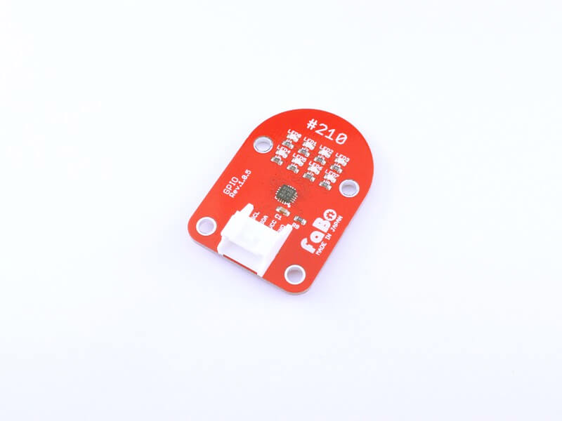

# #210 GPIO I2C Brick


<!--COLORME-->

## Overview
汎用I/O拡張チップを使用したBrickです。

I2Cで8個のLEDを制御できます。

## Connecting
GPIO210 BrickをI2C1_SCL	PB6、I2C1_SDA	PB7に接続します。

### CubeMXの設定
CubeMXを立ち上げ、New Projectを選択します。


使用するBrickのピンを設定します。今回はi2c1を使用します。


ボードをセレクト（Necleo-F446REの場合）します。


I2Cの設定の確認を行います。


今回はデフォルトのままで結構です。


以下の写真のように設定し、コードを生成します。


初期設定の部分　NXP PCAL6408のアドレスは0x20です。
```c
/* Includes ------------------------------------------------------------------*/
#include "main.h"
#include "stm32f4xx_hal.h"

/* USER CODE BEGIN Includes */

/* USER CODE END Includes */

/* Private variables ---------------------------------------------------------*/
I2C_HandleTypeDef hi2c1;

/* USER CODE BEGIN PV */
/* Private variables ---------------------------------------------------------*/

/* USER CODE END PV */

/* Private function prototypes -----------------------------------------------*/
void SystemClock_Config(void);
static void MX_GPIO_Init(void);
static void MX_I2C1_Init(void);

/* USER CODE BEGIN PFP */
/* Private function prototypes -----------------------------------------------*/

/* USER CODE END PFP */


/* USER CODE BEGIN 0 */

#define DEVICEADDRESS 0x20<<1
```

関数の定義部分
```c

HAL_StatusTypeDef I2cWrite(uint16_t MemAddress,uint8_t *d)
{
	HAL_StatusTypeDef stat;
	stat=HAL_I2C_Mem_Write(&hi2c1,DEVICEADDRESS,MemAddress,1,d,1,10000);
	return stat;
}

```


main関数
```c

int main(void)
{

  /* USER CODE BEGIN 1 */

  /* USER CODE END 1 */

  /* MCU Configuration----------------------------------------------------------*/

  /* Reset of all peripherals, Initializes the Flash interface and the Systick. */
  HAL_Init();

  /* USER CODE BEGIN Init */

  /* USER CODE END Init */

  /* Configure the system clock */
  SystemClock_Config();

  /* USER CODE BEGIN SysInit */

  /* USER CODE END SysInit */

  /* Initialize all configured peripherals */
  MX_GPIO_Init();
  MX_I2C1_Init();

  /* USER CODE BEGIN 2 */
  //レジスタ 0x00 入力　0x01 出力 0x03 IOの設定
	uint16_t cmd[4] = {0x00,0x01,0x02,0x03};
  //LEDの光らすパターン
	uint8_t patern[9] = {0x00,0x01,0x02,0x04,0x08,0x10,0x20,0x40,0x80};
	HAL_Delay(100);
  //PCAL6408の入出力設定
	I2cWrite(cmd[3],patern);
	HAL_Delay(100);
  //LEDを順番に点灯、消灯させる
  while (1)
  {
		for(int j=0;j<9;j++){
			I2cWrite(cmd[1],patern+j);
			HAL_Delay(500);
		}
	}
  /* USER CODE BEGIN 3 */

  }
  /* USER CODE END 3 */

```


## 構成Parts
-
NXP PCAL6408

## GitHub
