# #304 USB Serial Brick

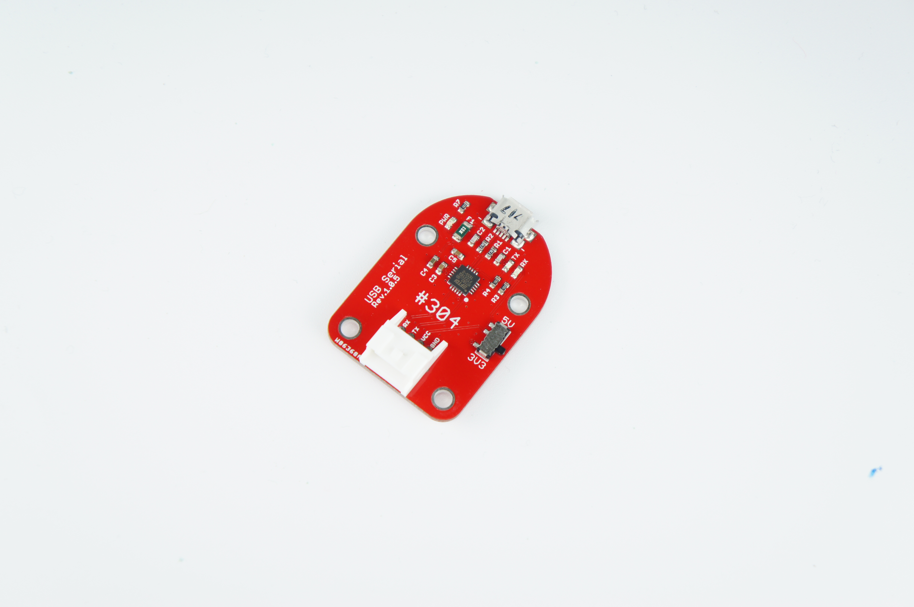
<!--COLORME-->

## Overview
FT232RLを使用した、USBシリアル通信ができるBrickです。

## Connecting
Serialコネクタへ接続し、MicroUSBコネクタを他のデバイスに接続します。Necleoのi/oは3.3Vで駆動しますのでUSB Brickの電圧スイッチを3.3Vにしてください。


## Sample Code
###ボードから送信のみ
ArduonoピンD0,D1をRX,TXとして使うため、SB62,SB63をはんだします。（注意：NecleoボードのSTLINKは、シリアル通信ができるので、Brickなしでもターミナルソフトで確認できます。従来は不要です。）

SB62,SB63は、初期状態はオープンです。
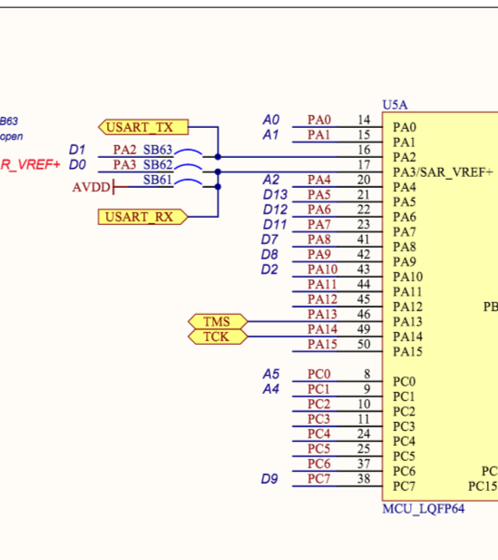

SB62,SB63をはんだを盛ってショートします。
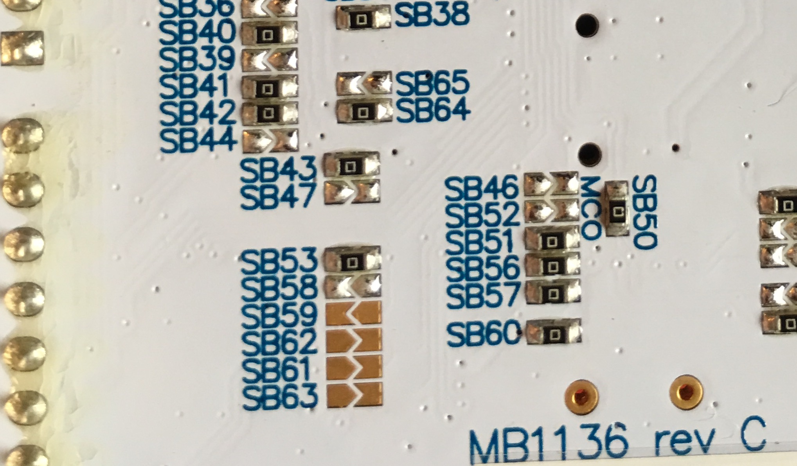

STM32CubeMXを起動してUART2を設定します。DisableからAnsynchrous（非同期）に変更します。
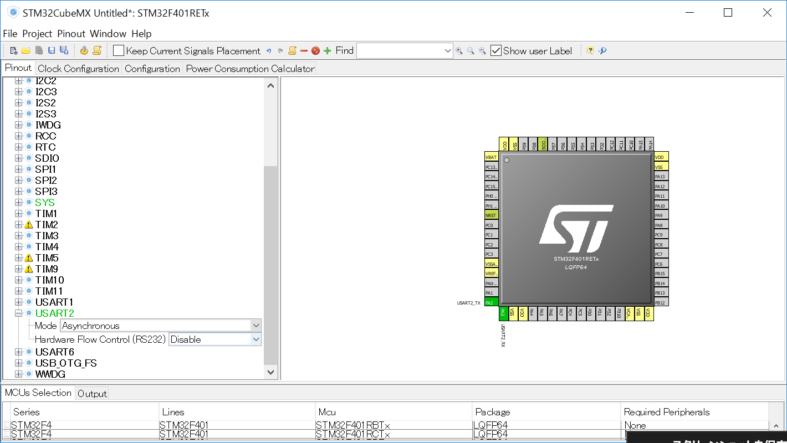

115200bpsに設定がされているか確認します。
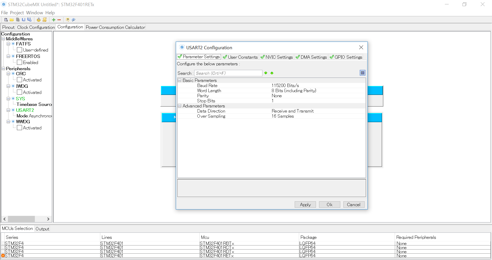

下記のコードMX_USART2_UART_Init関数が自動的に追加されます。必要に応じてボーレートを変更してください。

```c
/* USART2 init function */
static void MX_USART2_UART_Init(void)
{

  huart2.Instance = USART2;
  huart2.Init.BaudRate = 115200;
  huart2.Init.WordLength = UART_WORDLENGTH_8B;
  huart2.Init.StopBits = UART_STOPBITS_1;
  huart2.Init.Parity = UART_PARITY_NONE;
  huart2.Init.Mode = UART_MODE_TX_RX;
  huart2.Init.HwFlowCtl = UART_HWCONTROL_NONE;
  huart2.Init.OverSampling = UART_OVERSAMPLING_16;
  if (HAL_UART_Init(&huart2) != HAL_OK)
  {
    Error_Handler();
  }

}
```


下記のコードmain関数の中に追加します。

```c
int main(void)
{
  HAL_Init();
  SystemClock_Config();
  MX_GPIO_Init();
  MX_USART2_UART_Init();

	char message[15] ;
	int i = 101;

  while (1)
  {
		if (i<1000){
			sprintf(message,"Fabo Great Easy!%d\t",i);
			HAL_UART_Transmit(&huart2,(uint8_t*)message,strlen(message),0x1100);
			HAL_Delay(500);
			i++;
		}
  }

```

strlenを使用するので下記をコードに追記します。

```c
#include <stdio.h>
#include <string.h>
```
Arduinoシールドのリセットボタンを押し、USB304BrickをSerialにつなぎTeraTerm(Windows),(ターミナルスクリーンコマンド)Macなどのターミナルソフトを起動し確認します。（Brickなしでも、STM32F401とUSBでCOMポート接続でも確認できます。）

##ボードに送受信をする。
ボードにコマンドやデータを送ります。
シリアル通信は１対１の通信なのでUART２とULINK側のボードと切り離すため、抵抗SB13,SB14の0Ω抵抗をはんだゴテで除去します。
切り離すとパソコンのターミナルからシリアル通信はできなくなるので、#304 USB

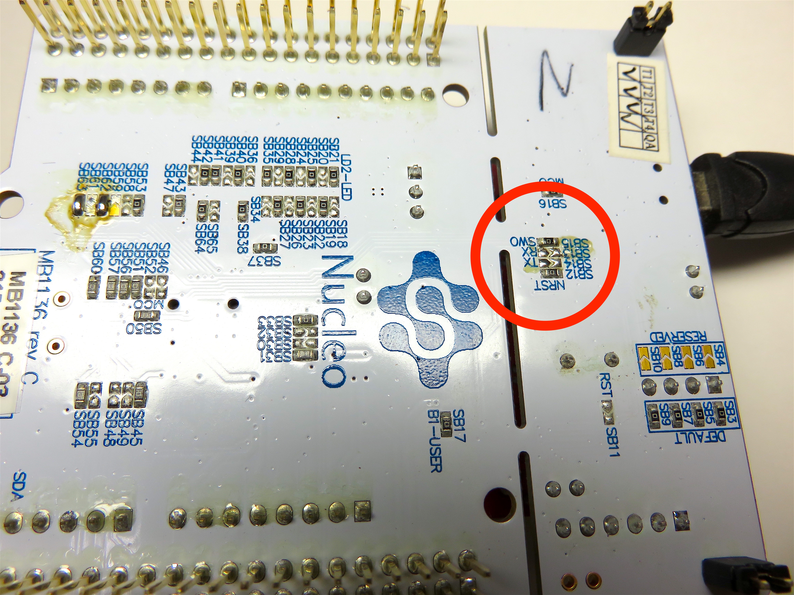

上記のコードに以下のようにコードを変えます。

```c

int c;
  while (1)
  {
  /* USER CODE END WHILE */
		  if (HAL_UART_Receive(&huart2,(uint8_t *)&c,1,0xffff)==HAL_OK)
			{
					HAL_UART_Transmit(&huart2,(uint8_t *)&c,1,0xffff);
			}

  /* USER CODE BEGIN 3 */

  }
  /* USER CODE END 3 */

}

```

今度はパソコンのターミナルとUSB Brickをつなぎ適切なCOMポートを選びます。
上記のプログラムは、ターミナルソフトからキーボードが入力すると、その文字信号は、マイコンへ送信され、その文字がマイコンからパソコンへ返されます。（エコーバック）

ただし、上記のプログラムを延々と受信を待機していなくてはならず、現実的には、他の処理をやらないといけない。
そこで必要に応じたバッファメモリを確保し、受信があった場合バッファにメモリに書き込み（割り込み）、バッファがいっぱいになつたら古いバッファメモリに上書きするという処理をおこないます。（環状バッファ）同時に古い方のバッファから読み出し処理をします。
##割り込みによる受信
STM32CubeMXを立ち上げて新しくプロジェクトを作ります。
PinOut設定が画面でUSART2をAsynchronousに設定し、ConfigurationボタンをクリックしてUART2 Configuration画面が出ます。
割り込みの設定をします。
NVIC Settingを選び、USART2　global interrupt を　Enabledにします。

するとmain.c以外にもstm32f4xx.it.cとｓｔｍ３２ｆ４ｘｘ_hal_map.cともにコードが自動的に追記されます。


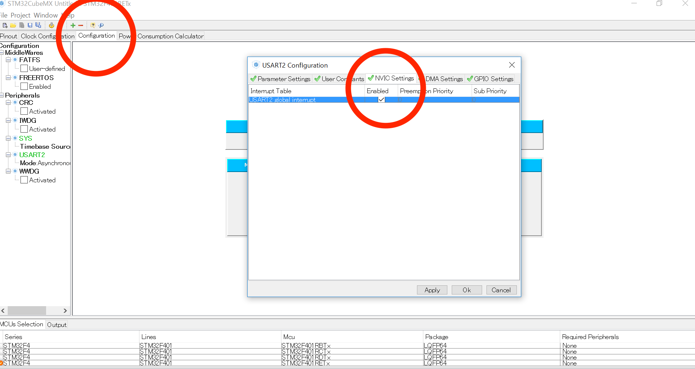

ｓｔｍ32f4xx.it.c(一部)

```c

/**
* @brief This function handles USART2 global interrupt.
*/
void USART2_IRQHandler(void)
{
  /* USER CODE BEGIN USART2_IRQn 0 */

  /* USER CODE END USART2_IRQn 0 */
  HAL_UART_IRQHandler(&huart2);
  /* USER CODE BEGIN USART2_IRQn 1 */

  /* USER CODE END USART2_IRQn 1 */
}

```

stm32f4xx_hal_msp.c

```c

void HAL_UART_MspDeInit(UART_HandleTypeDef* huart)
{

  if(huart->Instance==USART2)
  {
  /* USER CODE BEGIN USART2_MspDeInit 0 */

  /* USER CODE END USART2_MspDeInit 0 */
    /* Peripheral clock disable */
    __HAL_RCC_USART2_CLK_DISABLE();

    /**USART2 GPIO Configuration    
    PA2     ------> USART2_TX
    PA3     ------> USART2_RX
    */
    HAL_GPIO_DeInit(GPIOA, GPIO_PIN_2|GPIO_PIN_3);

    /* Peripheral interrupt DeInit*/
    HAL_NVIC_DisableIRQ(USART2_IRQn);

  }
  /* USER CODE BEGIN USART2_MspDeInit 1 */

  /* USER CODE END USART2_MspDeInit 1 */


```


##環状バッファのコード

下記のコードを追記します。画面を見やすくするため、今回は、バッファサイズは、３２バイトとします。

main.c

```c

/* Includes ------------------------------------------------------------------*/
#include "stm32f4xx_hal.h"

/* USER CODE BEGIN Includes */
#include <stdio.h>
#include <string.h>

#define SIZE 32

```

```c
struct queue_data{
    char queue[SIZE];
    int writePoint;
    int readPoint;
};
typedef struct queue_data queue_t;

	queue_t q;
  char data = 0;

/* USER CODE END PFP */

/* USER CODE BEGIN 0 */

char message[15] ;

#define queue_next(n) (((n) + 1) % SIZE)

static void qe_init(queue_t *q)
{
    q->writePoint = 0;
    q->readPoint = 0;
}

int
qe_empty(queue_t q)
{
    return(q.writePoint == q.readPoint);
}

int qe_push(queue_t *q, char data)
{
    if(queue_next(q->readPoint) == q->writePoint) return(-1);
    q->queue[q->readPoint] = data;
    q->readPoint = queue_next(q->readPoint);
    return(0);
}

_Bool qe_pop(queue_t *q, char *data){
    if(q->writePoint == q->readPoint) return(1);
    *data = q->queue[q->writePoint];
    q->writePoint = queue_next(q->writePoint);
    return(0);
}

static int usedRange(queue_t *q, int id)
{
    if((id < q->readPoint) && (id >= q->writePoint)) return(1);
    if((id > q->readPoint) && (id >= q->writePoint) && (q->writePoint > q->readPoint)) return(1);
    if((id < q->readPoint) && (id < q->writePoint)  && (q->writePoint > q->readPoint)) return(1);

    return(0);
}

static void qe_print(queue_t *q)
{
    int count;
						sprintf(message,"[");
            HAL_UART_Transmit(&huart2,(uint8_t*)message,strlen(message),0x1111);
    for(count = 0; count < SIZE; count++){
        if(usedRange(q, count)){
						 sprintf(message,"%2c,",q->queue[count]);
            HAL_UART_Transmit(&huart2,(uint8_t*)message,strlen(message),0x1111);
        }else{
						sprintf(message,"%2c",'.');
            HAL_UART_Transmit(&huart2,(uint8_t*)message,strlen(message),0x1111);
        }
    }
		sprintf(message,"]\n");
            HAL_UART_Transmit(&huart2,(uint8_t*)message,strlen(message),0x1111);
}


```

受信が発生した場合に呼ばれるコールバック関数を記述します。

```c
uint8_t RX_DATA;

void HAL_UART_RxCpltCallback(UART_HandleTypeDef *huart)
{
	qe_push(&q, RX_DATA);
	HAL_UART_Receive_IT(huart,&RX_DATA,1);
	sprintf(message,"***Input!***");
  HAL_UART_Transmit(&huart2,(uint8_t*)message,strlen(message),0x1111);
}

```


main関数は、以下のようにします。割り込みで書き込み(push)するので、main関数には、環状バッファからデータをPopするだけとなります。
HAL_UART_Receive_IT(&huart2,&RX_DATA,1)で割り込みを呼び出します。

```c

int main(void)
{
  /* USER CODE BEGIN 1 */
	qe_init(&q);
  /* USER CODE END 1 */

  /* MCU Configuration----------------------------------------------------------*/

  /* Reset of all peripherals, Initializes the Flash interface and the Systick. */
  HAL_Init();

  /* Configure the system clock */
  SystemClock_Config();

  /* Initialize all configured peripherals */
  MX_GPIO_Init();
  MX_USART2_UART_Init();

  /* USER CODE BEGIN 2 */

	 HAL_UART_Receive_IT(&huart2,&RX_DATA,1);

  /* USER CODE END 2 */

  /* Infinite loop */
  /* USER CODE BEGIN WHILE */
  while (1)
  {
  /* USER CODE END WHILE */
				 if(qe_pop(&q, (char *)&data) != 0){
					sprintf(message,"Null\n");
					HAL_UART_Transmit(&huart2,(uint8_t*)message,strlen(message),0x1111);
					 qe_print(&q);
        }else{
           sprintf(message,"ReadData--> %c  ",data);
            HAL_UART_Transmit(&huart2,(uint8_t*)message,strlen(message),0x1111);
            qe_print(&q);
        }
				HAL_Delay(1500);
  /* USER CODE BEGIN 3 */

  }
  /* USER CODE END 3 */

}

```

##DMAによるシリアル通信
DMAを使用すれば、CPUは他の処理をすることができ、効率的に処理できます。
サンプルは、入力した文字をエコーバックしています。

UART2のみ有効にします。
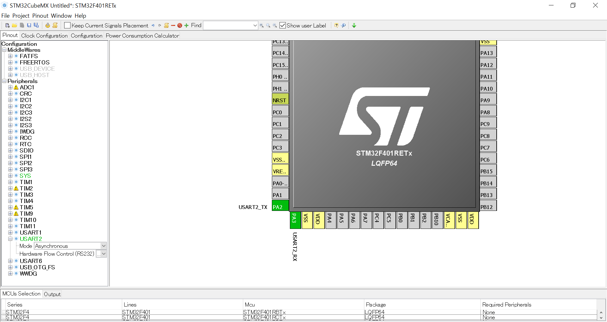


クロックが最大になるように設定してください。
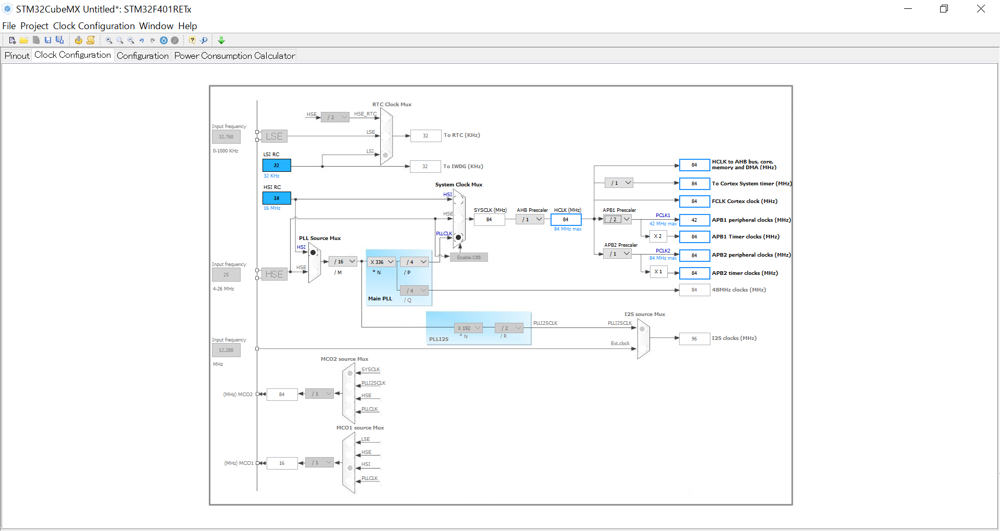


USART2を選択します。
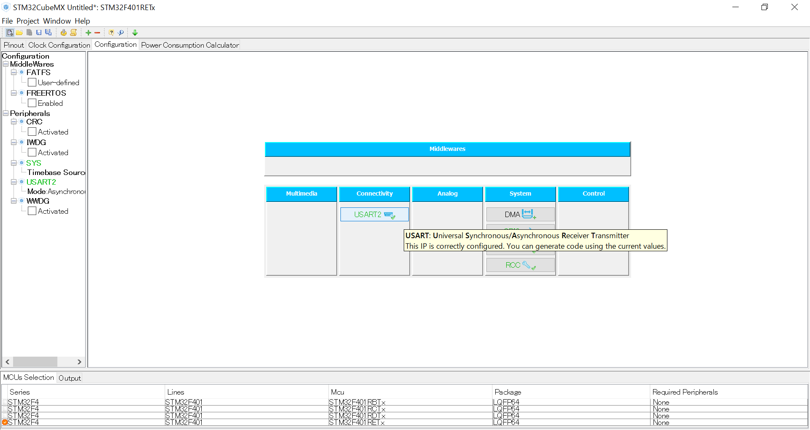


チェックします。
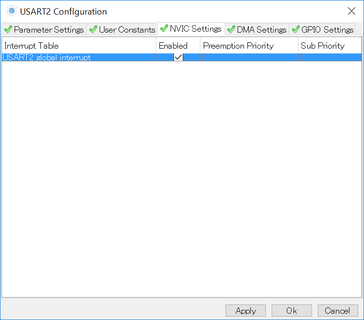


Addボタンを押して、RX,TXを追加します。
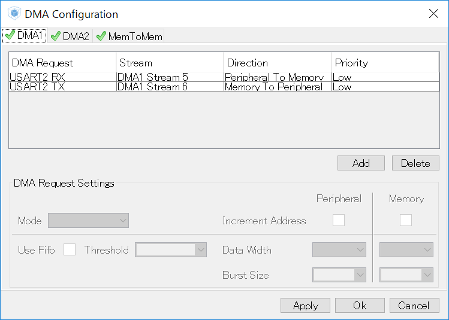

CodeGenerateします。

サンプルコード一部抜粋
```c
/* Includes ------------------------------------------------------------------*/
#include "stm32f4xx_hal.h"

/* USER CODE BEGIN Includes */
uint8_t RX_Buffer = '\000';
uint8_t TX_Buffer = '\000';

/* USER CODE END Includes */

/* Private variables ---------------------------------------------------------*/
UART_HandleTypeDef huart2;
DMA_HandleTypeDef hdma_usart2_rx;
DMA_HandleTypeDef hdma_usart2_tx;

/* USER CODE BEGIN PV */
/* Private variables ---------------------------------------------------------*/

/* USER CODE END PV */

/* Private function prototypes -----------------------------------------------*/
void SystemClock_Config(void);
void Error_Handler(void);
static void MX_GPIO_Init(void);
static void MX_DMA_Init(void);
static void MX_USART2_UART_Init(void);
```

受信時に呼ばれるコールバック関数。

```c

void HAL_UART_RxCpltCallback(UART_HandleTypeDef *huart)
{
        __HAL_UART_FLUSH_DRREGISTER(&huart2);
        TX_Buffer = RX_Buffer;
        HAL_UART_Transmit_DMA(&huart2, (uint8_t *)&TX_Buffer, 1);
				HAL_UART_Receive_DMA(&huart2, &RX_Buffer, 1);
        return;
}

```

main関数

```c

int main(void)
{

  /* USER CODE BEGIN 1 */

  /* USER CODE END 1 */

  /* MCU Configuration----------------------------------------------------------*/

  /* Reset of all peripherals, Initializes the Flash interface and the Systick. */
  HAL_Init();

  /* Configure the system clock */
  SystemClock_Config();

  /* Initialize all configured peripherals */
  MX_GPIO_Init();
  MX_DMA_Init();
  MX_USART2_UART_Init();

  /* USER CODE BEGIN 2 */

  __HAL_UART_FLUSH_DRREGISTER(&huart2);
  HAL_UART_Receive_DMA(&huart2, &RX_Buffer, 1);

  /* USER CODE END 2 */

  /* Infinite loop */
  /* USER CODE BEGIN WHILE */
  while (1)
  {
  /* USER CODE END WHILE */

  /* USER CODE BEGIN 3 */

  }
  /* USER CODE END 3 */

}


```


## 構成Parts
-

## GitHub
