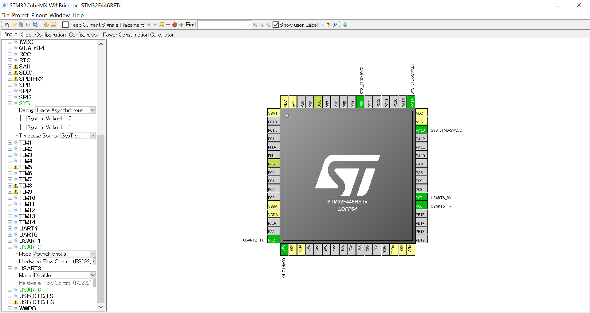
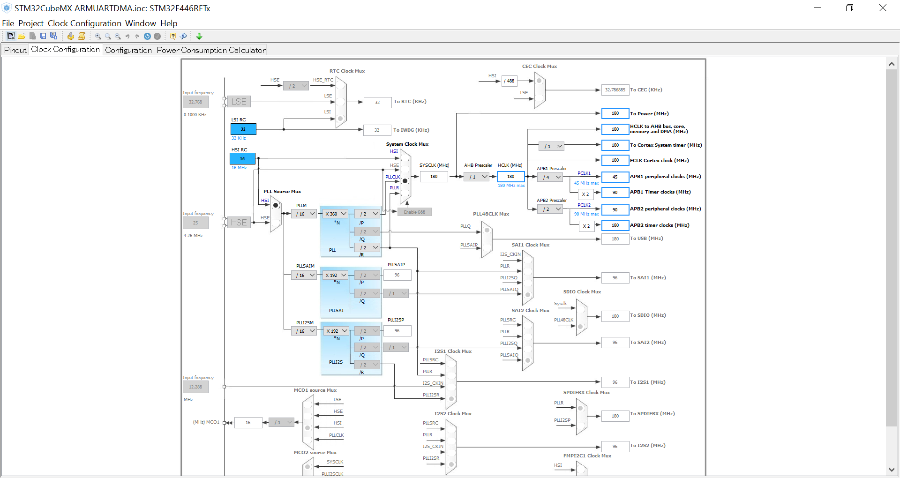
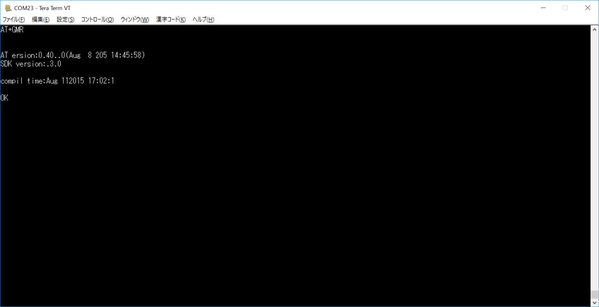
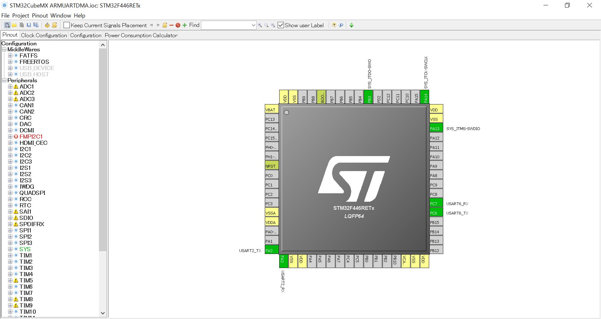
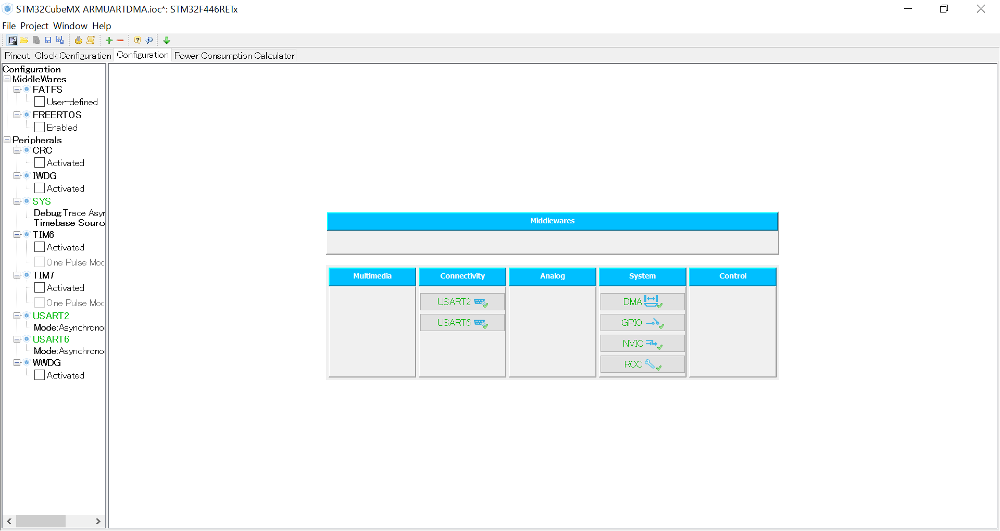
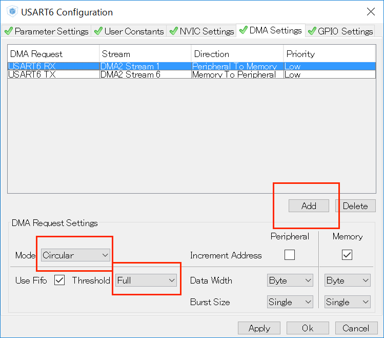
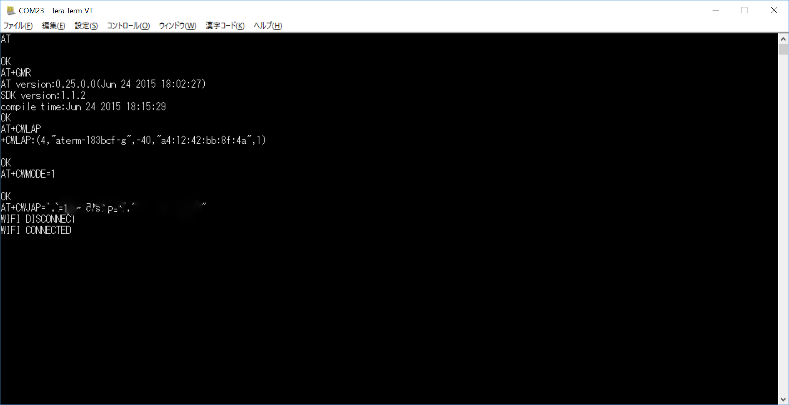

# #305 Wifi Serial Brick


<!--COLORME-->

## Overview
Wifi通信ができるBrickです。

## Connecting
Wifi Brickは　Arduino D9,CN10 mopho pin 4pinに接続します。

写真は開発中のものです。

###ポーリングによるシリアル通信
WifiBrickにATコマンドによる命令をします。命令はAT+GMRです。このコマンドは、WifiBrickのファームウェアバージョンを返します。
ポーリングして受信を待機します。手軽ではありますが、ループしないとデータを取りこぼします。
UART2はターミナルに表示。UART6をWifiBrick接続します。WifiBrickの通信速度は115200bps（デフォルト）に設定します。



下記のようにクロックを最大になるように、設定してください。


CodeGenerateします。
下記のコードを追記します。

```c
/* Includes ------------------------------------------------------------------*/
#include "stm32f4xx_hal.h"

/* USER CODE BEGIN Includes */
#include <stdio.h>
#include <string.h>

/* USER CODE END Includes */

/* Private variables ---------------------------------------------------------*/
UART_HandleTypeDef huart2;
UART_HandleTypeDef huart6;

```

main関数
```c
int main(void)
{

  /* USER CODE BEGIN 1 */

  /* USER CODE END 1 */

  /* MCU Configuration----------------------------------------------------------*/

  /* Reset of all peripherals, Initializes the Flash interface and the Systick. */
  HAL_Init();

  /* Configure the system clock */
  SystemClock_Config();

  /* Initialize all configured peripherals */
  MX_GPIO_Init();
  MX_USART2_UART_Init();
  MX_USART6_UART_Init();

  /* USER CODE BEGIN 2 */

	  char message[15] ;

	HAL_Delay(5000);
	sprintf(message,"AT+GMR\r\n");
	HAL_UART_Transmit(&huart6,(uint8_t*)message,strlen(message),0x1100);

while (1)
  {
char c;				
					while(HAL_UART_Receive(&huart6,(uint8_t *)&c,1,1111)==HAL_TIMEOUT);
					HAL_UART_Transmit(&huart2,(uint8_t *)&c,1,1111);

  /* USER CODE END WHILE */


  /* USER CODE BEGIN 3 */

  }
  /* USER CODE END 3 */


```

TeraTermなどでファームウェアバージョンが表示されたら正常です。



###DMAを利用した受信
UART2は、ターミナルと接続（USB),UART6は、WifiBrickに接続。
ＮｅｃｌｅｏからUART6に接続されたWifiBrickにコマンドを送信。WifiBrickの受信はDMAを使って受信します。

UART2,UART6をAnsynchrousを選択して有効にします。


クロックを下記のように設定します。


UART2,UART6,DMA,NVICを設定します。


confingration Nvic Settingsで有効にします。


configaration DMA Settingsで有効にします。


設定が終了したら、CodeGenerateします。コードが自動生成されます。

ソースコードの一部（抜粋）
```c

/* Includes ------------------------------------------------------------------*/
#include "stm32f4xx_hal.h"

/* USER CODE BEGIN Includes */

#include <stdio.h>
#include <string.h>

#define RXBUFFERSIZE 32768
#define TXBUFFERSIZE 32768

/* USER CODE END Includes */

/* Private variables ---------------------------------------------------------*/
UART_HandleTypeDef huart2;
UART_HandleTypeDef huart6;
DMA_HandleTypeDef hdma_usart2_rx;
DMA_HandleTypeDef hdma_usart2_tx;
DMA_HandleTypeDef hdma_usart6_rx;
DMA_HandleTypeDef hdma_usart6_tx;

__IO ITStatus uartstatus = RESET;
/* USER CODE BEGIN PV */
/* Private variables ---------------------------------------------------------*/

/* USER CODE END PV */

/* Private function prototypes -----------------------------------------------*/
void SystemClock_Config(void);
void Error_Handler(void);
static void MX_GPIO_Init(void);
static void MX_DMA_Init(void);
static void MX_USART2_UART_Init(void);
static void MX_USART6_UART_Init(void);

/* USER CODE BEGIN PFP */
/* Private function prototypes -----------------------------------------------*/

/* USER CODE END PFP */

/* USER CODE BEGIN 0 */

uint8_t TxBuffer[32768];
uint8_t RxBuffer[32768];

//DMAの送信が完了したときに呼ばれる
void HAL_UART_TxCpltCallback(UART_HandleTypeDef *huart)
{
  uartstatus = SET;
	HAL_UART_Transmit(&huart6,(uint8_t*)RxBuffer,TXBUFFERSIZE,0x1100);
	char meassage[32];
	sprintf(meassage,"TxCpltCallbackCalled:\n\r");
  HAL_UART_Transmit(&huart6,(uint8_t*)meassage,strlen(meassage),0x1100);
}

//DMAの受信が完了したときに呼ばれる
void HAL_UART_RxCpltCallback(UART_HandleTypeDef *huart)
{
  uartstatus = SET;
	char meassage[32];
	sprintf(meassage,"RxCpltCallbackCalled:\n\r");
  HAL_UART_Transmit(&huart6,(uint8_t*)meassage,strlen(meassage),0x1100);
}

void HAL_UART_ErrorCallback(UART_HandleTypeDef *huart)
{
		char meassage[32];
	sprintf(meassage,"ErrorCallback:\n\r");
   HAL_UART_Transmit(&huart6,(uint8_t*)meassage,strlen(meassage),0x1100);
}
void Dot(){
		char meassage[8];
	sprintf(meassage,".");
   HAL_UART_Transmit(&huart2,(uint8_t*)meassage,strlen(meassage),0x1100);
}

/* USER CODE END 0 */

int main(void)
{

  /* USER CODE BEGIN 1 */


  /* USER CODE END 1 */

  /* MCU Configuration----------------------------------------------------------*/

  /* Reset of all peripherals, Initializes the Flash interface and the Systick. */
  HAL_Init();

  /* Configure the system clock */
  SystemClock_Config();

  /* Initialize all configured peripherals */
  MX_GPIO_Init();
  MX_DMA_Init();
  MX_USART2_UART_Init();
  MX_USART6_UART_Init();

  /* USER CODE BEGIN 2 */

		char meassage[128];
	//バッファーへ送信
  if(HAL_UART_Receive_DMA(&huart6, (uint8_t *)RxBuffer, RXBUFFERSIZE) != HAL_OK)
  {
    Error_Handler();
  }
  //WifiBrickへコマンド送信
	sprintf(meassage,"Please Waitting.\r\n");
	HAL_UART_Transmit(&huart2,(uint8_t*)meassage,strlen(meassage),0x1100);
	sprintf(meassage,"AT\r\n");
	HAL_UART_Transmit(&huart6,(uint8_t*)meassage,strlen(meassage),0x1100);
	HAL_Delay(3000);
	sprintf(meassage,"AT+GMR\r\n");
	HAL_UART_Transmit(&huart6,(uint8_t*)meassage,strlen(meassage),0x1100);
	Dot();
	HAL_Delay(3000);
	sprintf(meassage,"AT+CWLAP\r\n");
  HAL_UART_Transmit(&huart6,(uint8_t*)meassage,strlen(meassage),0x1100);
	HAL_Delay(3600);
	sprintf(meassage,"AT+CWMODE=1\r\n");
  HAL_UART_Transmit(&huart6,(uint8_t*)meassage,strlen(meassage),0x1100);
	HAL_Delay(5000);
	Dot();
	sprintf(meassage,"AT+CWJAP=\"SSID\",\"Password\"\r\n");
  HAL_UART_Transmit(&huart6,(uint8_t*)meassage,strlen(meassage),0x1100);
	HAL_Delay(8000);
		sprintf(meassage,"AT+CIPSTART=\"TCP\",\"fabo.io\",80\r\n");
  HAL_UART_Transmit(&huart6,(uint8_t*)meassage,strlen(meassage),0x1100);
	HAL_Delay(12000);
	Dot();
	uint8_t str[] ="GET / HTTP/1.1\r\nHost:80\r\n\r\n";
	int s = strlen((const char*)str);
	sprintf(meassage,"AT+CIPSEND=%d\r\n",s);
  Dot();
	HAL_UART_Transmit(&huart6,(uint8_t*)meassage,strlen(meassage),0x1100);
	HAL_Delay(10000);
	sprintf(meassage,"GET / HTTP/1.1\r\nHost:80\r\n\r\n");
  HAL_UART_Transmit(&huart6,(uint8_t*)meassage,strlen(meassage),0x1100);
	Dot();
	HAL_Delay(32000);
	//WifiBrickで受信したデータをUART2へ送信
	HAL_UART_Transmit(&huart2,(uint8_t*)RxBuffer,RXBUFFERSIZE,0x1100);
	//受信待機
  while (uartstatus != SET)
  {
	//sprintf(meassage,"Waitting:\n\r");
  //HAL_UART_Transmit(&huart2,(uint8_t*)meassage,strlen(meassage),0x1100);
  }
  //受信完了
	uartstatus = RESET;

		//UART2へ送信
		strcpy((char *)TxBuffer,(char *)RxBuffer);
		HAL_UART_Transmit(&huart2,(uint8_t*)TxBuffer,TXBUFFERSIZE,0x1100);

  while (uartstatus != SET);

	//送信完了
	uartstatus = RESET;

  /* USER CODE END 2 */


  /* Infinite loop */
  /* USER CODE BEGIN WHILE */
  while (1)
  {

  /* USER CODE END WHILE */

  /* USER CODE BEGIN 3 */

  }
  /* USER CODE END 3 */

}
```

リセットボタンを押すと起動します。
Wifiに接続して、約２分ぐらいで表示されます。


## 構成Parts
-

## GitHub
