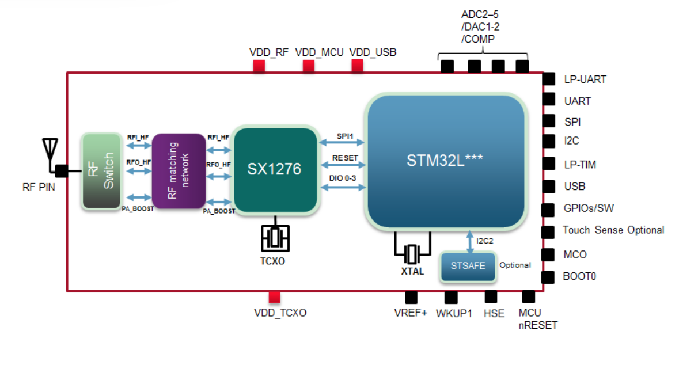
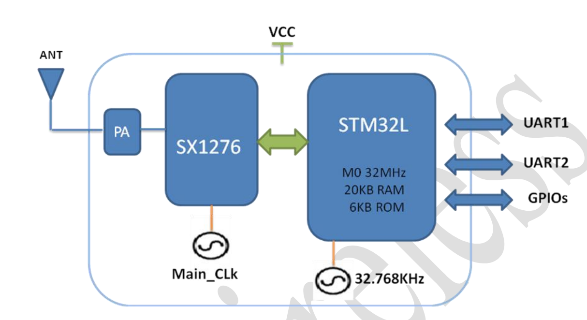
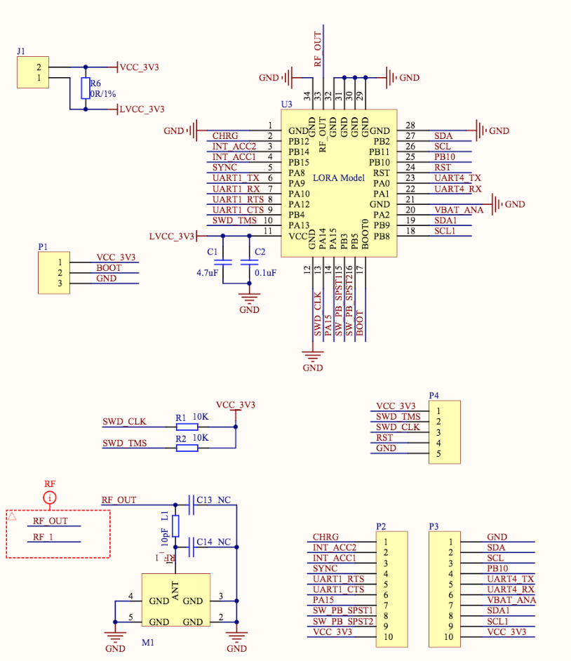
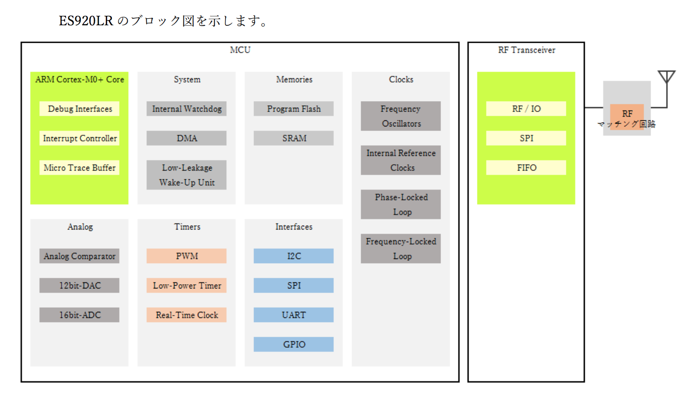

# LoRaチップ

## LoRa対応チップ

| Chip名 | Maker |Co-Proccesor| BLE Version | メモ |
| -- | -- | -- | -- |
|[SX1262](https://www.semtech.com/products/wireless-rf/lora-transceivers/sx1262)|[Semtech](https://www.semtech.com/) |  ARM® Cortex™  M4F(64 MHz) | LoRa | |

## LoRa対応モジュール

| Module名 | Maker | 技適 |
| -- | -- | -- | -- |
|[CMWX1ZZABZ-078](https://www.murata.com/ja-jp/products/lpwa/lora)| Murata |	取得済み |
|[RAK811](http://www.rakwireless.com/en/module/lora/RAK811)	| RAK Wireless	 |取得済み |
|[ES920LR](http://easel5.com/productinfo/)	| 株式会社イーゼル |	取得済み |
|TLM922S-P01A	| Kiwitec |	取得済み |

## Block Diagram

