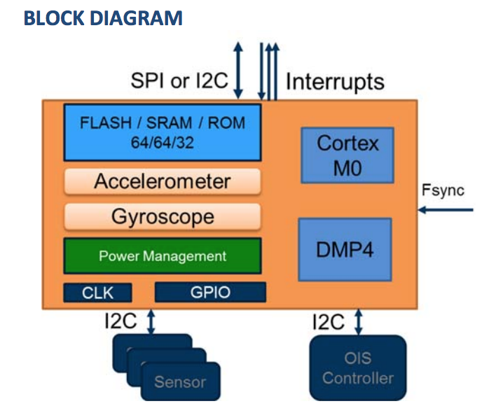
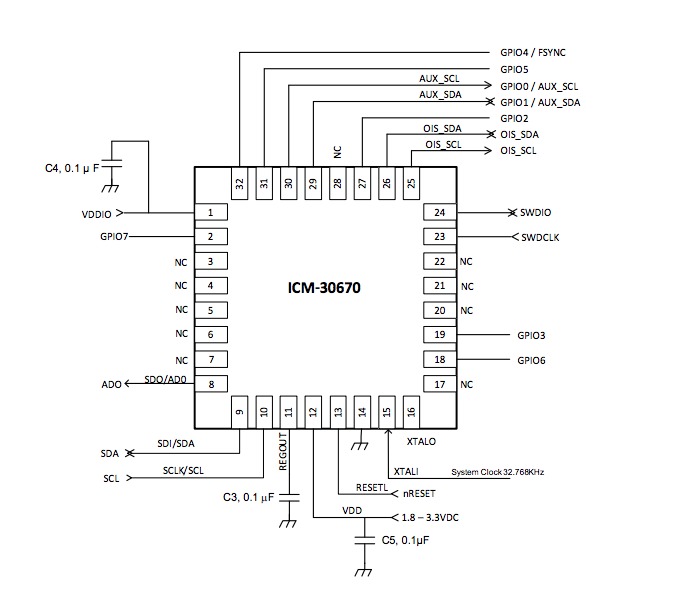

# Sensor SoCチップ

## SoC搭載Sensor

| Chip名 | Maker |Co-Proccesor|  |
| -- | -- | -- | -- |
|[ICM‐30670](https://www.invensense.com/wp-content/uploads/2015/12/DS-000129-ICM-30670-TYP-v1.0-3.pdf)|[InvenSense]](https://www.invensense.com/) |  ARM® Cortex™ M0 | 6-axis |

