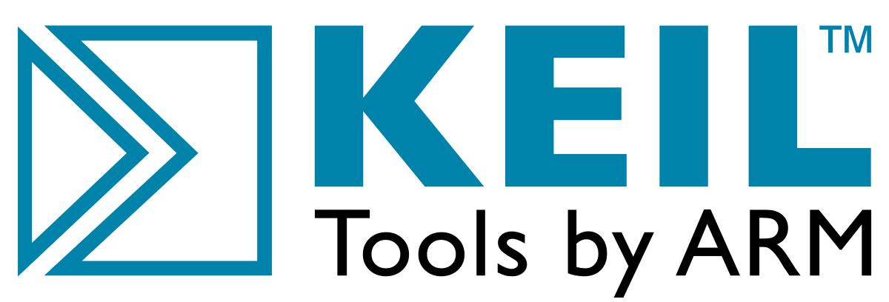

# KEIL MDK-ARMｍのダウンロード 

ターゲットとなる[NRF5Xシリーズ](https://www.nordicsemi.com/Products/Low-power-short-range-wireless/Bluetooth-low-energy)は、純正ARMコンパイラが使用できるKEIL、様々なマイコンに対応したIARやEmbedStduioで開発ができます。GCCでの開発も可能です。

本ドキュメントでは、KEIL（カイル）を使用して開発します。

[KEIL　μVersion](http://www2.keil.com/mdk5/uvision/)は、プロジェクト管理、実行環境、ソースコード編集、プログラムデバックをすべて揃ったARMの純正コンパイラ搭載の統合開発環境IDEです。

KEILには、有償版とコード容量制限付きの体験版(32KB)、期限付きコードサイズ無制限（KEIL設定必要）があります。

!!!Note
	Keilは、最新のマイコンに対応して、有償版はサポートが受けられます。開発時間の短縮が必要なときや開発費に余裕がある場合はこちらがお勧めです。

## MDK-ARM価格一覧

| ライセンス | 価格 | 詳細 |
|:--|:--|:--|
| MDK-Professional | 30-40万円(1年ライセンス) | Middleware Librariesも付属 |
| MDK-Standard | 約25-30万円(1年ライセンス)| Cortex®-Mシリーズ, ARM7,ARM9,Cortex®-R, SecureCore　|
| MDK-Cortex-M | 約20万円(1年ライセンス）| Cortex®-Mシリーズ限定 |
| MDK-Lite | 無料| 32K制限 |

## Keil MDK-ARMがサポートしているモジュール

* [DA14580](http://www.keil.com/dd/chip/6853.htm)
* [CYBL10X6X](http://www.keil.com/dd/chips/cypress/arm.htm)
* [nrf51822](http://www.keil.com/dd/chips/nordic/arm.htm)

## Keil uVersionのダウンロード

それでは、Downloadサイトより、Keil uVersionをダウンロードしてきます。

[https://www.keil.com/download/](https://www.keil.com/download/)
