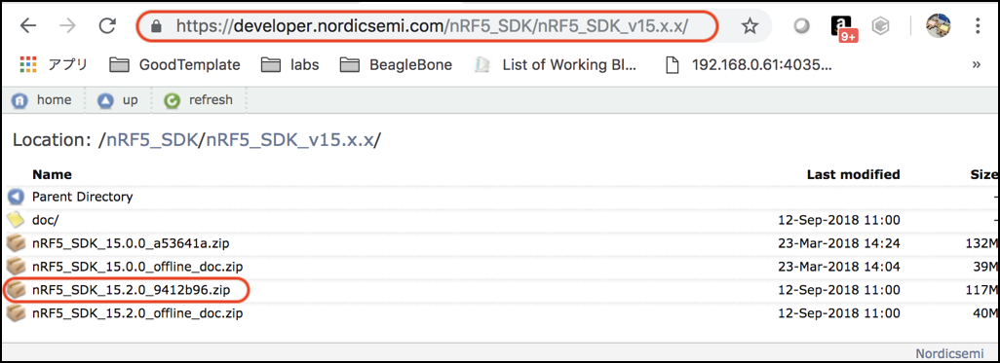

# 2.nRF52 SDKのダウンロード

## nRF5シリーズ

Noricセミコンダクタ社開発のBluetooth low energy/2.4GHz対応のSoCは、nRF51822(nRF51系)やnRF52832(nRF52系)などがあります。

## nRF5 SDK

nRF5 SDKは、nRF5シリーズ向けの開発環境です。ドライバ、ライブラリ、SoftDevices、独自の無線プロトコルなどが含まれます。

本チュートリアルでは、nRF5 SDK Version 15を使用します。2018年3月現在で、最新版のSDKはVersion 15となっています。

[https://developer.nordicsemi.com/nRF5_SDK/](https://developer.nordicsemi.com/nRF5_SDK/)

## SDKのダウンロード

NRF52アプリケーション開発に必要なSDKをダウンロードします。
SDKには、必要なコンポーネント、ツールチェーン、ソフトデバイス、サンプルコードが含まれています。
ソフトデバイスは、BLE開発の時に必要になります。

コンポーネント群やソフトデバイスおよびサンプルコード,ドキュメントがダウンロードされます。

|SDK Version 15のダウンロード先|
|:--|
|[https://developer.nordicsemi.com/nRF5_SDK/](https://developer.nordicsemi.com/nRF5_SDK/nRF5_SDK_v15.x.x/)|

