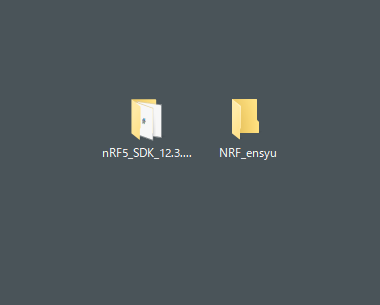

# 開発の事前準備

## SDKのコンポーネントをコピー

ダウンロードしたSDKのコンポーネント群をコピーしてテンプレートをつくりましょう。

ここでは利用するフォルダーを作成し、名前をNRF_ensyuと名前を付けてます。

SDKの入っているフォルダのコンポーネント、ライブラリ群をNRF_ensyuフォルダへコピーします。

## SDK_Config.hをコピー

モジュールを有効無効するファイルであるSDK_Config.hをコピーしておきます。

nRF5_SDK_12.3.0_d7731adの中のexample/ble_peripheral/ble_app_template/pca10040/s132/config/sdk_config.hのファイルを上記で作ったディレクトリー内へコピーします。

