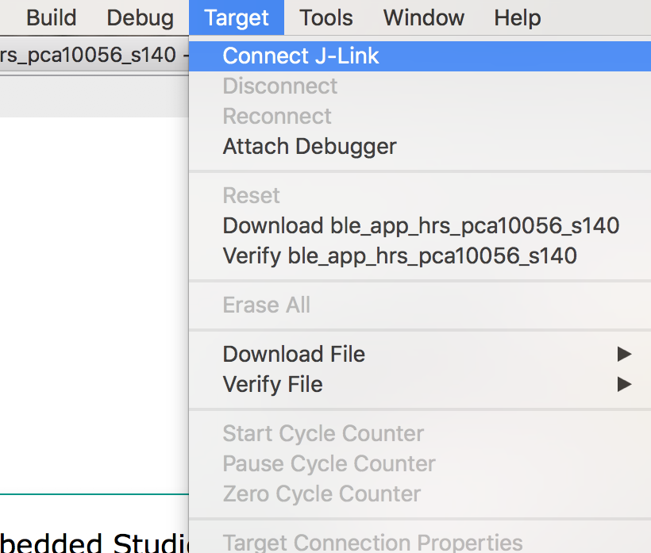
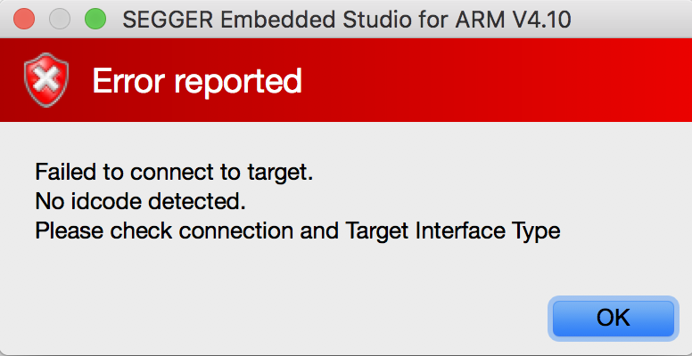

# エラーとその対処

## J-LINK





```
$ JLinkExe -device NRF52 -if SWD -speed 1518 -autoconnect 1
SEGGER J-Link Commander V6.34h (Compiled Oct  9 2018 15:49:05)
DLL version V6.34h, compiled Oct  9 2018 15:48:55

Connecting to J-Link via USB...O.K.
Firmware: J-Link Lite-Cortex-M V8 compiled Sep 15 2016 12:05:01
Hardware version: V8.00
S/N: 518112173
License(s): GDB
VTref=0.000V
Device "NRF52" selected.


Connecting to target via SWD
Cannot connect to target.
J-Link>
```

VTRef=0.000Vなので、ボードに電源が供給されていない。
