# UART

[UART module](http://infocenter.nordicsemi.com/index.jsp?topic=%2Fcom.nordic.infocenter.sdk51.v10.0.0%2Fgroup__app__uart.html&cp=4_1_0_6_7_22)を用いることで、UART通信を行うことが可能になります。


# 基板とオプション設定

UARTでデータの送受信をするには、基板のRX, TXのピンの位置を確認しておく。

| 基板名 | RX | TX | RTS | CTS |
| -- | -- | -- | -- | -- |
| PCA10028 | P0.11 | P0.09 | P0.08 | P0.06 |
| PCA10036 | P0.08 | P0.06 | P0.05 | P0.10 | 
| FaBo Breakout | P0.09 | P0.11 | なし | なし |

# コンポーネントの取り込み

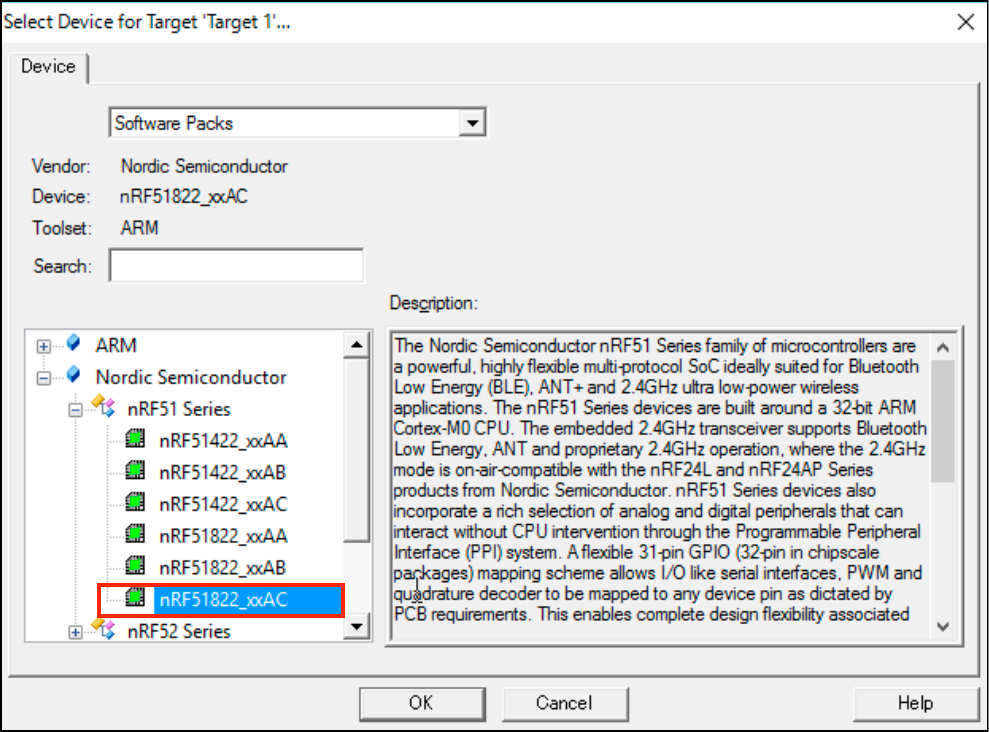

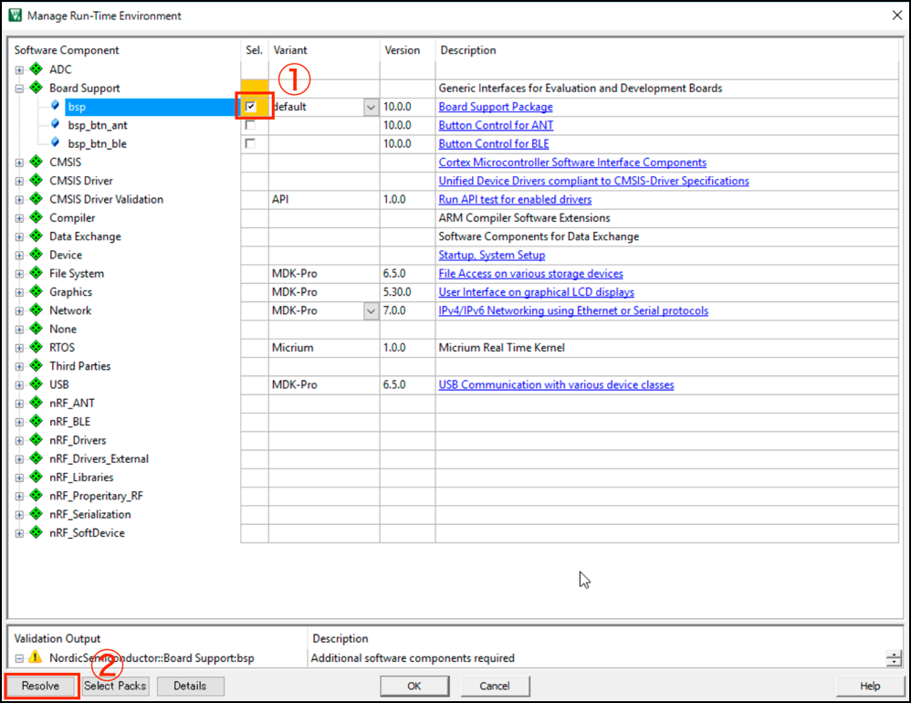

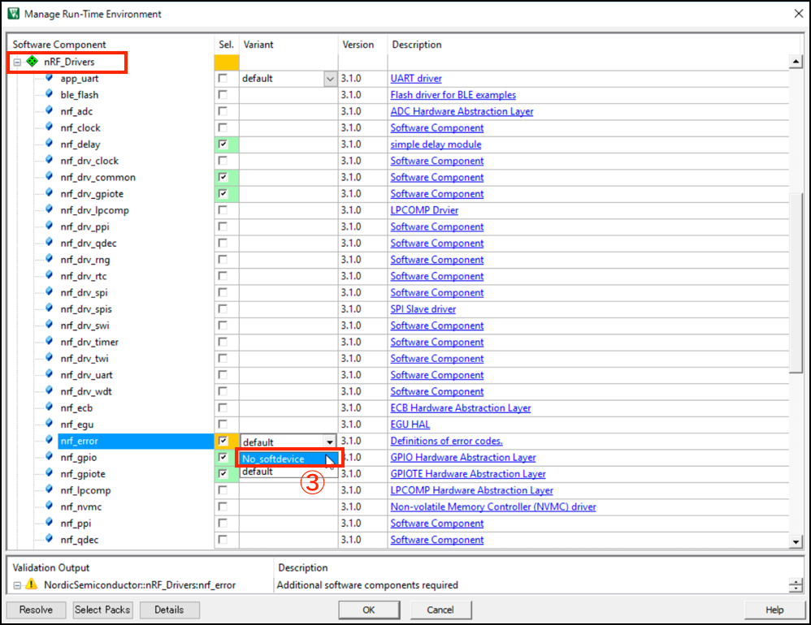

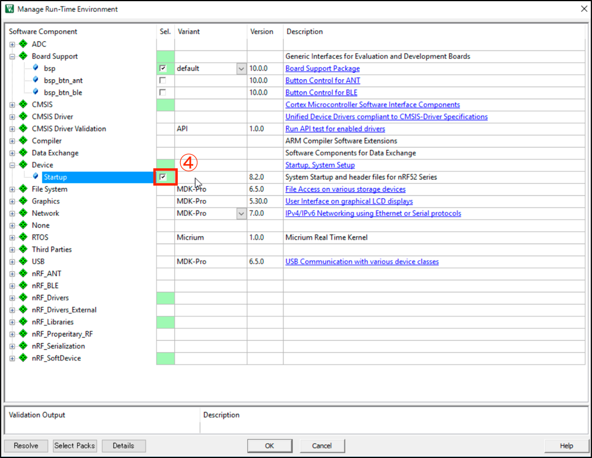

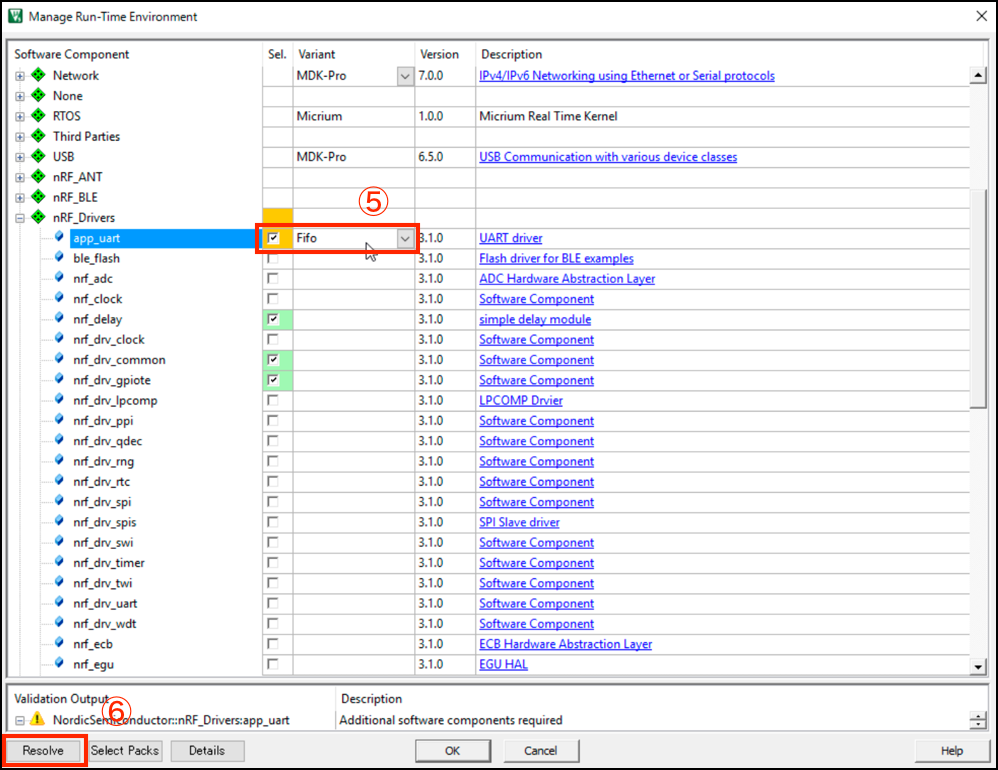

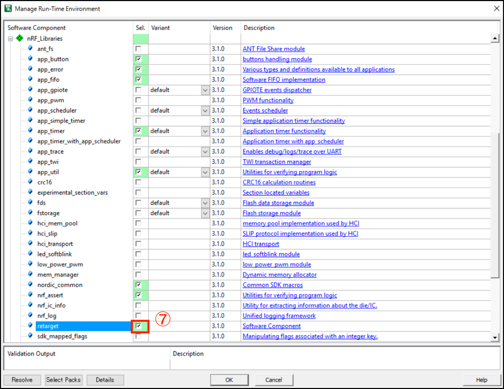

| Device関連 | nRF Driver | nRF Libraries| nRF SoftDevice|
| -- | -- |  -- | -- |
| 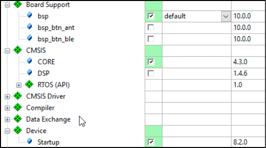 | 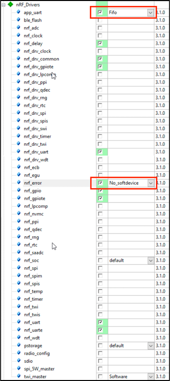 | 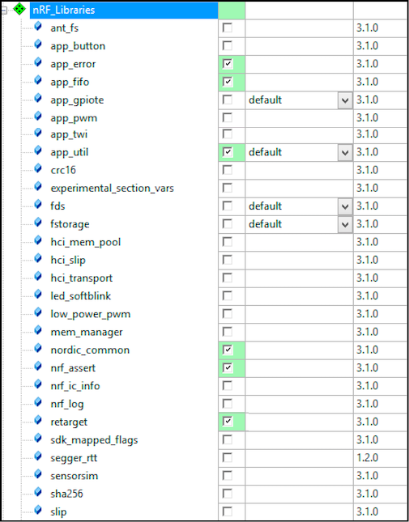 | 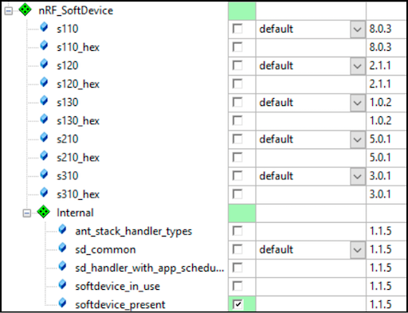 |

もし、オレンジ色に変わる場合は、ライブラリの足りていないエラーなので、Rsolvボタンを押して不足ライブラリを補充する。
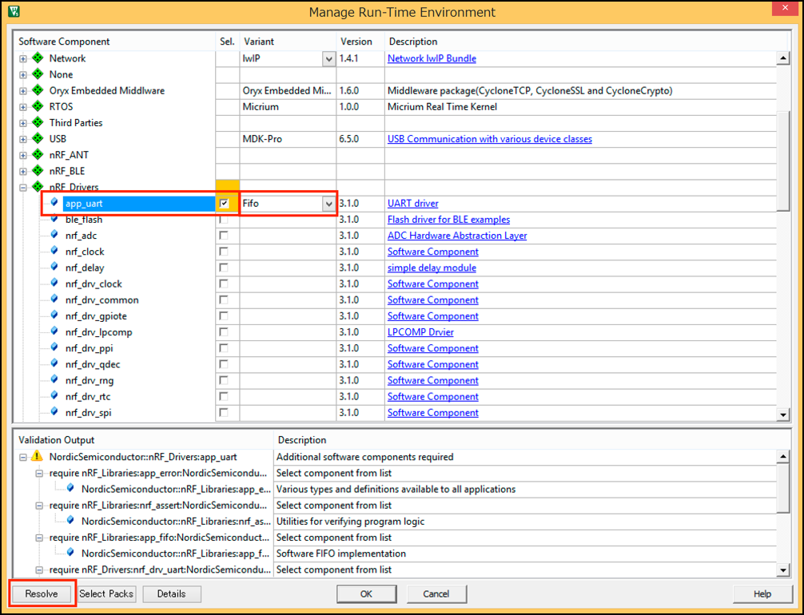

# URATの設定

OptionのC/C++タブで、Defineの値にボード名をいれることで、URATのPINを設定することができる。

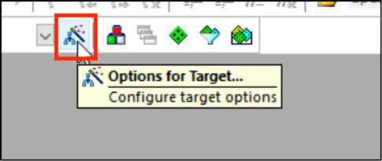

| 基板名 | Defineの値 | 実際の画面 |
| -- | -- | -- |
| PCA10028 | BOARD_PCA10028 | 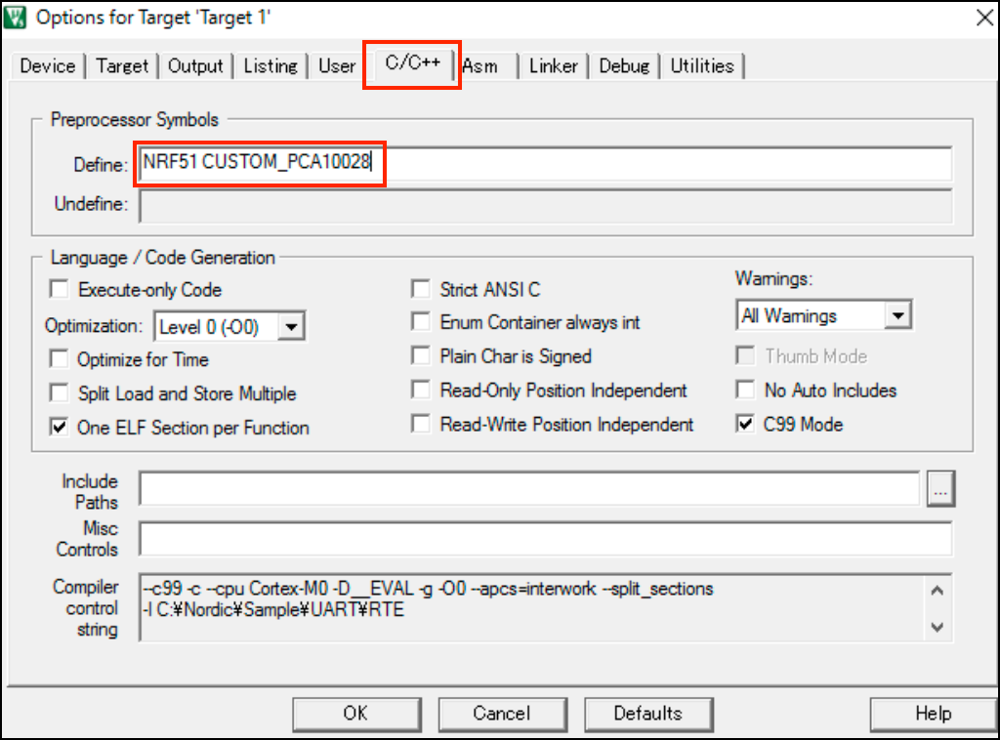| 
| PCA10036 | BOARD_PCA10036 | 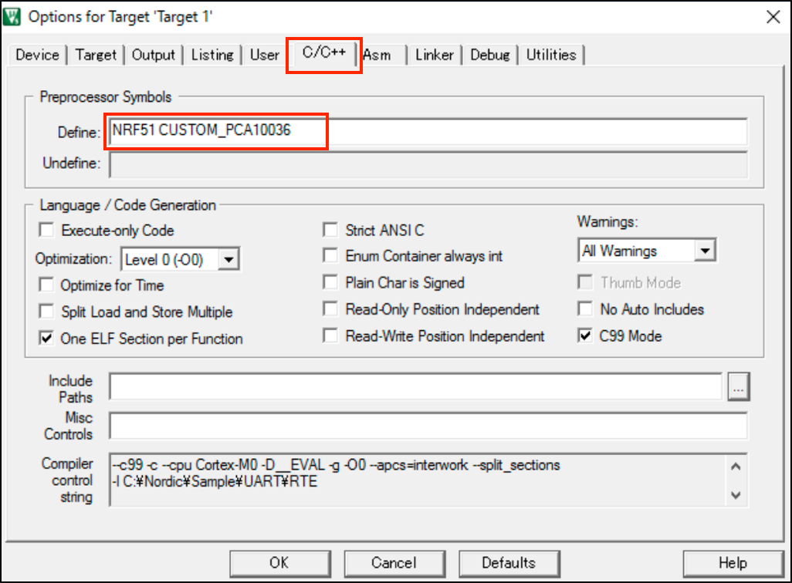|
| FaBo Breakout Board | BOARD_CUSTOM | 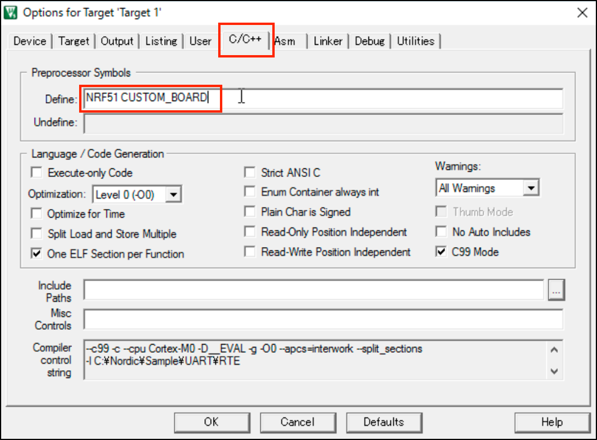 |

Nordic製の開発ボードは、boards.hを読み込みにいき、boards.hに書くボードようのヘッダーファイルのincludeが記載されている。PCA10028, PCA10036のPINの値は、それぞれpca10028.h, pca10036.hで定義されている。

`boards.h`

```c
#ifndef BOARDS_H
#define BOARDS_H

#include "nrf_gpio.h"

#if defined(BOARD_NRF6310)
  #include "nrf6310.h"
#elif defined(BOARD_PCA10000)
  #include "pca10000.h"
#elif defined(BOARD_PCA10001)
  #include "pca10001.h"
#elif defined(BOARD_PCA10002)
  #include "pca10000.h"
#elif defined(BOARD_PCA10003)
  #include "pca10003.h"
#elif defined(BOARD_PCA20006)
  #include "pca20006.h"
#elif defined(BOARD_PCA10028)
  #include "pca10028.h"
#elif defined(BOARD_PCA10031)
  #include "pca10031.h"
#elif defined(BOARD_PCA10036)
  #include "pca10036.h"
#elif defined(BOARD_PCA10040)
  #include "pca10040.h"
#elif defined(BOARD_WT51822)
  #include "wt51822.h"
#elif defined(BOARD_N5DK1)
  #include "n5_starterkit.h"
#elif defined(BOARD_CUSTOM)
  #include "custom_board.h"
#else
#error "Board is not defined"
```
FaBo Breakout Boardに関しては、独自にPINの値の定義をおこなう。CUSTOM_BOARDと定義すると、`boards_custom.h`を読みにいくようになるので、`boards_custom.h`を作成し、そこに値を記載する。また、`boards_custom.h`の作成したディレクトリにパスを通しておくことも忘れない。


`boards_custom.h`

```c
#define RX_PIN_NUMBER 9
#define TX_PIN_NUMBER 11
#define RTS_PIN_NUMBER 99
#define CTS_PIN_NUMBER 99
```


## SourceCode(PCA10028, PCA10036用)

`main.c`

```c

#include <stdbool.h>
#include <stdint.h>
#include <stdio.h>
#include "app_uart.h"
#include "app_error.h"
#include "nrf_delay.h"
#include "boards.h"

#define UART_TX_BUF_SIZE 1024u                                  /**< UART TX buffer size. */
#define UART_RX_BUF_SIZE 1024u                                  /**< UART RX buffer size. */

int counter = 0;

/**
 * @brief UARTのイベントハンドラ.
 */
void uart_events_handler(app_uart_evt_t * p_event)
{
    switch (p_event->evt_type)
    {
        case APP_UART_COMMUNICATION_ERROR: 
            APP_ERROR_HANDLER(p_event->data.error_communication);
            break;

        case APP_UART_FIFO_ERROR:          
            APP_ERROR_HANDLER(p_event->data.error_code);
            break;

        case APP_UART_TX_EMPTY:            
            break;

        default: break;
    }
}

/**
 * @brief UART初期化処理.
 */
void uart_config(void)
{
    uint32_t err_code;
    const app_uart_comm_params_t comm_params =
    {
        RX_PIN_NUMBER,
        TX_PIN_NUMBER,
        RTS_PIN_NUMBER,
        CTS_PIN_NUMBER,
        APP_UART_FLOW_CONTROL_DISABLED,
        false,
        UART_BAUDRATE_BAUDRATE_Baud38400
    };

    APP_UART_FIFO_INIT(&comm_params,
                       UART_RX_BUF_SIZE,
                       UART_TX_BUF_SIZE,
                       uart_events_handler,
                       APP_IRQ_PRIORITY_LOW,
                       err_code);

    APP_ERROR_CHECK(err_code);
}

/**
 * @brief Main処理.
 */
int main(void)
{
    uart_config();

    while (true)
    {
        printf("\n\rCounter:%d.\r\n", counter);
        nrf_delay_ms(1000);
        counter++;
    }
}
```

## SourceCode(FaBo Breakout)

`main.c`

```c
#include <stdbool.h>
#include <stdint.h>
#include <stdio.h>
#include "app_uart.h"
#include "app_error.h"
#include "nrf_delay.h"
#include "boards.h"

#define UART_TX_BUF_SIZE 1024u                                  /**< UART TX buffer size. */
#define UART_RX_BUF_SIZE 1024u                                  /**< UART RX buffer size. */

int counter = 0;

/**
 * @brief UARTのイベントハンドラ.
 */
void uart_events_handler(app_uart_evt_t * p_event)
{
    switch (p_event->evt_type)
    {
        case APP_UART_COMMUNICATION_ERROR: 
            APP_ERROR_HANDLER(p_event->data.error_communication);
            break;

        case APP_UART_FIFO_ERROR:          
            APP_ERROR_HANDLER(p_event->data.error_code);
            break;

        case APP_UART_TX_EMPTY:            
            break;

        default: break;
    }
}

/**
 * @brief UART初期化処理.
 */
void uart_config(void)
{
    uint32_t err_code;
    const app_uart_comm_params_t comm_params =
    {
        RX_PIN_NUMBER,
        TX_PIN_NUMBER,
        RTS_PIN_NUMBER,
        CTS_PIN_NUMBER,
        APP_UART_FLOW_CONTROL_DISABLED,
        false,
        UART_BAUDRATE_BAUDRATE_Baud38400
    };

    APP_UART_FIFO_INIT(&comm_params,
                       UART_RX_BUF_SIZE,
                       UART_TX_BUF_SIZE,
                       uart_events_handler,
                       APP_IRQ_PRIORITY_LOW,
                       err_code);

    APP_ERROR_CHECK(err_code);
}

/**
 * @brief Main処理.
 */
int main(void)
{
    uart_config();

    while (true)
    {
        printf("\n\rCounter:%d.\r\n", counter);
        nrf_delay_ms(1000);
        counter++;
    }
}
```

`board_custom.h` (新規作成)

```c
#define RX_PIN_NUMBER 9
#define TX_PIN_NUMBER 11
#define RTS_PIN_NUMBER 99
#define CTS_PIN_NUMBER 99
```

board_custom.hを作成したフォルダにパスを通す。

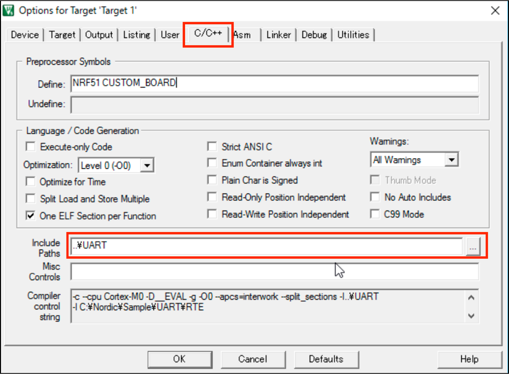

## Configを修正し、UARTを有効にする

nrf_drv_config.hファイルにGPIOTE, UARTの有効にする変数があるので、修正を加える。

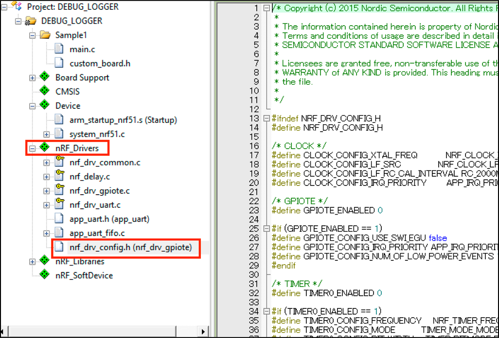

GPIOTEを有効にするため

    #define GPIOTE_ENABLED 1

にする。

```c
/* GPIOTE */
#define GPIOTE_ENABLED 1

#if (GPIOTE_ENABLED == 1)
#define GPIOTE_CONFIG_USE_SWI_EGU false
#define GPIOTE_CONFIG_IRQ_PRIORITY APP_IRQ_PRIORITY_LOW
#define GPIOTE_CONFIG_NUM_OF_LOW_POWER_EVENTS 1
#endif
```

UARTを有効にするため

    #define UART0_ENABLED 1

にする。


```c
/* UART */
#define UART0_ENABLED 1

#if (UART0_ENABLED == 1)
#define UART0_CONFIG_HWFC         NRF_UART_HWFC_DISABLED
#define UART0_CONFIG_PARITY       NRF_UART_PARITY_EXCLUDED
#define UART0_CONFIG_BAUDRATE     NRF_UART_BAUDRATE_38400
#define UART0_CONFIG_PSEL_TXD     0
#define UART0_CONFIG_PSEL_RXD     0
#define UART0_CONFIG_PSEL_CTS     0
#define UART0_CONFIG_PSEL_RTS     0
#define UART0_CONFIG_IRQ_PRIORITY APP_IRQ_PRIORITY_LOW
#ifdef NRF52
#define UART0_CONFIG_USE_EASY_DMA false
//Compile time flag
#define UART_EASY_DMA_SUPPORT     1
#define UART_LEGACY_SUPPORT       1
#endif //NRF52
#endif
```

## Buildして転送


