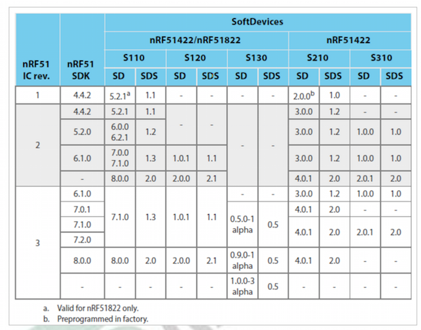
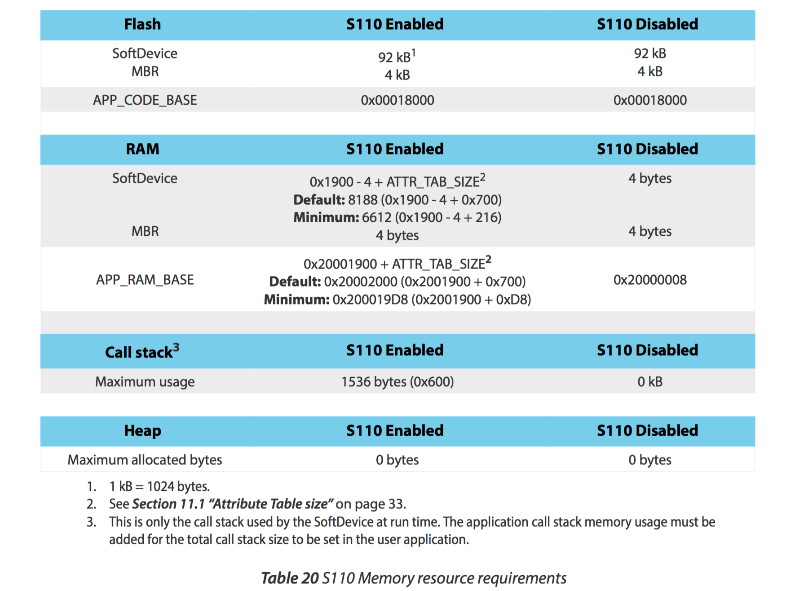
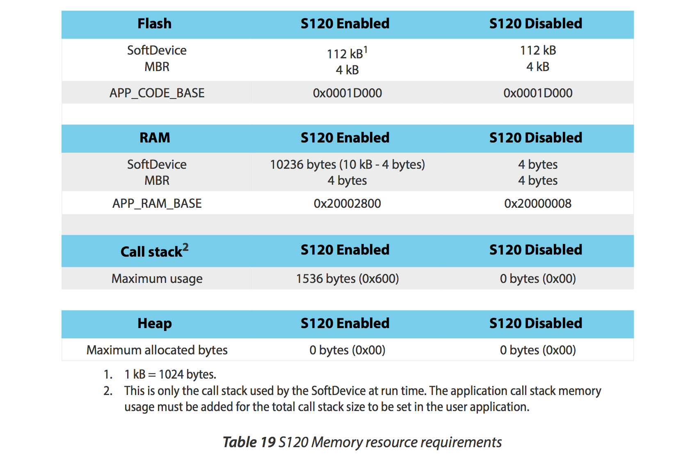

# SoftDevice

## SoftDeviceとは

Nordicが提供しているnRF5xシリーズ向けの[プロトコルスタック](https://ja.wikipedia.org/wiki/%E3%83%97%E3%83%AD%E3%83%88%E3%82%B3%E3%83%AB%E3%82%B9%E3%82%BF%E3%83%83%E3%82%AF)。  

### nRF51シリーズ  

BLE用はS110, S120, S130と３種類あり、それぞれ用途が異なる。  
ちなみにS210, S310は[ANT/ANT+](http://k-tai.impress.co.jp/docs/column/keyword/20110322_434325.html)用のスタックになる。  
ARM® CortexTM-M0向け。

### nRF52シリーズ

52シリーズ向けSoftDeviceは現在(2015/9)開発中で、S130をベースとしたS132のAlpha版が提供されている。  
S110,S120に対応した物も順次開発予定。  
ARM® Cortex-M4F向け。

### 対応チップとバージョン  

### 比較  

| SoftDevice | 概要 |
| -- | -- |
| S110 | Peripheral専用 |
| S120 | Central/Peripheral両用。  Centralモードの場合は8つ同時接続可能、Peripheralモードの場合は同時にBroadcasterとしても動作する。|
| S130 | Central/Peripheral同時利用。 Centralとして３接続と１つのPeripheralとして動作する。こちらはObserverとBroadcaster両方になれる。 |

### メモリマップ

SoftDeviceの種類によってApplicationを書き込むアドレスやメモリの領域が異なる  
ビルド設定時に以下の情報が必要になる  

## S110

## S120

## S130

