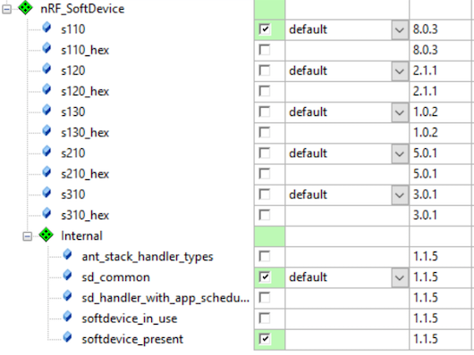
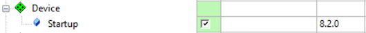
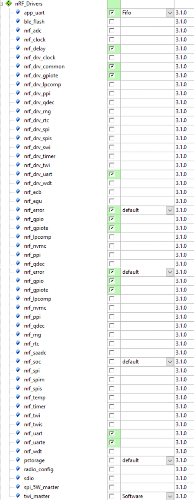

# Sample

## 事前準備

[Debug Logger](nrf51debug.md)と[Common application error handler](nrf51error.md)を事前に組み込む。

## SourceCode
main.c
```c
#include <stdbool.h>
#include <string.h>
#include "app_trace.h"
#include "app_error.h"
#include "softdevice_handler.h"
#include "ble_conn_params.h"
#include "custom_board.h"
#include "ble_advdata.h"
#include "ble.h"
#include "ble_advdata.h"
#include "ble_conn_params.h"

// サービスが変更されないなら0
#define IS_SRVC_CHANGED_CHARACT_PRESENT      0

#define APP_COMPANY_IDENTIFIER 0x002C // Apple

#define APP_BEACON_INFO_LENGTH 0x17 // Beaconのデータの長さ
#define APP_BEACON_TYPE 0x02, 0x15 // Beaconのタイプ

#define APP_MAJOR_VALUE 0x01, 0x02                        // iBeaconのMajor 
#define APP_MINOR_VALUE 0x03, 0x04                        // iBeaconのMinor 
#define APP_BEACON_UUID     0x01, 0x12, 0x23, 0x34, \
							0x45, 0xaa, 0x67, 0x78, \
							0x89, 0xba, 0x13, 0xbc, \
							0x33, 0x1a, 0x22, 0xf0 // iBeaconのUUID
							
#define APP_MEASURED_RSSI 0xC3 // RSSI出力の計測値

static uint8_t m_beacon_info[APP_BEACON_INFO_LENGTH] =  // iBeaconのAdvertising Data
{
    APP_BEACON_TYPE,
    APP_BEACON_UUID,     
    APP_MAJOR_VALUE,     
    APP_MINOR_VALUE,    
    APP_MEASURED_RSSI
};

#define NON_CONNECTABLE_ADV_INTERVAL    MSEC_TO_UNITS(100, UNIT_0_625_MS) /**< The advertising interval for non-connectable advertisement (100 ms). This value can vary between 100ms to 10.24s). */

/**
 * @brief エラーハンドラ.APP_ERROR_CHECKでエラーが発生している場合は、呼ばれる.
 */
void app_error_handler(uint32_t error_code,
                uint32_t line_num,
                const uint8_t *p_file_name )
{
    app_trace_log("error_code: %d\r\n", error_code);
    app_trace_log("line_num:  %d\r\n", line_num);
    app_trace_log("p_file_name: %s\r\n", p_file_name);
}

/**
 * @brief 関連するModule群にシステムイベントを送出する関数.
 *
 * @details システムイベントが発生したあとに、システムイベント割り込みハンドラから呼び出される.
 *
 * @param[in]  sys_evt システムスタックイベント
 */
static void sys_evt_dispatch(uint32_t sys_evt)
{
}

/**
 * @brief BLEスタックイベントに関連するすべてのModule群にBLEスタックイベントを送出するための関数.
 *
 * @details BLEスタックイベントを受信したあと、メインループの中のスケジューラーから呼び出される.
 *          
 * @param[in]   p_ble_evt   Bluetoothスタックイベント.
 */
static void ble_evt_dispatch(ble_evt_t * p_ble_evt)
{
}

/**@brief Function for the Power manager.
 */
static void power_manage(void)
{
	uint32_t err_code = sd_app_evt_wait();
	APP_ERROR_CHECK(err_code);
}

int main() { 
	uint32_t err_code;

    // Denug loggerの初期化.
    app_trace_init();

    SOFTDEVICE_HANDLER_INIT(NRF_CLOCK_LFCLKSRC_RC_250_PPM_8000MS_CALIBRATION, NULL);

    // BLEスタックを有効にする. 
    ble_enable_params_t ble_enable_params;
    memset(&ble_enable_params, 0, sizeof(ble_enable_params));
    ble_enable_params.gatts_enable_params.service_changed = IS_SRVC_CHANGED_CHARACT_PRESENT;
    err_code = sd_ble_enable(&ble_enable_params);
    APP_ERROR_CHECK(err_code);

    // BLEイベントを登録する.
    err_code = softdevice_ble_evt_handler_set(ble_evt_dispatch);
    APP_ERROR_CHECK(err_code);

    // BLEイベント群のためのSoftDeviceハンドラモジュールを登録.
    err_code = softdevice_sys_evt_handler_set(sys_evt_dispatch);
    APP_ERROR_CHECK(err_code);

    // AdvDataのManufacture Specificの領域の値の定義.
    ble_advdata_manuf_data_t manuf_specific_data;
	manuf_specific_data.company_identifier = APP_COMPANY_IDENTIFIER;
	manuf_specific_data.data.p_data = (uint8_t *) m_beacon_info;
	manuf_specific_data.data.size = APP_BEACON_INFO_LENGTH;
    
    // AdvDataを構築
	ble_advdata_t advdata;
	memset(&advdata, 0, sizeof(advdata));
	advdata.name_type = BLE_ADVDATA_NO_NAME;
	uint8_t flags = BLE_GAP_ADV_FLAGS_LE_ONLY_GENERAL_DISC_MODE;
	advdata.flags = flags;
	advdata.p_manuf_specific_data = &manuf_specific_data;
    
    // AdvDataを登録.
	err_code = ble_advdata_set(&advdata, NULL);
	APP_ERROR_CHECK(err_code);

	// Advertisingパラメーターの設定
	ble_gap_adv_params_t m_adv_params;  
    memset(&m_adv_params, 0, sizeof(m_adv_params));
    m_adv_params.type = BLE_GAP_ADV_TYPE_ADV_NONCONN_IND; // ADV_NONCONN_IND
    m_adv_params.p_peer_addr = NULL; // 不特定多数デバイスから接続可能に
    m_adv_params.fp = BLE_GAP_ADV_FP_ANY; // 不特定多数デバイスから接続可能に
    m_adv_params.interval = NON_CONNECTABLE_ADV_INTERVAL; // 発信周期
    m_adv_params.timeout = 0;
    
    // Advertisingを開始
    err_code = sd_ble_gap_adv_start(&m_adv_params);
    APP_ERROR_CHECK(err_code);
    
    while(true){
        power_manage();
    }
}

```

custom_board.h
```h
#define RX_PIN_NUMBER 9
#define TX_PIN_NUMBER 11
#define RTS_PIN_NUMBER 100
#define CTS_PIN_NUMBER 100

```

## Optionの設定


Define:

    DEBUG BOARD_CUSTOM ENABLE_DEBUG_LOG_SUPPORT BLE_STACK_SUPPORT_REQD

## ソフトウェアコンポーネントの追加

|nRF_SoftDevice |
| -- | -- |
|  | 


| Board Support | CMSIS | Device|
| -- | -- |
|  |  |  |

| BLE Modules | nRF_Devices | nRF_Libraries|
| -- | -- |
|  |  |  |


