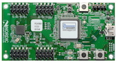
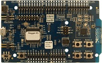

# Board

## 開発ボード

| 名称 | 開発ボード型番 | ボード情報 | 写真 |
|  -- |-- | -- | -- |
| | PCA10001 | [DevZone](https://devzone.nordicsemi.com/documentation/nrf51/4.3.0/html/group__nrf518__examples__pca10001.html#details) | |
| NRF51 DK| PCA10028 | [DevZone]() ||
| NRF52 Preview DK |PCA10036 | [DevZone]() ||

## OptionのC/C++での設定

| 名称 | 開発ボード型番 | ボード情報 |
|  -- |-- | -- | 
| | PCA10001 | CUSTOM_PCA10001|
| NRF51 DK| PCA10028 |CUSTOM_PCA10028|
| NRF52 Preview DK |PCA10036 |CUSTOM_PCA10036|

