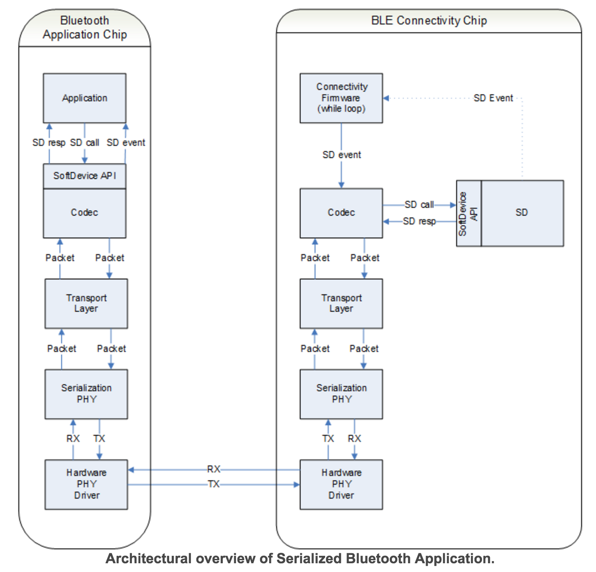

# Serialization

## 概要

nRF51に直接実装せずに外部MCUなどからシリアル通信で制御する方式をBLE serializationと呼ぶ。

* [ドキュメント](http://infocenter.nordicsemi.com/index.jsp?topic=%2Fcom.nordic.infocenter.sdk51.v10.0.0%2Flib_serialization.html)

ドキュメントで紹介されている方法は開発ボードを二台接続して、ApplicationBoard（制御する側）とConnectivityBoard（制御される側）に分けて実装を行う方法になる。  
実際はApplicationBoard側はnRF51を使用せずにARMを直で使用することが多くなるはず。  
接続はUART, SPI, HCIが利用できる。


ApplicationBoardではSoftdeviceを使用しないが専用ライブラリによりSoftdeviceを使用した時と同じコードでConnectivityBoardを制御することができる。  
ConnectivityBoardには、Softdeviceと接続用のアプリケーションをインストールする。  



## Arduinoとつなぐ

ArduinoをApplicationBoardとしてつなぐ場合は専用ライブラリが利用できないので、直にシリアル通信を行う必要がある。  
また、Arduinoはフローコントロールができないなど、シリアル通信の設定も変える必要もある。

### 接続アプリのコンパイル

接続アプリはコード量が多いのでKeilの無料版でばビルドできないので、今回はGCCを用います。  

1. [こちら](https://launchpad.net/gcc-arm-embedded)からArm用のGCCをダウンロードし、任意の場所へ置く。

2. 下記のGNU_INSTALL_ROOTにGCCの場所を記載する。
 * [SDK]/components/toolchain/gcc/Makefile.posix  

3. 下記のヘッダにシリアル通信の設定があるので、Arduinoに合わせた設定にする。

 * [SDK]/components/serialization/common/ser_config.h

 ```
/** UART transmission parameters */
//#define SER_PHY_UART_FLOW_CTRL          APP_UART_FLOW_CONTROL_ENABLED
//#define SER_PHY_UART_PARITY             true
//#define SER_PHY_UART_BAUDRATE           UART_BAUDRATE_BAUDRATE_Baud1M
#define SER_PHY_UART_FLOW_CTRL          APP_UART_FLOW_CONTROL_DISABLED
#define SER_PHY_UART_PARITY             false
#define SER_PHY_UART_BAUDRATE           UART_BAUDRATE_BAUDRATE_Baud115200
 ```

4. 接続アプリは利用するSoftdevice毎に下記フォルダに用意されているので、移動してmakeを実行するとhexファイルが生成される。

 * [SDK]/examples/ble_central_and_peripheral/ble_connectivity [S130]
 * [SDK]/examples/ble_peripheral/ble_connectivity [S110]
 * [SDK]/examples/ble_central/ble_connectivity [S120]

5. 開発ボードにSoftdeviceと先ほどのhexファイルを書き込む。


### 接続

表の通りにGPIOを接続する。

| 開発ボード | Arduino |
| -- | -- |
| GND | GND |
| P0.12 | P2 |
| P0.13 | P3 |

### Arduinoプログラム

iBeaconを発信するプログラム。

 ```
#include <SoftwareSerial.h>

SoftwareSerial serial(2, 3);

int state = 0;
int count = 0;

void setup() {
  // BLEとの通信用
  serial.begin(115200);
  // ログ出力用
  Serial.begin(9600);
  Serial.write("*Start!\n");
  // BLEを有効化
  Serial.write("sd_ble_enable()\n");
  sd_ble_enable();
}

void loop() {
  while (serial.available()) {
    Serial.print(serial.read(), HEX);
    if (count++ > 6) {
      Serial.write("\n");
      count = 0;
      switch(state++) {
        case 0:
          Serial.write("*sd_ble_gap_adv_data_set()\n");
          sd_ble_gap_adv_data_set();
        break;
        case 1:
          Serial.write("*sd_ble_gap_adv_start()\n");
          sd_ble_gap_adv_start();
        break;
        case 2:
          Serial.write("*Finish!\n");
        break;
      }
    } else {
      Serial.write(",");
    }
  }
}

// データ送信
void send_data(byte *data) {
  int len = data[0] + 2;
  for (int i=0; i<len; i++) {
    serial.write(data[i]);
  }
}

// BLEを有効化
void sd_ble_enable() {
  byte data[] = {
    // パケットサイズ
    0x08, 0x00, 
    // タイプ（0:コマンド, 1:レスポンス）
    0x00, 
    // コマンドタイプ
    0x60, 
    // コマンドの内容
    0x01, 0x00, 0x00, 0x00, 0x00, 0x00
    };
  send_data(data);
}


// Advertisingのデータを設定
void sd_ble_gap_adv_data_set() {
  byte data[] = {
    0x24, 0x00, 0x00, 0x72, 0x1e, 0x01, 
    // Header
    0x02, 0x01, 0x06, 0x1a, 0xff, 0x4c, 0x00, 0x02, 0x15,
    // UUID
    0x01, 0x12, 0x23, 0x34, 0x45, 0x56, 0x67, 0x78, 0x89, 0x9a, 0xab, 0xbc, 0xcd, 0xde, 0xef, 0xf0,
    // Major
    0x01, 0x02,
    // Minor
    0x03, 0x4,
    0xc3, 0x00, 0x00};
  send_data(data);
}

// Advertising開始
void sd_ble_gap_adv_start() {
  byte data[] = {
    0x0c, 0x00, 0x00, 0x73, 0x01, 
    // ADV_NONCONN_IND
    0x03, 
    0x00, 0x00, 0x00, 
    // Interval(0.625 ms units)
    0xa0, 
    0x00, 0x00, 0x00, 0x00};
  send_data(data);
}

 ```

### パケットフォーマット

例）sd_ble_enableのパケットフォーマット  
他のパケットフォーマットは[こちら](http://infocenter.nordicsemi.com/index.jsp?topic=%2Fcom.nordic.infocenter.sdk51.v10.0.0%2Flib_serialization.html)


| サイズ | タイプ | コマンド | コマンド | パラメータ |
| -- | -- | -- | -- | -- |
| 2Byte | 1byte | 1byte | 1byte | 5byte |
| 0x08, 0x00 | 0x00 | 0x60 | 0x01| 0x00... |
| 以降8Byte | コマンドタイプ | sd_ble_enableを表す | BLEを有効化する | 5byte |

 ```
  byte data[] = {
    // パケットサイズ
    0x08, 0x00, 
    // タイプ（0:コマンド, 1:レスポンス）
    0x00, 
    // コマンドタイプ
    0x60, 
    // コマンドの内容
    0x01, 0x00, 0x00, 0x00, 0x00, 0x00
    };
 ```

## スキャンする

### 準備

Advertisingパケットをスキャンするには[sd_ble_gap_scan_start](http://infocenter.nordicsemi.com/index.jsp?topic=%2Fcom.nordic.infocenter.sdk51.v10.0.0%2Fble_serialization_s130_functions_gap.html&anchor=nrf51_scan_start_encoding)を利用する。  
これはS110のソフトデバイスでは対応していないので、S130を書き込む。


### Arduinoプログラム

 ```
#include <SoftwareSerial.h>

SoftwareSerial serial(2, 3);

int state = 0;
int count = 0;
uint8_t buff[255];
int buff_pos = 0;
int data_len = 0;
int data_com = 0;


void setup() {
  // BLEとの通信用
  serial.begin(115200);
  // ログ出力用
  Serial.begin(38400);
  Serial.write("*Start!\n");
  // BLEを有効化
  Serial.write("sd_ble_enable()\n");
  sd_ble_enable();
}

// パケットの内容をパース
void parse(uint8_t data) {
  buff[buff_pos++] = data;
  if (buff_pos == 2) {
    data_len = buff[0] + (buff[1] << 8);
    Serial.write("len:");
    Serial.print(data_len, DEC);
    Serial.write("\n");
  }
  if (buff_pos == 3) {
    Serial.write("type:");
    Serial.print(data, HEX);
    Serial.write("\n");
  }
  if (buff_pos == 4) {
    data_com = data;
    Serial.write("command:");
    Serial.print(data, HEX);
    Serial.write("\n");
  }
  if (buff_pos > 4) {
    Serial.print(data, HEX);
  } else {
    return;
  }
  if (data_len == buff_pos -2) {
    buff_pos = 0;
    data_len = 0;
    state++;
    Serial.write("\n");
  } else {
    Serial.write(",");
  }
}


void loop() {
  if (serial.overflow()) {
    // SoftwareSerialはバッファが64byteしかなくオーバーフローしてしまうので、回避策が必要。
    Serial.println("\nSoftwareSerial overflow!");
    delay(100);
    exit(1);
  }
  while (serial.available()) {
    parse(serial.read());
    if (state == 1 && buff_pos == 0) {
        Serial.println("sd_ble_gap_scan_start()"); 
        sd_ble_gap_scan_start();
    }
  }
}


// データ送信
void send_data(byte *data) {
  int len = data[0] + 2;
  for (int i=0; i<len; i++) {
    serial.write(data[i]);
  }
}

// BLEを有効化
void sd_ble_enable() {
  byte data[] = {
    // パケットサイズ
    0x08, 0x00, 
    // タイプ（0:コマンド, 1:レスポンス）
    0x00, 
    // コマンドタイプ
    0x60, 
    // コマンドの内容
    0x01, 0x00, 0x00, 0x00, 0x00, 0x00
    };
  send_data(data);
}

// Scan開始
void sd_ble_gap_scan_start() {
  byte data[] = {
    // パケットサイズ
    0x0b, 0x00, 
    // タイプ（0:コマンド, 1:レスポンス）
    0x00, 
    // コマンドタイプ
    0x86, 
    // コマンドの内容
    0x01, // present
    0x00, // Active Scanning
    0x00, // Whitelist
    0x40, 0x06, // Interval(0.625 ms units)
    0x50, 0x00, // Scan window(0.625 ms units)
    0x00, 0x00 // Timeout(No timeout)
    };
  send_data(data);
}
 ```

### 改良

[SimpleFIFO](https://github.com/rambo/SimpleFIFO)を利用してSoftwareSerialのオーバーフローを回避する。


 ```
#include <SimpleFIFO.h>

SimpleFIFO<uint8_t,255> sFIFO;

// ~~略~~

void loop() {

  // シリアルから読み取ったデータはすぐにQueueに入れる
  while (serial.available()) {
    sFIFO.enqueue(serial.read());
  }

  // シリアルからの読み込みが無いタイミングで処理する
  if (sFIFO.count() > 0) {
    parse(sFIFO.dequeue());
    if (state == 1 && buff_pos == 0) {
        Serial.println("sd_ble_gap_scan_start()"); 
        sd_ble_gap_scan_start();
    }
  }

}
 
 ```

### より見やすく

parse関数の内容を変更してBLE_GAP_EVT_ADV_REPORTのイベントをより詳細に表示するように改良。

 ```
// ~~略~~
  if (buff_pos > 4) {
    if (data_com == 0x1b) {
      // BLE_GAP_EVT_ADV_REPORT
      if (buff_pos > 16) {
        Serial.print(data, HEX);
      } else if (buff_pos == 16) {
        Serial.write("handle:");
        Serial.print(buff[5], HEX);
        Serial.print(buff[6], HEX);
        Serial.write("\n");
        Serial.write("type:");
        Serial.print(buff[7], HEX);
        Serial.write("\n");
        Serial.write("address:");
        Serial.print(buff[8], HEX);
        Serial.print(buff[9], HEX);
        Serial.print(buff[10], HEX);
        Serial.print(buff[11], HEX);
        Serial.print(buff[12], HEX);
        Serial.print(buff[13], HEX);
        Serial.write("\n");
        Serial.write("rssi:");
        Serial.print(buff[14], HEX);
        Serial.write("\n");
        return;
      } else {
        return;
      }
    } else {
      Serial.print(data, HEX);
    }
  } else {
    return;
  }
// ~~略~~

 ```
