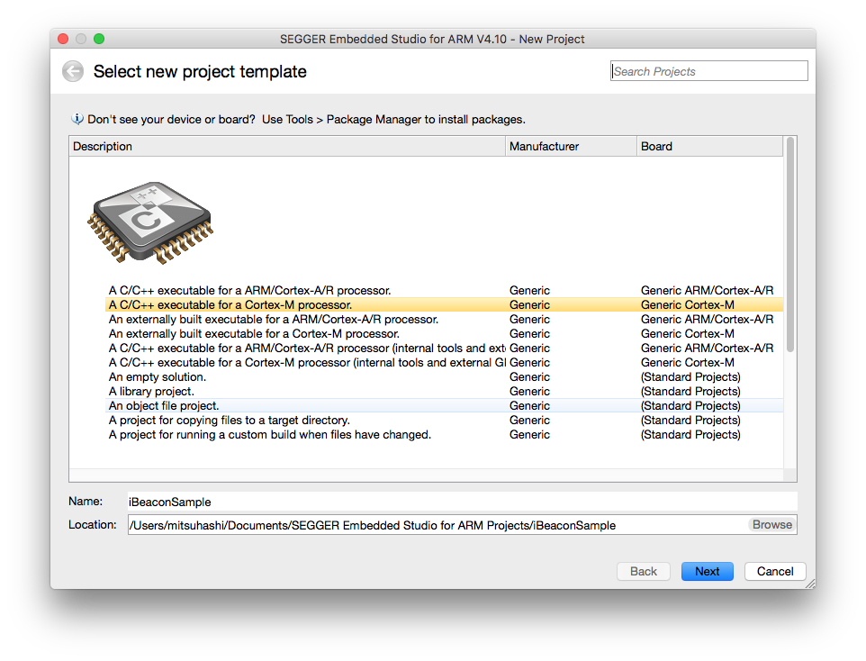
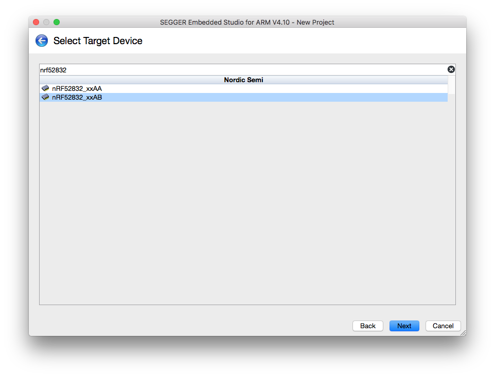
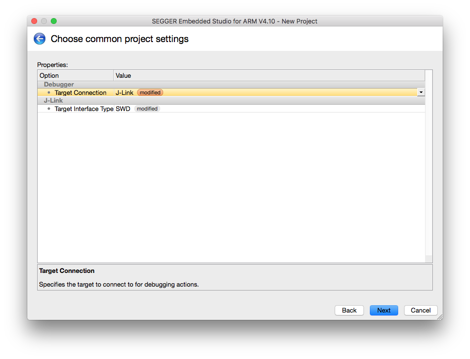
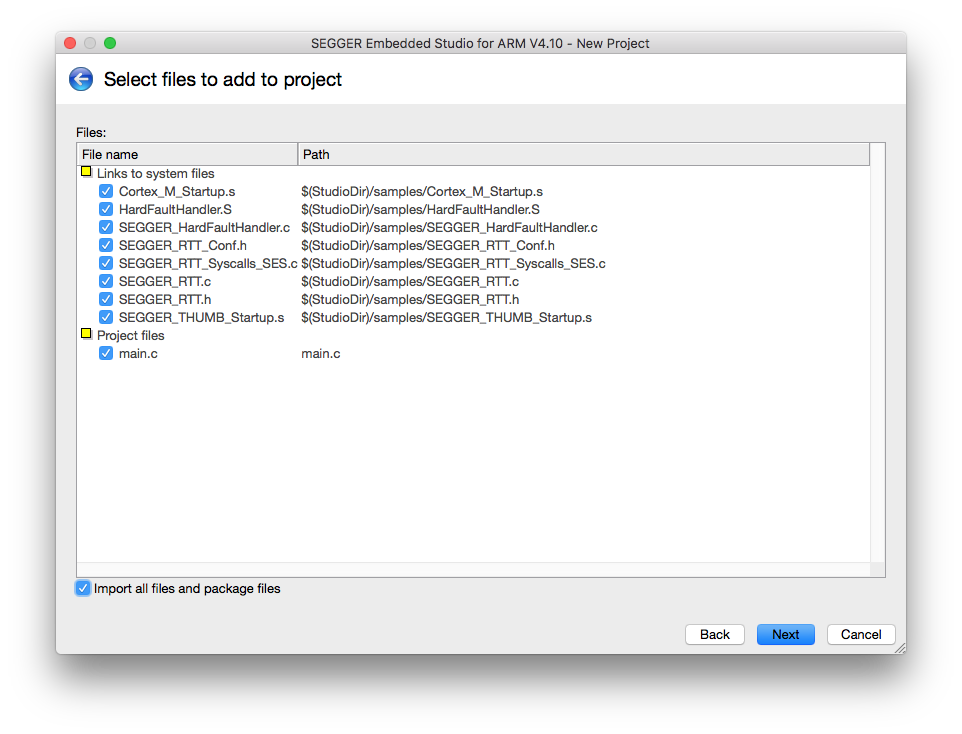
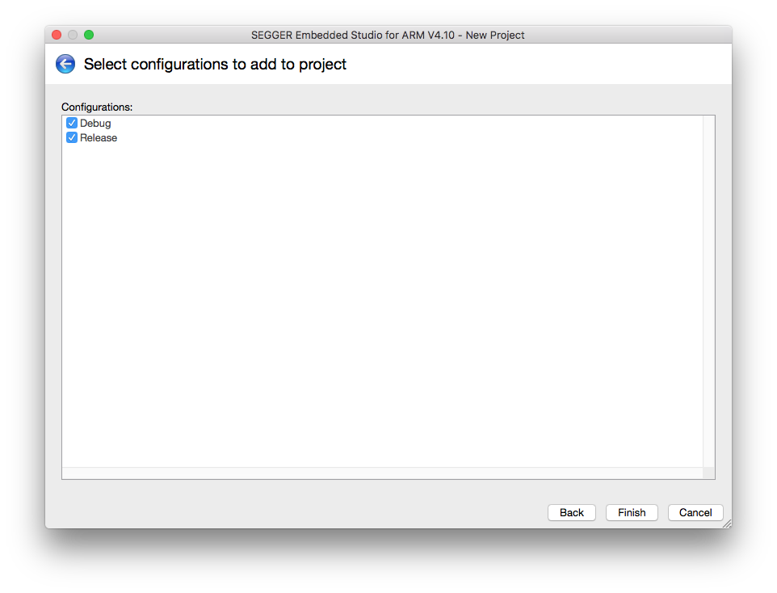
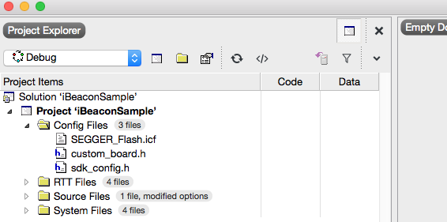

# Projectの設定















## config用フォルダ作成
Project ExplorerでProjectを選択後、上のMenu BarよりProject -> Add New Folderでフォルダを作成する。名前は何でもOK。(作成しなくても良い)

## sdk_config.hの取り込み
(SDK_PATH)/example/ble_peripheral/ble_app_beacon/pca10040/s132/config/sdk_config.hをProject配下に取り込み

## custom_board.hの作成
Project配下にcustom_board.hを作成

```c
// Shinobi Dev Board

#ifndef CUSTOM_BOARD_H
#define CUSTOM_BOARD_H

#define LEDS_NUMBER    1
#define LED_1          18
#define LEDS_LIST { LED_1 }
#define LEDS_ACTIVE_STATE 1
#define BSP_LED_0      LED_1
#define BUTTONS_NUMBER 1
#define BUTTON_0       16
#define BUTTONS_ACTIVE_STATE 0
#define BSP_BUTTON_0   BUTTON_0
#define BUTTONS_LIST { BUTTON_0 }
#define BUTTON_PULL    NRF_GPIO_PIN_PULLUP

#define LEDS_INV_MASK  0

#define RX_PIN_NUMBER  9
#define TX_PIN_NUMBER  11
#define CTS_PIN_NUMBER 10
#define RTS_PIN_NUMBER 8
#define HWFC           false

#define SPIS_MISO_PIN  20    // SPI MISO signal.
#define SPIS_CSN_PIN   21    // SPI CSN signal.
#define SPIS_MOSI_PIN  22    // SPI MOSI signal.
#define SPIS_SCK_PIN   23    // SPI SCK signal.

#define SPIM0_SCK_PIN       23u     /**< SPI clock GPIO pin number. */
#define SPIM0_MOSI_PIN      20u     /**< SPI Master Out Slave In GPIO pin number. */
#define SPIM0_MISO_PIN      22u     /**< SPI Master In Slave Out GPIO pin number. */
#define SPIM0_SS_PIN        21u     /**< SPI Slave Select GPIO pin number. */

#define SPIM1_SCK_PIN       29u     /**< SPI clock GPIO pin number. */
#define SPIM1_MOSI_PIN      24u     /**< SPI Master Out Slave In GPIO pin number. */
#define SPIM1_MISO_PIN      28u     /**< SPI Master In Slave Out GPIO pin number. */
#define SPIM1_SS_PIN        25u     /**< SPI Slave Select GPIO pin number. */

// serialization APPLICATION board

// UART
// this configuration works with the SPI wires setup
#define SER_APP_RX_PIN              20     // UART RX pin number.
#define SER_APP_TX_PIN              22     // UART TX pin number.
#define SER_APP_CTS_PIN             23     // UART Clear To Send pin number.
#define SER_APP_RTS_PIN             21     // UART Request To Send pin number.

// serialization CONNECTIVITY board

// UART
#if 0
#define SER_CON_RX_PIN              22    // UART RX pin number.
#define SER_CON_TX_PIN              20    // UART TX pin number.
#define SER_CON_CTS_PIN             21    // UART Clear To Send pin number. Not used if HWFC is set to false.
#define SER_CON_RTS_PIN             23    // UART Request To Send pin number. Not used if HWFC is set to false.
#else
// this configuration works with the SPI wires setup
#define SER_CON_RX_PIN              20    // UART RX pin number.
#define SER_CON_TX_PIN              22    // UART TX pin number.
#define SER_CON_CTS_PIN             21    // UART Clear To Send pin number. Not used if HWFC is set to false.
#define SER_CON_RTS_PIN             23    // UART Request To Send pin number. Not used if HWFC is set to false.
#endif

#define SER_CONN_ASSERT_LED_PIN     LED_0

#define NRF_CLOCK_LFCLKSRC      {.source        = NRF_CLOCK_LF_SRC_XTAL,            \
                                 .rc_ctiv       = 0,                                \
                                 .rc_temp_ctiv  = 0,                                \
                                 .accuracy      = NRF_CLOCK_LF_ACCURACY_20_PPM}

#endif
```

## SEGGER_Flash.icfの取り込み
Project Explorer -> Add Existing FileからSEGGER_Flash.icfファイルを取り込み



## Build Optionの設定
Project ExplorerでProject選択後、OptionsボタンからOption画面を開く。その後、左上のdrop-down listでPrivate ConfigurationのCommonを選択する


以下のOptionを設定する

### Preprocessor -> Preprocessor Definitions
|Option|
|:--|
|NRF52832_XXAB|
|BOARD_CUSTOM|
