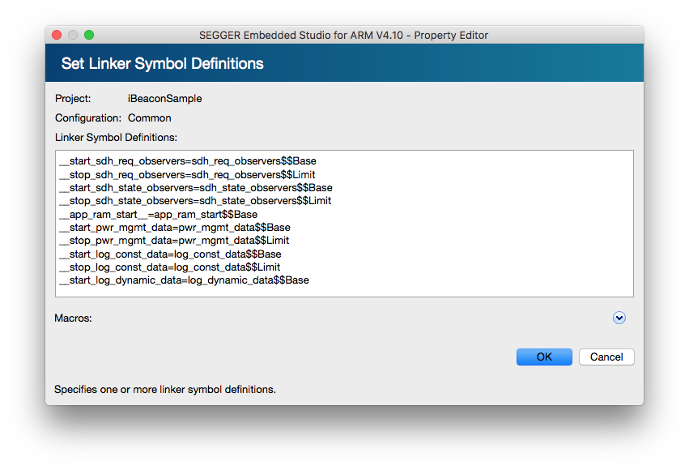

# BLE Stackの初期化

iBeaconを発信するためにBLE Stackの初期化を行う。

## Defineの追加

```c
#define APP_BLE_CONN_CFG_TAG    1
```

## Externの追加

```c
extern uint32_t __app_ram_start__;
```

## BLE Stackの初期化処理

```c
/**@brief Function for initializing the BLE stack.
 */
 void    ble_stack_init(void) {
     APP_ERROR_CHECK(nrf_sdh_enable_request());
     APP_ERROR_CHECK(nrf_sdh_ble_default_cfg_set(APP_BLE_CONN_CFG_TAG, &__app_ram_start__));
     APP_ERROR_CHECK(nrf_sdh_ble_enable(&__app_ram_start__));
 }
```

## Build Optionの設定
Project ExplorerでProject選択後、OptionsボタンからOption画面を開く。その後、左上のdrop-down listでPrivate ConfigurationのCommonを選択し、以下のOptionを追加設定する

 ### Linker -> Linker Symbol Definitions
 |Symbol|
 |:--|
 |__start_sdh_req_observers=sdh_req_observers$$Base|
 |__stop_sdh_req_observers=sdh_req_observers$$Limit|
 |__start_sdh_state_observers=sdh_state_observers$$Base|
 |__stop_sdh_state_observers=sdh_state_observers$$Limit|
 |\__app_ram_start__=app_ram_start$$Base|



## Linker Scriptの編集
SEGGER_Flash.icfファイルを開き、以下の編集を行う

SEGGER_Flash.icf
```c
/*** 省略 ***/
define block log_const_data   { section .log_const_data*   };
define block log_dynamic_data { section .log_dynamic_data* };
define block pwr_mgmt_data    { section .pwr_mgmt_data*    };
define block app_ram_start with size = 4 { }; //追加
define block sdh_req_observers   { section .sdh_req_observers* }; //追加
define block sdh_state_observers { section .sdh_state_observers* }; //追加
//
// Explicit initialization settings for sections
//
/*** 省略 ***/
place in RAM                             {                                          // Special sections
                                           section .non_init, section .non_init.*,  // No initialization section
                                           block tls,                               // Thread-local-storage block
                                           block app_ram_start //追加
                                         };
/*** 省略 ***/
```

 main.c

```c
#include "app_error.h"
#include "bsp.h"
#include "nrf_pwr_mgmt.h"
#include "nrf_sdh.h"
#include "nrf_sdh_ble.h"

#define NRF_LOG_MODULE_NAME iBEACON_SAMPLE
#include "nrf_log.h"
NRF_LOG_MODULE_REGISTER();
#include "nrf_log_ctrl.h"
#include "nrf_log_default_backends.h"

#define LED1                    BSP_BOARD_LED_0
#define APP_BLE_CONN_CFG_TAG    1

extern uint32_t __app_ram_start__;

void    ble_stack_init(void) {
    APP_ERROR_CHECK(nrf_sdh_enable_request());
    APP_ERROR_CHECK(nrf_sdh_ble_default_cfg_set(APP_BLE_CONN_CFG_TAG, &__app_ram_start__));
    APP_ERROR_CHECK(nrf_sdh_ble_enable(&__app_ram_start__));
}

void    log_init(void) {
    APP_ERROR_CHECK(NRF_LOG_INIT(NULL));
    NRF_LOG_DEFAULT_BACKENDS_INIT();
}

int main(void) {
    log_init();
    NRF_LOG_INFO("iBEACON_SAMPLE");
    NRF_LOG_FLUSH();

    bsp_board_init(BSP_INIT_LEDS);

    APP_ERROR_CHECK(nrf_pwr_mgmt_init());
    ble_stack_init();

    bsp_board_led_on(LED1);

    while(true) {
        if(NRF_LOG_PROCESS() == false) {
            nrf_pwr_mgmt_run();
        }
    }
}
```
