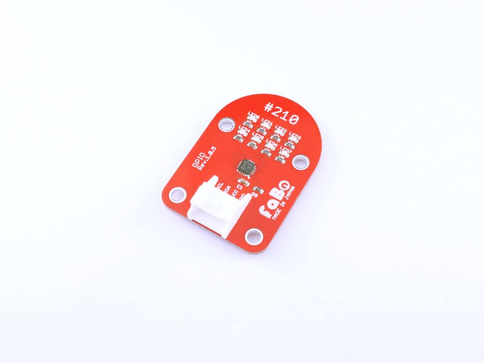

# #210 GPIO I2C Brick


<!--COLORME-->

## Overview
汎用I/O拡張チップを使用したBrickです。

I2Cで8個のLEDを制御できます。

## Connecting

```c

#include <stdio.h>
#include "boards.h"
#include "app_util_platform.h"
#include "app_error.h"
#include "nrf_drv_twi.h"
#include "nrf_delay.h"

#define NRF_LOG_MODULE_NAME "APP"
#include "nrf_log.h"
#include "nrf_log_ctrl.h"

/* TWI instance ID. */
#define TWI_INSTANCE_ID     0

/* Common addresses definition for temperature sensor. */
#define PCAL6408          0x20

/* TWI instance. */
static const nrf_drv_twi_t m_twi = NRF_DRV_TWI_INSTANCE(TWI_INSTANCE_ID);

	uint16_t cmd[4] = {0x00,0x01,0x02,0x03};

	uint8_t patern[9] = {0x00,0x01,0x02,0x04,0x08,0x10,0x20,0x40,0x80};

/**
 * @brief Function for setting active mode on MMA7660 accelerometer.
 */
void PCAL6408_set_mode(void)
{
    ret_code_t err_code;
    uint8_t reg[2] = {cmd[3],0x00};
    err_code = nrf_drv_twi_tx(&m_twi, PCAL6408, reg, sizeof(reg), false);
    APP_ERROR_CHECK(err_code);
}

void twi_handler(nrf_drv_twi_evt_t const * p_event, void * p_context)
{

}

void twi_init (void)
{
    ret_code_t err_code;
		 NRF_LOG_INFO("\r\nTWI_init\r\n");

    const nrf_drv_twi_config_t twi_PCAL6408_config = {
       .scl                = 27,
       .sda                = 26,
       .frequency          = NRF_TWI_FREQ_100K,
       .interrupt_priority = APP_IRQ_PRIORITY_HIGH,
       .clear_bus_init     = false
    };

    err_code = nrf_drv_twi_init(&m_twi, &twi_PCAL6408_config, twi_handler, NULL);
    APP_ERROR_CHECK(err_code);

    nrf_drv_twi_enable(&m_twi);
}

int main(void)
{
		ret_code_t err_code;
    APP_ERROR_CHECK(NRF_LOG_INIT(NULL));

    NRF_LOG_INFO("\r\nFaboGPIO #210\r\n");
    NRF_LOG_FLUSH();
    twi_init();
    PCAL6408_set_mode();


	while(1){
		for(int j=0;j<9;j++){
			uint8_t reg[2] = {cmd[1],patern[j]};
			nrf_drv_twi_tx(&m_twi, PCAL6408, reg, sizeof(reg), false);
			nrf_delay_ms(500);
		}
	}
}

```


## 構成Parts
-
NXP PCAL6408

## GitHub
