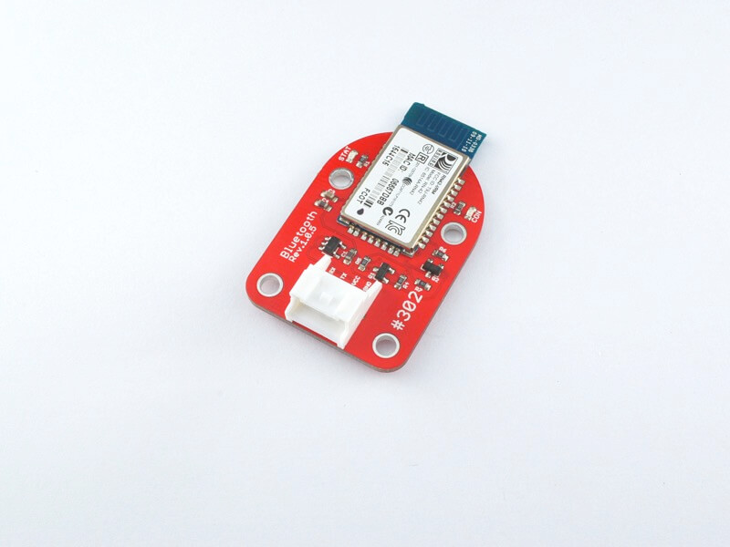

# #302 Buletooth Serial Brick

<!--COLORME-->

## Overview
Bluetooth通信ができるBrickです。

PCやスマートフォンなどの端末とシリアル通信することができます。

## Connecting
Wifi Brickは　Arduino D9,CN10 mopho pin 4pinに接続します。

写真は開発中のものです。

###DMAによる通信
DMAはＣＰＵを仲介せず直接メモリにアクセスしデータを送受信します。その間は、ＣＰＵは他の処理ができるようになりますが、DMAがバスを使用しますので制限があります。
