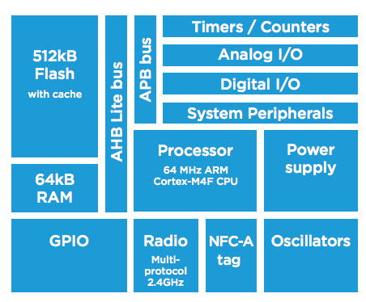
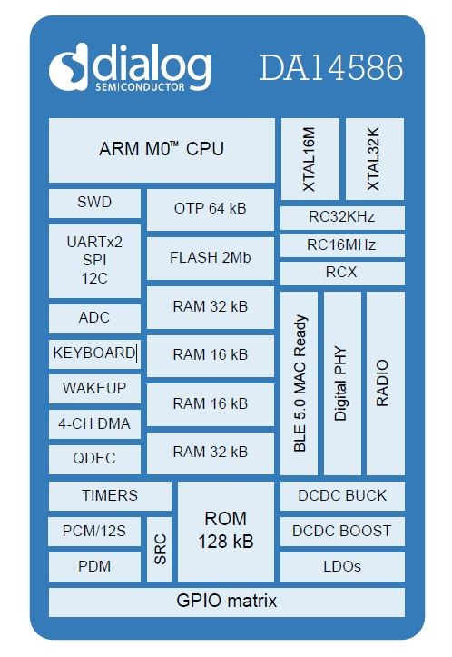
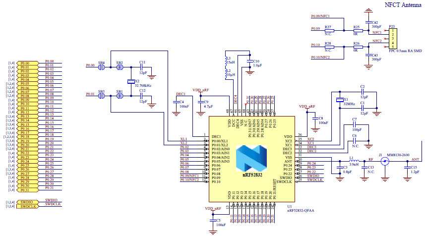

# BLEチップ

## 5.0対応BLEチップ

| Chip名 | Maker |Co-Proccesor| BLE Version | メモ |
| -- | -- | -- | -- |
|[nRF52840](https://www.nordicsemi.com/eng/Products/nRF52840)|[Nordic Semiconductor](https://www.nordicsemi.com) |  ARM® Cortex™  M4F(64 MHz) | 5.0 | |
| [DA14586](https://www.dialog-semiconductor.com/products/smartbond-da14586) | [dialog](http://www.dialog-semiconductor.com/) | ARM® Cortex™ M0(30μA/MHz) | ARM® Cortex™  M0 | |

## 4.2対応BLEチップ

| Chip名 | Maker |Co-Proccesor| BLE Version | メモ |
| -- | -- | -- | -- |
| [DA14680](http://www.dialog-semiconductor.com/docs/site-pdf/dialog-smartbond-da14680-product-brief-japanese.pdf?sfvrsn=2)|[dialog](http://www.dialog-semiconductor.com/) | ARM® Cortex™ M0(30μA/MHz) | 4.2 | |
| [BGM111](http://www.silabs.com/products/wireless/bluetooth/Pages/bluegecko-bluetooth-smart-module-intro.aspx) | [Silicon Lab ](http://www.csr.com/) |  ARM® Cortex™  M4(40MHz) |4.1 (4.2にUpgrade可能) | |
| [NRF52832](https://www.nordicsemi.com/Products/Bluetooth-Smart-Bluetooth-low-energy/nRF52832) | [Nordic Semiconductor](https://www.nordicsemi.com) |  ARM® Cortex™  M4F(64 MHz) | 4.2 | 2015年12月から量産 |

## 4.1対応BLEチップ

| Chip名 | Maker |Co-Proccesor| BLE Version |
| -- | -- | --- |
| [DA14580](http://www.dialog-semiconductor.com/products/bluetooth-smart) | [dialog](http://www.dialog-semiconductor.com/) | ARM® Cortex™ M0 | 4.1 |
| [NRF51822](http://www.nordicsemi.com/eng/Products/Bluetooth-R-low-energy/nRF51822) | [Nordic Semiconductor](http://www.nordicsemi.com/)  |  ARM® Cortex™ M0 | 4.1 |
| [NRF51422](http://www.nordicsemi.com/eng/Products/ANT/nRF51422)  | [Nordic Semiconductor](http://www.nordicsemi.com/) |  ARM® Cortex™ M0 | 4.1 |
| [BCM20737S](http://www.broadcom.com/collateral/pb/WICED-Sense-PB100.pdf) | [Broadcom](http://ja.broadcom.com/) |  ARM® Cortex™ M3 | 4.1 |
| [CYBL10X6X](http://japan.cypress.com/?rID=99422 ) | [CYPRESS](http://japan.cypress.com/) |ARM® Cortex™ M0| 4.1 |
| [CC2640](http://www.tij.co.jp/product/jp/cc2640)|[TI](http://www.tij.co.jp/)|ARM® Cortex™ M3(48MHz)|4.1|
| [Kinetis KW40Z](http://www.freescale.com/ja/products/arm-processors/kinetis-cortex-m/w-series/kinetis-kw40z-30z-20z-bluetooth-low-energy-802.15.4-wireless-mcus:KW4x) | [Freescale](http://www.freescale.com/) | ARM® Cortex™ M0+ | 4.1 |

## BLE4.0

| Chip名 | Maker |Co-Proccesor| BLE Version |
| -- | -- | --- |
| [CSR1010](https://www.csrsupport.com/download/39359/CSR1010%20Data%20Sheet%20CS-231985-DS.pdf) | [CSR](http://www.csr.com/) | 独自MCU(RISC) 16Bit | 4.0 |
| [CSR1011](https://www.csrsupport.com/download/40289/CSR1010%20Data%20Sheet%20CS-231986-DS.pdf) | [CSR](http://www.csr.com/)  | 独自MCU(RISC) 16Bit | 4.0 |
| [CSR1012](https://www.csrsupport.com/download/47278/CSR1012%20Data%20Sheet%20CS-238833-DS.pdf) | [CSR](http://www.csr.com/)  | 独自MCU(RISC) 16Bit | 4.0 |
| [BlueNGR](http://www.st.com/web/catalog/sense_power/FM1968/CL1976/SC1898/PF258646?ecmp=pf258646_link_emf_jan2014&sc=bluenrg) |  [STMicro](http://www.st-japan.co.jp/web/jp/home.html) | ARM® Cortex™ M0 | 4.0 |
| [QN902X](http://www.nxp.com/documents/data_sheet/QN902X.pdf) | [NXP](http://www.nxp.com/) | ARM® Cortex™ M0 | 4.0 |
| [CC2540](http://m.tij.co.jp/product/jp/CC2540)| [TI](http://www.tij.co.jp/) |  8051互換 8ビット | 4.0|
| [CC2541](http://m.tij.co.jp/product/jp/CC2541) | [TI](http://www.tij.co.jp/) |  8051互換 8ビット| 4.0 | 
|[TZ1000](http://toshiba.semicon-storage.com/jp/product/assp/applite/tz1000.html) |[Toshibaセミコン](http://toshiba.semicon-storage.com/) |ARM® Cortex™ M4F(48MHz)|4.0|
|[ML1705-002](http://www.lapis-semi.com/jp/semicon/telecom/ble.html)| [LAPIS](http://www.lapis-semi.com)|ARM® Cortex™ M0|4.0|
| [CC2564](http://www.ti.com/product/cc2564) | [TI](http://www.tij.co.jp/) |  - | 4.0|

